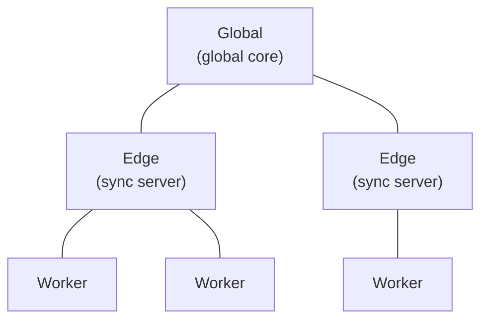
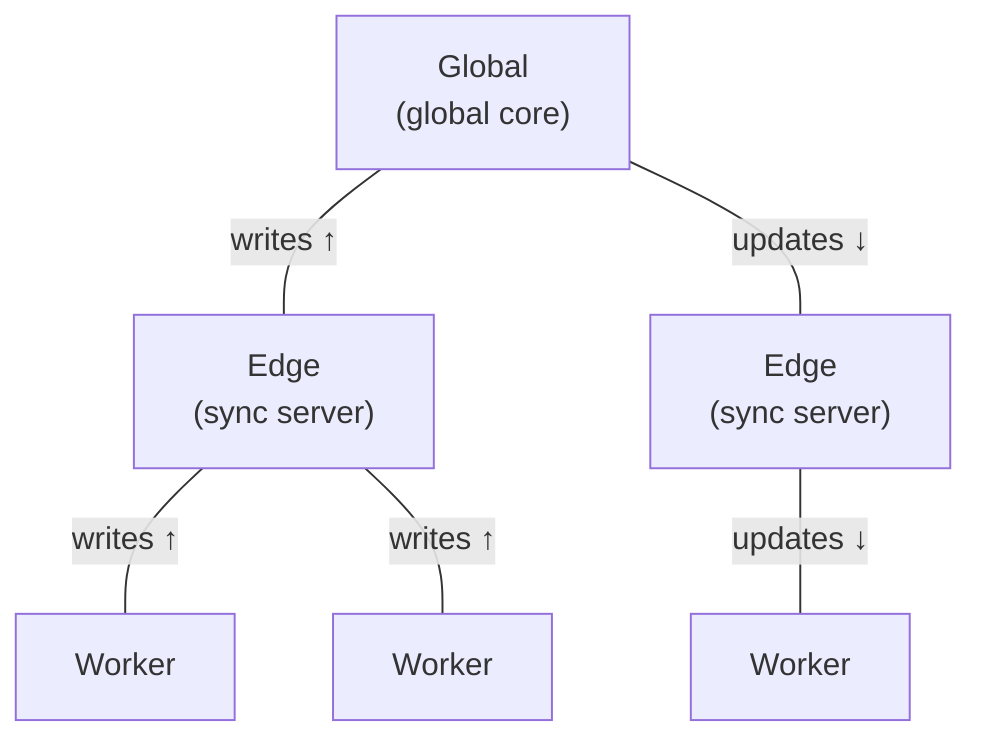

Traditional apps send queries to a remote server, which queries a database and returns data.

This presents a number of difficulties:

- The data is immediately stale
- Both the client and the server must be online
- Your app's performance depends on the speed of each network hop

Techniques like websockets, client-side caching, and optimistic updates alleviate some of these issues, but they add complexity without solving the underlying problem.

Jazz solves these problems with **query subscriptions**.

## Queries drive everything

The underlying problem with the request/response model is that it doesn't match how users experience apps. When you use an app, you want it to show you _the latest data, immediately_.

To deliver this, Jazz uses query subscriptions. When your app [subscribes to a query](/docs/reading/queries) (say, all todos where [`done = false`](/docs/reading/filters-and-sorting)), Jazz sends the query to the server. The server evaluates the query against its own data, finds the matching rows, and sends them back. The client only ever sees rows it's asked for (and [has permission to read](/docs/auth/permissions)).

The set of active queries on a client defines the database rows it can see and will receive updates for.

## The server keeps you subscribed

When you register a query subscription with the server, it remembers. Every part of the query is broken down into small components, which allows the server to quickly and efficiently update subscribers when data changes.

For example, when another client writes a row, or upstream sync delivers new data, the server recognises that you are subscribed to data which has changed and pushes the update to you.

If a new row matches your query, it is automatically pushed to you. Conversely, if a previously matching row changes so it no longer fits your query (e.g. you subscribe to `done = false` and someone sets `done = true`), you stop receiving updates.

The server watches continuously, efficiently re-evaluating only parts of queries that have changed, and pushing deltas to subscribed clients in real-time. Clients use these deltas to update their local replicas.

## What happens offline

Reads always come from your local storage. In the browser, Jazz uses a dedicated worker thread reading from data stored locally in OPFS (Origin Private File System). When multiple tabs are open, Jazz automatically elects one tab as the storage leader, and other tabs route through it. In case the leader tab closes, a new leader is elected. Even without a network connection, your app can read data it already has locally (for example, because it has been synced previously, or because the data was written locally).

[Writes](/docs/writing/writing-data) work the same way: they are stored immediately locally so your UI updates without waiting on a round-trip. Jazz automatically queues those writes to be synced upstream. When you reconnect, all queued writes are sent to the sync server, and active query subscriptions are replayed. This means that as soon as you reconnect, your app automatically refreshes with the latest data.

## Infrastructure tiers

Jazz sync runs across three tiers:

**Worker** runs on the client itself, making it the first tier to respond to queries. The worker keeps a local copy of all the data the client is subscribed to so it can respond immediately while updates from higher tiers stream in. It also immediately persists writes and handles the syncing with the next tier up.

**Edge** is a server node. It's the first hop your data takes after it leaves your client. In cloud configurations, this will normally be a node geographically close to your user. Edge servers only hold data that their connected clients have written or read.

**Global** is the global core. Edge servers reconcile through global, which is how updates cascade to all clients. An edge server fetches data from global only when a connected client subscribes to data the edge doesn't already have. Two clients on different edge servers will see each other's writes once both edges have reconciled.

### How data flows

Writes flow **upward**: your app &rarr; worker &rarr; edge &rarr; global. As your write flows through the network, each tier acknowledges when it is received. You can choose which tier you want to wait for before confirming the write. For example, you may choose to wait only for the local worker to acknowledge before moving on, and allow background sync to take care of propagation. Alternatively, you may want to wait for confirmation that the write has left the user's device, or is available at the global level. You can read more about this mechanism on the [durability tiers page](/docs/reference/durability-tiers).

Data flows **downward on demand**. Whenever you create a query subscription, it is passed up through the tiers. Your worker registers the subscription with the edge server, which registers it with the global core. This allows edge servers and your worker to efficiently replicate only the data they've been asked for. The trade-off is that the initial response from each tier may be stale while further data is requested from the next tier up.

Lower tiers have lower latency, but the write has further to propagate before others can read it. As a rough guide:

- waiting for the global core is only necessary if you want strong consistency
- waiting for the edge tier is useful for ensuring that data has left the user's device
- the default worker tier is good for most data where eventual consistency is acceptable

<Callout type="info" title="Sync is automatic">
  Sync happens whenever a node is online. Writes automatically propagate up through the network even
  if the promise resolves at the worker level. Reads similarly propagate down as each tier registers
  your query subscription with the next tier. If higher tiers have newer data, it streams down to
  your client automatically.
</Callout>

## Consistency model

Every write in Jazz produces a **commit**: an immutable, timestamped record of the change. All commits are stored, meaning a full history of every row in your database is saved.

This commit-based model allows changes to propagate throughout the network in an eventually consistent way, without needing clients to wait for a full round trip. This means that the state of data between tiers can diverge. A client that has just written locally has a different view of the data than the global core until the commit propagates. Another client on a different edge server might have its own unreconciled writes. All of this converges: commits propagate upward, get persisted at a global level, and flow back down to every subscribed client. Under normal circumstances, convergence takes roughly one network round-trip to the global core.

As clients can write concurrently, Jazz uses **last-writer-wins (LWW)** to resolve merge conflicts when they occur. When two clients try to write to the same column of the same row concurrently, the commit with the later timestamp wins. Because Jazz tracks all commits, even commits which lose out in the merge are still stored in the row's history, and no data is ever lost. This allows you to implement your own conflict resolution strategies if LWW is not suitable for your use case.

## See it in action

[Wequencer](https://github.com/garden-co/jazz2/tree/main/docs/examples/wequencer) is a collaborative real-time music sequencer built with Jazz and Svelte. Multiple users place beats on a shared grid and hear each other's changes immediately&hairsp;—&hairsp;a good example of query subscriptions, real-time sync, and conflict-free collaboration in practice.
