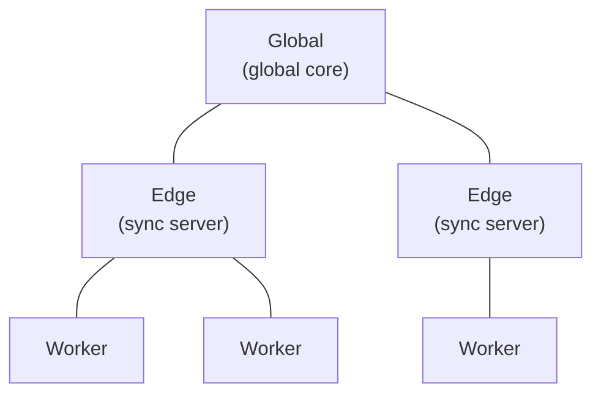

Traditional apps send queries to a remote server, which queries a database and returns data.

This creates a few familiar problems:

- the data is immediately stale
- both the client and the server must be online
- your app's performance depends on the speed of each network hop

Techniques like websockets, client-side caching, and optimistic updates help, but they add
complexity without changing the basic request/response shape.

Jazz solves these problems with **query subscriptions** backed by a local replica.

## Queries drive everything

When your app [subscribes to a query](/docs/reading/queries) (say, all todos where
[`done = false`](/docs/reading/filters-and-sorting)), Jazz sends that query subscription upstream.
The server evaluates the query against its own current relational state, finds the matching rows,
and sends them back. The client only ever sees rows it has asked for (and
[has permission to read](/docs/auth/permissions)).

The set of active queries on a client defines the rows it can see and will keep receiving updates
for.

## The server keeps you subscribed

When you register a query subscription with the server, it remembers.

The server keeps a live query graph for that subscription. When local writes, remote replay, or
schema/policy changes affect the result, it re-settles only the changed parts of the query and
pushes the relevant row updates downstream.

That means:

- if a new row matches your query, it is pushed automatically
- if a matching row changes and no longer fits, it stops appearing in the subscription result
- clients update their local replicas from deltas instead of from full snapshots every time

## What happens offline

Reads always come from local storage.

In the browser, Jazz uses a dedicated worker reading from data stored locally in OPFS (Origin
Private File System). When multiple tabs are open, Jazz elects one tab as the storage leader and
routes follower tabs through it. If the leader tab closes, a new leader is elected.

Even without a network connection, your app can still read data it already has locally, whether
that data was synced earlier or written locally on the device.

[Writes](/docs/writing/writing-data) behave the same way: they are stored locally immediately so the
UI updates without waiting on a round-trip. Jazz queues the corresponding row-version updates for
upstream sync. When the client reconnects, queued writes are sent and active query subscriptions are
replayed automatically.

## Infrastructure tiers

Jazz sync runs across three tiers:



**Worker** runs on the client itself, making it the first tier to respond to queries. The worker
keeps the locally durable copy of subscribed data so it can respond immediately while updates from
higher tiers stream in.

**Edge** is the first server hop after the client. In cloud configurations it is usually a nearby
node. Edge servers hold the data needed to serve the queries currently flowing through them.

**Global** is the global reconciliation tier. Edge servers reconcile through global, which is how
updates eventually spread to every subscribed client.

### How data flows

Writes flow **upward**:

```text
app -> worker -> edge -> global
```

As a write flows through the network, each tier can confirm that it has durably received it. That
is what durability tiers are built on.

Reads flow **downward on demand**. When you create a query subscription, it is forwarded upward.
Each tier registers the subscription with the next tier and asks for the rows needed to satisfy it.
That allows the system to replicate only the data that has actually been requested.

Lower tiers have lower latency, but writes have further to travel before every other client can see
them. As a rough guide:

- waiting for the global core is only necessary if you want the strongest cross-region visibility
- waiting for edge is useful when you want to know data has left the user's device
- the default worker tier is right for most local-first interactions

<Callout type="info" title="Sync is automatic">
  Sync happens whenever a node is online. Writes keep propagating upward even if your promise
  resolves at the worker tier. Reads similarly propagate downward as each tier registers the query
  with the next one up. If higher tiers have newer rows, they stream down automatically.
</Callout>

## Consistency model

Every write in Jazz produces a new **row version**. That row version is stored locally, can be
replicated upward, and contributes to the current visible state for that row.

Because sync is local-first, different tiers can temporarily disagree:

- your worker may already have a newer row version than edge
- one edge may have data another edge has not fetched yet
- another client may have its own concurrent local write

All of that still converges. Row versions propagate upward, are durably stored at higher tiers, and
flow back down to every subscribed client that needs them.

When clients write concurrently to the same field of the same row, Jazz uses
**last-writer-wins (LWW)** to decide the current visible result. Even row versions that lose that
race remain in row history, so the system keeps enough information to reconcile deterministically
and to support richer history-aware behavior later.

## See it in action

[Wequencer](https://github.com/garden-co/jazz2/tree/main/examples/wequencer) is a collaborative
real-time music sequencer built with Jazz and Svelte. Multiple users place beats on a shared grid
and hear each other's changes immediately, which makes it a good example of query subscriptions,
real-time sync, and conflict-friendly collaboration in practice.
