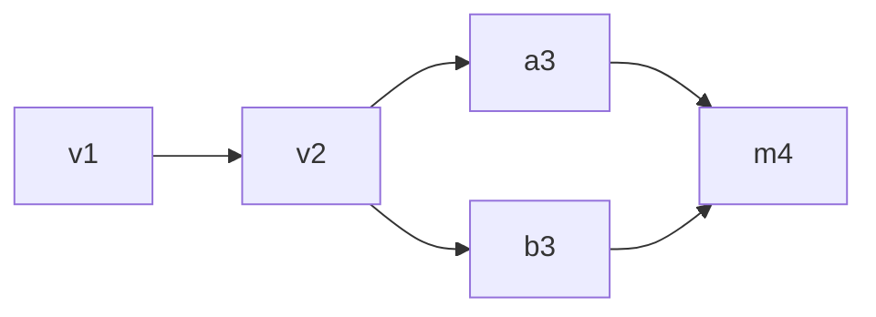

Jazz embeds a database on each device and syncs to the server in the background.

## How Jazz stores data

As covered in [How Sync Works](/docs/concepts/how-sync-works), traditional apps wait on a network
round-trip for every read and write. Jazz eliminates that entirely by embedding a subset of the
database on your users' devices.

[Reads](/docs/reading/queries) are immediate from local storage. [Writes](/docs/writing/writing-data)
(`insert`, `update`, `delete`) are also applied locally immediately, with no network round-trip.
The sync layer picks those changes up in the background and propagates them whenever a client is
online.

This has a practical consequence: there is no difference between "optimistic" and "real" state.
The local write _is_ the state. There is no single always-online source of truth. Instead, every
client that has received the same row-history updates converges on the same current result.

### The only loading moment

Devices cannot show data they do not have. On the very first load from the server, there will be a
loading moment while data starts to populate the local embedded database. From that point on, data
for that query is available locally and can be read again even while offline.

<Callout type="info" title="Durability Tiers">
  If you need to ensure data is fully up-to-date before displaying it, you can opt in to waiting for
  a higher [durability tier](/docs/reference/durability-tiers).
</Callout>

## Tables, row versions, and visible state

Jazz stays table-first all the way down.

Each application table still behaves like a table, but the engine also tracks a little extra
information for each logical row:

- a stable row identity
- a current visible state used for ordinary reads
- a retained history of row versions over time

The easiest picture is:

```text
todos
  visible: current answer for each row in a branch
  history: row versions over time for that same row
```

That is why the app-facing API can stay simple while the runtime still has enough information for
replay, reconnect, and conflict resolution.

## Row history

Every write to a row creates a new **row version**.

That version records:

- the new row values
- which earlier version(s) it came from
- engine-managed metadata such as branch, delete state, and durability state

Physically, that row version is still one flat stored row: user columns plus reserved `_jazz_*`
columns in the same binary row format. So the runtime keeps a row-local history graph rather than
just overwriting the row in place.

### Concurrent edits

When only one device is editing a row, the history is effectively linear. When multiple peers edit
the same row concurrently, several row versions can exist at once and later be reconciled into a
single current visible result.

You can think of it like this:



The important point is not the exact shape of the graph. The important point is that Jazz preserves
enough row history to converge deterministically after peers reconnect.

## Conflict resolution

When concurrent writes touch the same field of the same row, Jazz resolves the visible result with
[last-writer-wins (LWW)](/docs/concepts/how-sync-works#consistency-model). The later row version
wins for the conflicting field.

If two peers update different fields, both changes can still be preserved in the resulting visible
row state. Even row versions that lose out in the current visible result remain in row history, so
no local-first reconciliation information is discarded.

<Callout type="warn" title="Beware of unexpected results">
  Jazz can resolve structural conflicts for you, but it cannot fully understand the meaning of your
  data. If Alice renames a to-do while Bob marks it complete, both changes may be preserved even if
  the new title changes what the task means. You still need application-level judgment about what
  kinds of concurrent editing should be allowed.
</Callout>

## How this differs from traditional apps

|                        | Traditional                                | Jazz                                                               |
| ---------------------- | ------------------------------------------ | ------------------------------------------------------------------ |
| **Read path**          | HTTP request, wait for response            | Read from local storage                                            |
| **Write path**         | HTTP request, wait for confirmation        | Immediate local persistence, background sync                       |
| **Optimistic updates** | Manually implemented, must handle rollback | Not needed, the local write is authoritative                       |
| **Offline support**    | Bespoke queueing and retry logic           | Reads and writes continue to work against the local database       |
| **Loading states**     | Every network call                         | Only on first connection                                           |
| **Source of truth**    | Single authoritative database              | Every client with the same row-history updates sees the same state |
| **Conflict handling**  | Server rejects or last-request-wins        | Automatic visible-state reconciliation with retained history       |
