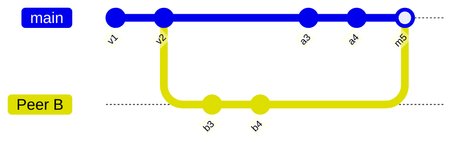

Jazz embeds a database on each device and syncs to the server in the background.

## How Jazz stores data

As covered in [How Sync Works](/docs/concepts/how-sync-works), traditional apps need to wait for a network round-trip for every read and write. Jazz eliminates that entirely by embedding a subset of the database on your users' devices. [Reads](/docs/reading/queries) are immediate from local storage. [Writes](/docs/writing/writing-data) (`insert`, `update`, `delete`) can also be applied locally immediately, with no network round-trip. The sync layer picks up changes in the background and propagates them over the network whenever a client is online.

This has a practical consequence: there is no difference between "optimistic" and "real" state. The local write _is_ the state. There is no single source of truth. Instead, every client that has received the same commits converges on the same result.

### The only loading moment

Devices can't show data they don't have. On the very first load from the server, there'll be a loading moment while data starts to populate the local embedded database. From this point on, data for that query will always be available. You never need to wait for the network again: your app reads from what's already on disk, even offline.

<Callout type="info" title="Durability Tiers">
  If you need to ensure data is fully up-to-date before displaying it, you can opt-in to waiting for
  a higher [durability tier](/docs/reference/durability-tiers).
</Callout>

## Versioned objects

Every update or change made to a row in Jazz is recorded as a **commit**, and each commit results in a new, immutable version of the row it affects. Under the hood, each row's history is an append-only log of commits. The full history of each row is available, allowing you to view a row as it looked at any point in history, including intermediate, conflicting states.

Each version links back to its parent, forming a chain.

## The DAG

When only a single device is creating commits, the chain is simple and linear. However, when multiple peers edit the same row concurrently, the history is no longer a single chain, and it can diverge into multiple states. Peer A creates version `a3` from `v2`; peer B independently creates version `b3` from the same `v2`. When these peers sync, the database merges the updates, producing a new version with two parents.

The result is a [**directed acyclic graph**](https://en.wikipedia.org/wiki/Directed_acyclic_graph) (DAG), similar to Git:

Two peers that have never synced will each have their own view of history. Once they sync, their updates are merged, and from that point on, both peers share the same history.

For explicit isolation between independent lines of history, see [Branches](/docs/concepts/branches).

## Conflict resolution

When updates from multiple peers are merged, two or more peers may have changed the same column of the same row. Jazz resolves this with the [last-writer-wins (LWW)](/docs/concepts/how-sync-works#consistency-model) strategy. Each commit has a timestamp, and the most recent write is considered to have won.

Jazz only uses this strategy when multiple peers have written to the same column of the same row. For example, if Alice changes the `title` of a to-do while Bob changes its `completed` status, even though both have updated the same row, there is no conflict, and both edits can be preserved in full.

Conflict resolution is deterministic: every peer that sees the same set of versions will arrive at the same merged result, and even commits that lose out in a merge are still stored in the row's history. No data is ever lost.

<Callout type="warn" title="Beware of unexpected results">
  In the example above, Jazz allows Alice to change a `title` and Bob to change the `completed`
  status. This can lead to unexpected results, where Bob marks a to-do as `completed`, but in the
  meantime, Alice has completely changed what needed to be done. Jazz resolves structural conflicts,
  but you must also be cautious when writing your application to avoid conflicts in the **meaning**
  of the data.
</Callout>

## How this differs from traditional apps

|                        | Traditional                                | Jazz                                                         |
| ---------------------- | ------------------------------------------ | ------------------------------------------------------------ |
| **Read path**          | HTTP request, wait for response            | Read from local storage                                      |
| **Write path**         | HTTP request, wait for confirmation        | Immediate local persistence, background sync                 |
| **Optimistic updates** | Manually implemented, must handle rollback | Not needed, the local write is authoritative                 |
| **Offline support**    | Bespoke queueing and retry logic           | Reads and writes continue to work against the local database |
| **Loading states**     | Every network call                         | Only on first connection                                     |
| **Source of truth**    | Single authoritative database              | Every client with the same commits sees the same state       |
| **Conflict handling**  | Server rejects or last-request-wins        | Automatic per-column LWW merge                               |
