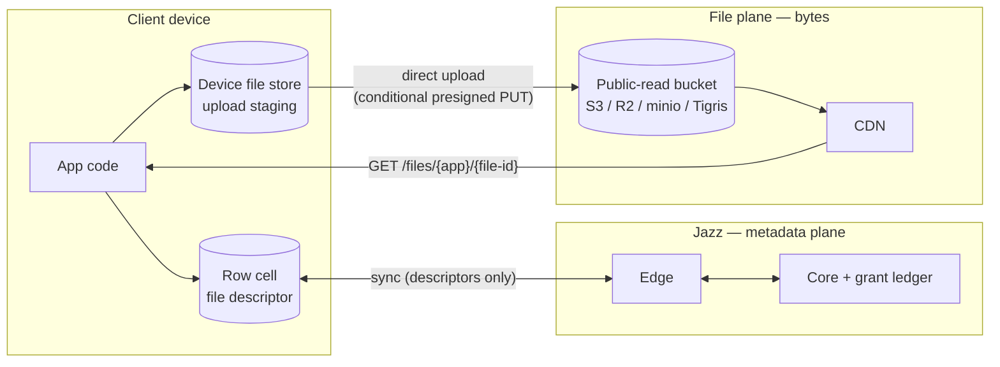
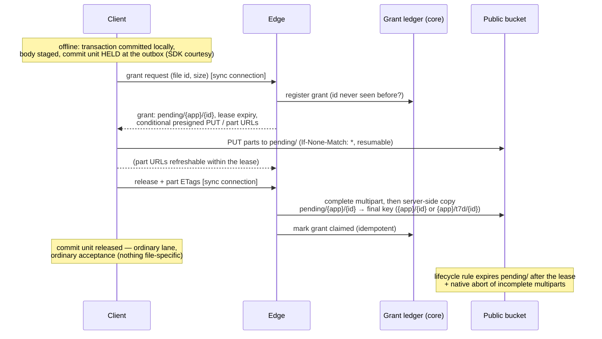
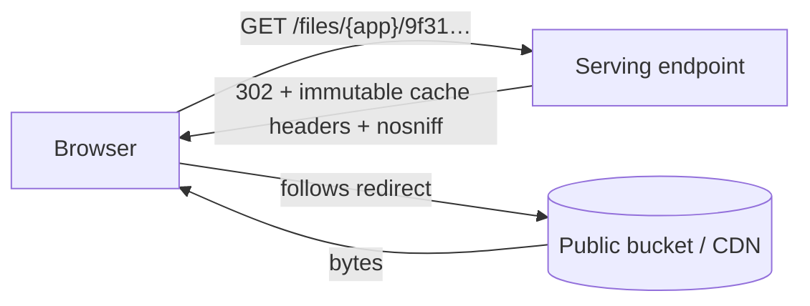

# Files in Jazz — the design, explained

```ts
const avatar = await jazz.files.fromBlob(blob);        // offline-capable
await db.profiles.update(me.id, { avatar });           // a normal column write

                          // a plain URL
```

## The big picture: two planes

Metadata and bytes follow two different roads:

- metadata is stored as column data (like for s.json())
- bytes are uploaded to S3



Why this split, rather than pushing bytes through sync like large blobs do
today:

- **Cost.** Large blobs make every gigabyte pass through Jazz compute and
  land in Jazz storage — the expensive tier. Object storage plus CDN egress
  is the cheap tier, and because uploads go browser→S3 and downloads go
  CDN→browser, our servers never carry the bytes at all. Billing becomes
  "storage + egress", which is exactly what the object store already meters.
- **URLs.** The web already knows how to display a file: give it a URL. By
  serving bytes at `GET /files/{app}/{file-id}`, every file works in
  ``, `<video>`, and pasted links with zero SDK involvement on the read
  path.

## Choice 1: a file is a value in your row

There is no file table and no new entity to manage. **File is a column
type.** You put it wherever the file belongs, next to the data it belongs
to:

```ts
const appSchema = {
  profiles: s.table({
    handle: s.string(),
    avatar: s.file(), // the file lives ON the profile row
    banner: s.file(), // more than one is fine
  }),
  messages: s.table({
    text: s.string(),
    attachment: s.file(), // optional like any column
  }),
};
```

Under the hood this is the same trick `s.json()` already plays: a
schema-level column kind that stores its value as canonical JSON text. No
new value type exists anywhere in the stack — not in the row format, not in
the WASM/NAPI bindings — only a schema facade plus one write-path check
that the _shape_ is right.

The cell holds a **file descriptor** — a small versioned value naming one
body:

| Field       | Meaning                                                                                                    |
| ----------- | ---------------------------------------------------------------------------------------------------------- |
| `v`         | descriptor version (`1`); strict on write, lenient on read                                                 |
| `file id`   | client-minted, **mandated cryptographically random** (UUIDv4-grade); the object key and URL derive from it |
| `name`      | filename at creation (download filename)                                                                   |
| `mime_type` | content type, pinned onto the object at upload                                                             |
| `size`      | body length in bytes, as declared by the uploader                                                          |
| `ttl`       | optional TTL class from the deployment's set (`"7d"`); absent = permanent; fixed at creation               |

Two things make this easy to reason about — and note what's _not_ on the
list:

- **The descriptor is a convention, not an enforced invariant.** Jazz
  validates its shape (canonical `v:1` JSON, known fields) and nothing
  else. Editing fields in place, copying a descriptor into another cell,
  even hand-writing one — all ordinary column writes under the ordinary
  update policy. What stays hard is the _body_: it is immutable at the
  bucket (an id is never granted twice, and the store itself refuses a
  write to an occupied key), so no write to any cell can change any bytes.
  `name`/`mime_type`/`size` are app-trusted metadata — the same class as
  the `hash` we deliberately dropped: a lying value misleads only that
  app's own readers.
- **Queryable metadata is a sibling column.** The file cell is opaque to
  the query layer (whole-value equality, null checks — text semantics).
  Anything you filter or sort by — display names, tags, a size you trust —
  lives in real columns on the same row.

Why a column instead of a dedicated file table (the shape we discarded):

- The file sits **where the data is** — no side table, no foreign key, no
  join to render a profile with its avatar.
- **Permissions collapse to the obvious thing**: the host table's row
  policies. There is no parallel file table whose policies must mirror the
  referencing table's.
- The column model **subsumes** the table model: a drive-style app is just
  `s.table({ content: s.file(), ...metadata })`. The reverse isn't true — a
  file table can't put an avatar directly on the profile row.

## Choice 2: every file is public by URL — on a public-read bucket

Every file is readable by anyone who has its URL. Full stop.

```
https://<host>/files/{app}/9f31c2ae-…     ← stable, unauthenticated, forever
```

The bucket itself is **public-read**: anonymous `GetObject` allowed,
listing denied. That one decision is what makes the caching story clean —
there are no signed GET URLs anywhere, so nothing in the read path ever
expires. The serving endpoint just 302-redirects to the public object URL
(the path mirrors the object key `{app}/{file-id}` exactly, so no lookup is
needed), and deployments can equally point a CDN straight at the bucket.

What the permissions system does and does not cover:

```
                 ┌──────────────────────────────────┐
   row policies  │  METADATA (the host row)         │  read  → who syncs it
   gate this ──▶ │  descriptor + sibling columns    │  update→ who edits cells
                 │                                  │  delete→ who deletes rows
                 └──────────────────────────────────┘
                 ┌──────────────────────────────────┐
   nothing gates │  BYTES (the body)                │  anyone with the URL
   this ───────▶ │  GET /files/{app}/{file-id}      │  reads them
                 └──────────────────────────────────┘
```

Why public-only instead of the classic published/private split:

- **Caching gets trivial.** Immutable bodies at never-expiring public URLs
  mean unconditional `Cache-Control: immutable` for permanent files (and a
  `max-age` capped to the class for TTL'd ones), so any CDN can cache every
  body confidently. Private files would have forced short-TTL signed URLs,
  mint round-trips, and a revocation asterisk on caching.
- **Serving gets flat.** A download is one redirect — no Jazz DB lookup, no
  policy evaluation, no auth. Cost per download is effectively the CDN's.
- **Honesty.** Byte-level access control through signed URLs is
  bearer-token security with TTL caveats — easy to mistake for more than it
  is. "Bytes are public, metadata is permissioned" is a rule developers can
  hold in their head.

The value Jazz adds to files is the **integrated experience** — files as
values in your own relational rows, synced, subscribed, permission-gated as
metadata — plus **offline capability**. Apps with genuinely confidential
content keep it out of files or encrypt client-side; byte-level access
control can be layered on later without changing the URL scheme.

## Choice 3: upload is offline-first — and nobody verifies anything

Creating a file works with the network unplugged, because it is just a local
byte write plus a normal transaction:

```ts
const attachment = await jazz.files.fromBlob(blob);
await db.messages.insert({ text: "look at this", attachment });
// committed locally; the body sits in the device file store (upload staging)
```



The decisions hiding in that diagram:

- **Nothing is verified — deliberately.** There is no HEAD, no size check,
  no file-specific acceptance step. Everything verification used to protect
  is either already unprotected by choice (descriptor fields are
  app-trusted) or handled structurally: overwrites are impossible at the
  bucket, and unreleased uploads are garbage-collected by the bucket
  itself. A client that lies — releases without uploading, declares the
  wrong size — harms only its own descriptor, whose URL 404s or
  misdescribes its own body. No one else's path carries the cost of
  checking.
- **Release is the only ceremony: complete + copy + claim.** Uploads land
  under `pending/{app}/{id}`. On release the edge completes the multipart
  (it holds the `UploadId`), server-side-copies the object to its final
  key — permanent, or the file's TTL-class prefix — the copy is what makes
  the public URL go live — and marks the grant claimed in the ledger. All
  idempotent: a retried release returns the recorded outcome.
- **Cleanup is the bucket's job, not a sweeper's.** A lifecycle rule
  expires the `pending/` prefix after the lease window (days), and the
  native incomplete-multipart abort rule covers half-finished uploads.
  Prefix-based, so it works on S3, R2, minio, and Tigris alike. No sweep
  machinery exists; grant farming accumulates nothing past the lease. After
  an expiry the SDK just restarts with a fresh id (ids are never granted
  twice).
- **The hold is an SDK courtesy, not a server gate.** The transaction that
  writes a `fromBlob` descriptor (including its sibling columns) waits at
  the outbox until release, so files created through the upload path are
  fetchable by the time other devices see them. Later, unrelated commit
  units bypass the held one — one slow 2 GB video never stalls the session.
  An app that wants the message text visible before the upload finishes
  models the file cell in its own row and renders its own pending state.
- **The grant ledger is small and permanent**: file id → uploader identity
  - granted/claimed. Consulted exactly three times — issue (never re-grant
    an id), release (mark claimed), delete (who may). That's the whole
    server-side brain of the file plane.

No second credential system exists anywhere in this: grant, part-URL
refresh, release, and delete are messages on the already-authenticated sync
connection.

The client observes all of it through one state machine on the handle:

```
local ──▶ uploading(progress) ──▶ released ──▶ accepted
                                          └──▶ rejected
```

where accepted/rejected are the ordinary transaction fates — and the
"unreleased files on this device" signal matters, because until release the
creating device holds the only copy.

## Choice 4: download is a redirect to a public object



One HTTP endpoint, `GET /files/{app}/{file-id}` (with the TTL class in the
path for classed files, mirroring the key), is the entire read-path
surface, and it does nothing but translate the path into the public object
URL — same key, no database, no policy check, no signature. Range requests
(video seeking) are handled natively by the store/CDN. Because bodies are
immutable and the public URL never changes meaning,
`Cache-Control: immutable` has no asterisks for permanent files — a CDN can
hold a body forever — and TTL'd files carry a `max-age` capped to their
class instead.

`file.url()` is therefore **pure local string construction** — no round
trip, no async step, no expiry:

```tsx

<video src={msg.attachment.url()} />
```

One honest caveat: the URL goes live at **release** (the copy to the
permanent key). Before that it 404s — which is fine, because the only party
who can render the file before release is the device that just created it,
and that device is already holding the Blob (see the API section).

## Choice 5: reads are the web's — offline lives _below_ the URL

The SDK has **no `toBlob`, no `toStream`**. Reading a file is
`fetch(file.url())` — userland, like any other web resource:

```ts
const blob = await (await fetch(msg.attachment.url())).blob();
```

The dominant read path is a URL in an ``/`<video>` tag, whose bytes
never pass through the SDK — so an SDK-level cache could never make files
work offline. The offline layer therefore sits _below_ the URL, as a
**per-platform interceptor** that every URL load passes through. Both
interceptors run the same three-step logic over the device file store:
serve this device's **staged** body (own files render immediately —
offline, even before release), else serve the **cached** body, else fetch
through and write the cache.

- **Web: a Jazz-shipped service worker** intercepting `/files/*` — the
  mechanism the web uses for every other offline asset, and the only one
  that also covers plain `` tags. The app registers it once. Caveat:
  no SW controls the very first page load, so requests then fall through
  to the network — the Blob-in-hand preview never fully dies.
- **React Native: a loopback HTTP server** inside the Jazz native module —
  there are no service workers on RN, and images/video load through native
  networking that JS can't intercept, so the interception point becomes a
  local URL. On RN, `file.url()` returns
  `http://127.0.0.1:<port>/<secret>/files/{app}/{file-id}`, which makes
  `<Image>`, video components, and WebViews work unmodified. One Rust
  implementation over the same device file store. Bound to loopback only,
  random port, per-boot secret path segment (other apps on the device can
  reach localhost); it dies when the app is suspended — fine, nothing
  renders then. URLs you store or share must be canonical:
  `url({ canonical: true })`.

The device file store accordingly holds two classes of bodies, and only
interceptors read it: **staged** (created here, kept until the writing
transaction is accepted — never evicted before that; possibly the only
copy in existence) and **cached** (keyed by file id — safe, bodies are
immutable — LRU-evicted under a configurable budget; eviction is
reversible, bodies are refetchable by URL). Any file opened once is
readable offline, and your own files are readable offline from the moment
you create them.

## Choice 6: deletion is explicit — cells never kill bodies, but time can

Editing rows never deletes bytes. Overwrite a file cell, null it, delete
the whole row — the object stays. Copies of a descriptor, history, and
branches all stay coherent by default, and there is no settle-observation
machinery deciding when a body is "unreferenced."

Bodies leave the bucket exactly two ways. The first is a deliberate call:

```ts
await jazz.files.delete(msg.attachment.id);
```

- **Who may:** the uploader identity — recorded in the grant ledger when
  the grant was issued — or the app's backend surface. Richer rules
  ("album owners can delete") are app-backend logic that ends in a backend
  delete call.
- **How it runs:** the request travels over the sync connection like grant
  and release; the core executes it durably — a durable queue of
  idempotent, retried DELETEs — so an accepted delete always eventually
  happens. The URL then 404s; CDN-cached copies age out on their own
  (immutable caching makes purge best-effort at most, and the design says
  so rather than pretending otherwise).
  The second is **a TTL, picked at creation**:

```ts
const attachment = await jazz.files.fromBlob(blob, { ttl: "7d" });
```

- **How it works:** the deployment declares a fixed set of TTL classes
  (recommended defaults: `1d`, `7d`, `30d`; permanent is the default). The
  class rides in the descriptor and in the object key —
  `{app}/t7d/{id}` — and each class is one bucket lifecycle rule on its
  prefix: the same zero-code mechanism that already expires `pending/`.
  The clock starts at release (the copy is what creates the object), and
  expiry deletes the body only — descriptor cells remain and their URLs
  404, like any bodyless descriptor.
- **The honest edges:** classes are day-grained (lifecycle granularity),
  fixed for the file's life (extension would be a clock-resetting re-copy
  — deferred), and a CDN may serve a cached copy up to one class-length
  past expiry, since `max-age` is capped to the class rather than
  synchronized with it. Need tighter? Pick a shorter class.
- **The flip side, stated plainly:** permanent storage persists until
  someone deletes it. An app that wants tidy storage deletes when its
  domain says so, or creates with a `ttl` — Jazz won't guess from row
  edits.

Descriptors pointing at a deleted or expired body — live cells, copies,
historical reads, branches — are all the same ordinary state: metadata
readable, URL 404s. **Bodyless descriptors are legal**, not a crash.

## The API, end to end

```ts
// declare — a file column wherever a file belongs
const appSchema = {
  messages: s.table({
    text: s.string(),
    attachment: s.file(),
  }),
};

// create — offline-capable, background upload
const attachment = await jazz.files.fromBlob(blob);
const msg = await db.messages.insert({ text: "specs attached", attachment });

// or create ephemeral — the bucket deletes the body after the class expires
const preview = await jazz.files.fromBlob(blob, { ttl: "7d" });

// preview immediately — you already hold the bytes; the URL goes live at release
img.src = URL.createObjectURL(blob);

// observe the upload
attachment.uploadState.subscribe((st) => {
  // "local" | "uploading" (with progress) | "released" | "accepted" | "rejected"
});

// render once released — plain URL, no async, no auth
;

// read bytes — userland, like any web resource
const blob2 = await (await fetch(msg.attachment.url())).blob();

// replace — swap the cell to a fresh upload (the old body stays until deleted)
await db.messages.update(msg.id, {
  attachment: await jazz.files.fromBlob(newBlob),
});

// remove the reference — kill the cell (bytes untouched)
await db.messages.update(msg.id, { attachment: null });

// remove the bytes — explicit, uploader-or-backend only
await jazz.files.delete(oldAttachment.id);
```

(`fromBlob` follows the existing `file-storage.ts` runtime shape; its
`toBlob`/`toStream`/`fromStream` siblings are deliberately not carried over.
Exact builder spellings like `s.file` may shift during implementation.)

## What we deliberately didn't build

| Not built                           | Because                                                                                                                                                        |
| ----------------------------------- | -------------------------------------------------------------------------------------------------------------------------------------------------------------- |
| A file table / built-in file rows   | the column subsumes it (a files table is a table with a file column) and puts files where the data is                                                          |
| Private files / signed URLs         | would poison caching and flat-cost serving; metadata permissions + mandated-entropy ids are the v1 story                                                       |
| Descriptor immutability enforcement | it protected an app only from itself; the body is immutable at the bucket, which is the part that matters                                                      |
| Body verification                   | everything it protected is either app-trusted by choice or handled structurally (conditional PUTs, pending-prefix TTL)                                         |
| Automatic deletion on cell death    | inference machinery + refcounting questions for a call the app can make explicitly; `jazz.files.delete` is the one reclamation                                 |
| Server sweep for unclaimed uploads  | the bucket's own lifecycle rules (prefix expiry + multipart abort) do it with zero code                                                                        |
| SDK read API (`toBlob`/`toStream`)  | the real read path is the URL; blob derivation is two lines of userland `fetch`                                                                                |
| SDK-level offline reads             | only URL interceptors can honestly provide offline (they cover `` tags); v1 ships a web SW and an RN loopback server instead                              |
| `fromStream` / unknown-size upload  | the grant needs `size` up front; a Blob knows it, a stream doesn't                                                                                             |
| Content hashing & dedup             | hash protects only the uploader's own readers; dedup needs refcounting before deletion is safe                                                                 |
| Lists of files in one cell          | one file column per cell in v1; use multiple columns or a side table                                                                                           |
| Upload through Jazz servers         | our bandwidth would pay for every upload                                                                                                                       |
| Standalone file service             | second deployable + duplicated policy evaluation; revisit when traffic warrants                                                                                |
| Rate limits / per-identity quotas   | the pending-prefix TTL bounds storage abuse in v1; rate limits on grants and egress are planned future work                                                    |
| Exact per-file expiry timestamps    | portable lifecycle rules are per-prefix, days-granular; TTL classes ride them with zero machinery — arbitrary timestamps would need a scheduled-delete service |
| TTL extension / shortening          | a re-copy that resets the lifecycle clock; deferred until a real need appears                                                                                  |

Each of these is expanded in the design doc's "Rejected alternatives"
section — required reading before reopening any of them.
