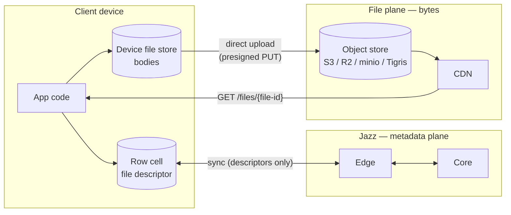
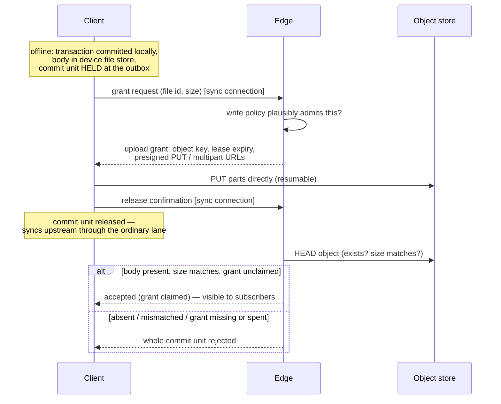
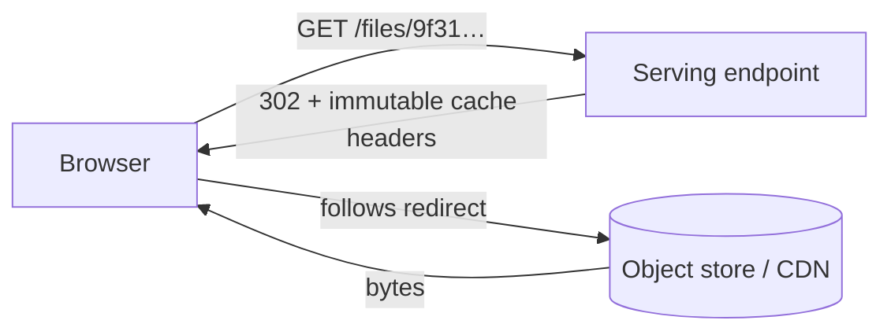

# Files in Jazz — the design, explained

Date: 2026-07-09
Audience: humans. The implementation-facing PRD is
`2026-07-09-files-spec.md`; the grilled design rationale is
`2026-07-08-files-design.md` (this document and the PRD supersede its
file-table data model and its private-files split). This document explains
the design in plain language, with diagrams and API examples.

## The one-sentence version

A file in Jazz is a value in one of your own rows — a small immutable
descriptor in a cell — while the bytes live on cheap object storage:
created offline like any write, uploaded in the background, and served to
the whole web through one stable public URL.

```ts
const avatar = await jazz.files.fromBlob(blob);        // offline-capable
await db.profiles.update(me.id, { avatar });           // a normal column write

                          // a plain URL
```

## The big picture: two planes

The core split is that **metadata and bytes travel completely different
roads**. The descriptor rides the existing Jazz machinery like any cell
value. The bytes never touch it.



Why this split, rather than pushing bytes through sync like large blobs do
today:

- **Cost.** Large blobs make every gigabyte pass through Jazz compute and
  land in Jazz storage — the expensive tier. Object storage plus CDN egress
  is the cheap tier, and because uploads go browser→S3 and downloads go
  CDN→browser, our servers never carry the bytes at all. Billing becomes
  "storage + egress", which is exactly what the object store already meters.
- **URLs.** The web already knows how to display a file: give it a URL. By
  serving bytes at `GET /files/{file-id}`, every file works in ``,
  `<video>`, and pasted links with zero SDK involvement on the read path.
- **History hygiene.** Rows are editable and versioned; bodies are immutable
  and huge. Keeping bodies out of the database keeps history, branches, and
  sync payloads small.

## Choice 1: a file is a value in your row

There is no file table and no new entity to manage. **File is a column
type.** You put it wherever the file belongs, next to the data it belongs
to:

```ts
const appSchema = {
  profiles: s.table({
    handle: s.string(),
    avatar: s.file(), // the file lives ON the profile row
    banner: s.file(), // more than one is fine
  }),
  messages: s.table({
    text: s.string(),
    attachment: s.file(), // optional like any column
  }),
};
```

The cell holds a **file descriptor** — an immutable value naming exactly one
body:

| Field       | Meaning                                                          |
| ----------- | ---------------------------------------------------------------- |
| `file id`   | client-minted opaque name; the object key and URL derive from it |
| `name`      | filename at creation (download filename)                         |
| `mime_type` | content type                                                     |
| `size`      | bytes, server-verified                                           |

Two rules make the whole system easy to reason about:

- **The descriptor is immutable.** You never edit its fields. "Replace the
  file" means uploading new bytes and swapping the _whole cell_ to the new
  descriptor — an ordinary column update, gated by the ordinary update
  policy. Each descriptor-body pair is immutable forever, which is what lets
  every cache downstream treat bodies as never-changing.
- **Mutable metadata is a sibling column.** A display name the user can
  edit, captions, tags — those are normal columns on the same row, queryable
  and policy-gated like everything else. File identity and app metadata
  never fight.

Why a column instead of a dedicated file table (the shape we discarded):

- The file sits **where the data is** — no side table, no foreign key, no
  join to render a profile with its avatar.
- **Permissions collapse to the obvious thing**: the host table's row
  policies. There is no parallel file table whose policies must mirror the
  referencing table's.
- The column model **subsumes** the table model: a drive-style app is just
  `s.table({ content: s.file(), ...metadata })`. The reverse isn't true — a
  file table can't put an avatar directly on the profile row.

There is deliberately **no `hash` field**. Bodies are single-writer and
immutable, so a hash declared by the uploader would only protect the
uploader's own readers from the uploader — little value for real
verification cost. Apps that want tamper-evidence add their own column.

## Choice 2: every file is public by URL

Every accepted file is readable by anyone who has its URL. Full stop.

```
https://<host>/files/9f31c2ae-…        ← stable, unauthenticated, forever
```

What the permissions system does and does not cover:

```
                 ┌──────────────────────────────────┐
   row policies  │  METADATA (the host row)         │  read  → who syncs it
   gate this ──▶ │  descriptor + sibling columns    │  update→ who swaps/renames
                 │                                  │  delete→ who deletes
                 └──────────────────────────────────┘
                 ┌──────────────────────────────────┐
   nothing gates │  BYTES (the body)                │  anyone with the URL
   this ───────▶ │  GET /files/{file-id}            │  reads them
                 └──────────────────────────────────┘
```

The only thing standing between the world and the bytes is that the file id
in the URL is unguessable.

Why public-only instead of the classic published/private split:

- **Caching gets trivial.** No per-download policy check and no signed URLs
  means every response carries long-lived immutable cache headers, and any
  CDN can cache every body unconditionally. Private files would have forced
  short-TTL signed URLs, mint round-trips, and a revocation asterisk on
  caching.
- **Serving gets flat.** A download is one redirect — no Jazz DB lookup, no
  policy evaluation, no auth. Cost per download is effectively the CDN's.
- **Honesty.** Byte-level access control through signed URLs is bearer-token
  security with TTL caveats — easy to mistake for more than it is. "Bytes
  are public, metadata is permissioned" is a rule developers can hold in
  their head.

The value Jazz adds to files is the **integrated experience** — files as
values in your own relational rows, synced, subscribed, permission-gated as
metadata — plus **offline capability**. Apps with genuinely confidential
content keep it out of files or encrypt client-side; byte-level access
control can be layered on later without changing the URL scheme.

## Choice 3: upload is offline-first, with leases

Creating a file works with the network unplugged, because it is just a local
byte write plus a normal transaction:

```ts
const attachment = await jazz.files.fromBlob(blob);
await db.messages.insert({ text: "look at this", attachment });
// row committed locally, bytes in the device file store —
// the creating device can render everything right now, offline
```

The interesting part is what happens between "created offline" and "visible
to everyone", because Jazz never shows anyone a descriptor whose bytes don't
exist yet:



Four decisions hide in that diagram:

- **The hold takes the whole transaction — and that's a feature.** The
  transaction that writes a fresh descriptor (including its sibling columns)
  waits at the outbox until the body is confirmed uploaded. So when the
  message above arrives at another device, the attachment is already
  fetchable: **a descriptor you can see is a file you can get**. There is no
  "pending attachment" protocol state to handle.
- **Independent writes bypass; you choose early visibility.** Later,
  unrelated commit units skip past the held one and sync normally — one
  slow 2 GB video never stalls the rest of the session. If an app _wants_
  the message text visible before the upload finishes, it models the file
  cell in its own row (an attachments row) and renders its own pending
  state — an app choice, not a forced semantic.
- **Grants are leases.** An upload grant expires if unclaimed within its
  window (days, operator-tunable); the edge then deletes the uploaded
  object. That is the whole storage-abuse story — no general garbage
  collector. The lease window is also the resume window: completed multipart
  part ETags persist locally, so an app restart resumes where it left off
  while the lease is alive.
- **A grant is claimable exactly once.** Acceptance consumes it. That means
  one file id lives in exactly one cell, ever — copying a descriptor into a
  second cell is rejected — which is precisely what makes deletion (below)
  sound without refcounting.

No second credential system exists anywhere in this: grant and release are
messages on the already-authenticated sync connection. Whatever admitted the
session (JWT, bearer, anonymous) authorizes file operations.

The client observes all of it through one state machine on the handle:

```
local ──▶ uploading(progress) ──▶ released ──▶ accepted
                                          └──▶ rejected
```

which is the existing durability-tier story extended by one file-specific
stage — and the app's surface for "this device holds unreleased files",
which matters because until release, the creating device holds the only
copy.

## Choice 4: download is a redirect



One HTTP endpoint, `GET /files/{file-id}`, is the entire read-path surface.
It redirects to a presigned object-store URL (or streams, for backends that
cannot presign). No cookies, no headers, no policy check, no database.
`Content-Type` and the download filename are object metadata, set at upload
from the descriptor. Because bodies are immutable and URLs never change
meaning, `Cache-Control: immutable` has no asterisks — a CDN can hold a
body forever.

`file.url()` is therefore **pure local string construction** — no round
trip, no async step, no expiry:

```tsx

<video src={msg.attachment.url()} />
```

## Choice 5: offline reads through the device cache

The device file store holds two kinds of bodies:

- **Pinned** — bodies this device created, kept at least until the writing
  transaction is accepted upstream (they may be the only copy in
  existence).
- **Cached** — downloaded bodies, keyed by file id (safe: bodies are
  immutable and 1:1 with file ids), LRU-evicted under a configurable
  budget.

```ts
const blob = await jazz.files.toBlob(msg.attachment); // cache first
const stream = await jazz.files.toStream(msg.attachment); // same, streaming
```

Reads check the cache before the network and write fetched bodies through
it, so **any file opened once is readable offline**. Eviction is the
reversible kind — an evicted body is refetchable by URL. A cold-cache read
with no network fails with a typed "body unavailable offline" error (the
analogue of today's `IncompleteFileDataError`), so apps render a real
fallback instead of a spinner. No automatic prefetch in v1; offline
availability is earned by opening the file.

## Choice 6: deletion is "the cell died"

There is no delete-a-file operation, because there is nothing extra to
delete. A file's body is deleted when its cell dies, through ordinary,
policy-gated writes:

- the cell is **overwritten** with a new descriptor (file replaced),
- the cell is **set to null** (file removed),
- the **row is deleted**.

The one-live-cell rule from Choice 3 makes "this body is unreferenced"
exact, so responsibility can have a single owner: the **core** — the one
place that observes writes settle globally — appends the dead file id to a
durable deletion queue and issues idempotent, retried DELETEs against the
object store. The metadata change is visible immediately; the object
disappears eventually; the URL then 404s. CDN-cached copies age out on
their own — with immutable caching, purge is best-effort at most, and the
design says so rather than pretending otherwise.

One deliberate wrinkle: **bodyless history**. Historical reads and branches
can surface a descriptor at a past cut after its object is deleted. That is
correct, not a bug — bodies live outside history, so deleting an object is
truncation-like for the bytes while the descriptor stays readable. Reading
such a body fails with the same typed missing-body error as a cold cache.

## The API, end to end

```ts
// declare — a file column wherever a file belongs
const appSchema = {
  messages: s.table({
    text: s.string(),
    attachment: s.file(),
  }),
};

// create — offline-capable, background upload
const attachment = await jazz.files.fromBlob(blob);
const msg = await db.messages.insert({ text: "specs attached", attachment });

// observe the upload
attachment.uploadState.subscribe((st) => {
  // "local" | "uploading" (with progress) | "released" | "accepted" | "rejected"
});

// render — plain URL, no async, no auth
;

// read the bytes — device cache first
const blob2 = await jazz.files.toBlob(msg.attachment);

// replace — swap the whole cell to a fresh upload (old body gets deleted)
await db.messages.update(msg.id, {
  attachment: await jazz.files.fromBlob(newBlob),
});

// remove — kill the cell (or delete the row)
await db.messages.update(msg.id, { attachment: null });
```

(Names follow the existing `file-storage.ts` runtime shapes — `fromBlob`,
`fromStream`, `toBlob`, `toStream` — re-backed onto the file plane; exact
builder spellings like `s.file` may shift during implementation.)

## What we deliberately didn't build

| Not built                          | Because                                                                                               |
| ---------------------------------- | ----------------------------------------------------------------------------------------------------- |
| A file table / built-in file rows  | the column subsumes it (a files table is a table with a file column) and puts files where the data is |
| Private files / signed URLs        | would poison caching and flat-cost serving; metadata permissions + unguessable ids are the v1 story   |
| Content hashing & dedup            | hash protects only the uploader's own readers; dedup needs refcounting before deletion is safe        |
| Descriptor move/copy between cells | needs refcounting or a transfer protocol; v1 is one file id, one live cell                            |
| Lists of files in one cell         | one file column per cell in v1; use multiple columns or a side table                                  |
| Upload through Jazz servers        | our bandwidth would pay for every upload                                                              |
| Standalone file service            | second deployable + duplicated policy evaluation; revisit when traffic warrants                       |
| General orphan GC                  | grant leases + an S3 lifecycle rule already close the abuse faucet                                    |
| Automatic prefetch                 | the read-through cache covers offline; prefetch is policy, apps know theirs                           |
| Per-identity quotas                | leases bound abuse; accounting is future work                                                         |

Each of these is expanded in the design doc's "Rejected alternatives"
section — required reading before reopening any of them.
