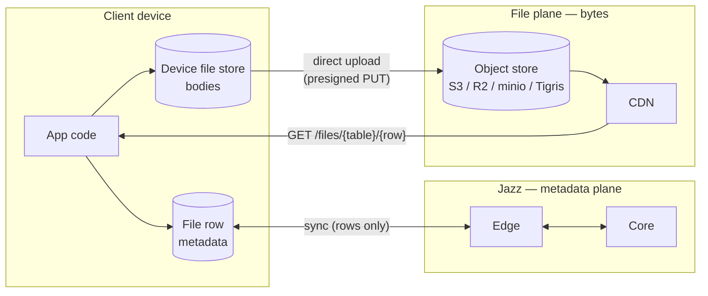
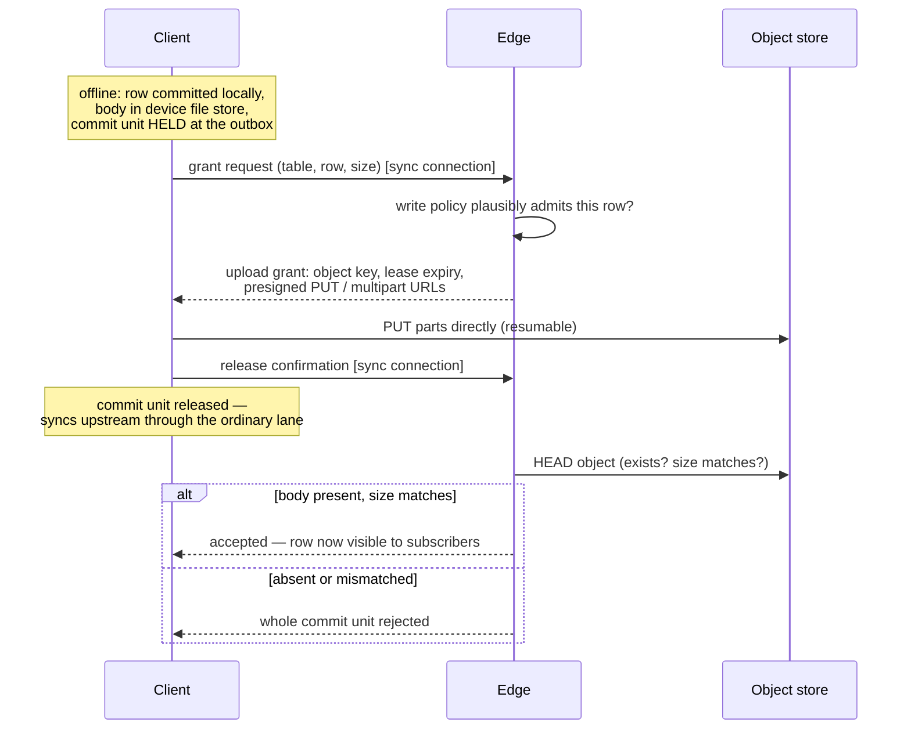
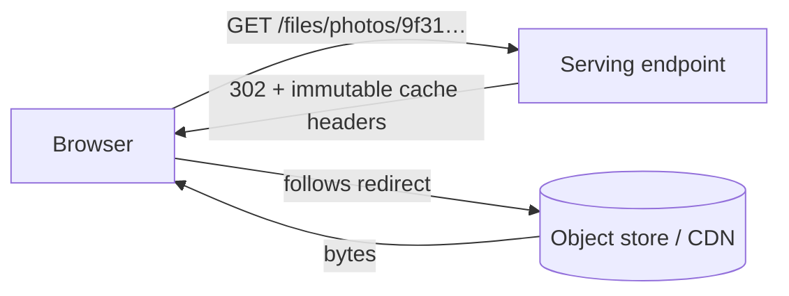

# Files in Jazz — the design, explained

Date: 2026-07-09
Audience: humans. The implementation-facing PRD is
`2026-07-09-files-spec.md`; the grilled design rationale is
`2026-07-08-files-design.md`. This document explains the same design in
plain language, with diagrams and API examples.

## The one-sentence version

A file in Jazz is an ordinary database row for the metadata, plus an
immutable blob on cheap object storage for the bytes — created offline like
any row, uploaded in the background, and served to the whole web through one
stable public URL.

```ts
const photo = await db.files.fromBlob(blob, { name: "sunset.jpg" });
// usable immediately, uploads in the background


// a plain URL — works in , <video>, links, CDNs
```

## The big picture: two planes

The core split is that **metadata and bytes travel completely different
roads**. Metadata rides the existing Jazz machinery. Bytes never touch it.



Why this split, rather than pushing bytes through sync like large blobs do
today:

- **Cost.** Large blobs make every gigabyte pass through Jazz compute and
  land in Jazz storage — the expensive tier. Object storage plus CDN egress
  is the cheap tier, and because uploads go browser→S3 and downloads go
  CDN→browser, our servers never carry the bytes at all. Billing becomes
  "storage + egress", which is exactly what the object store already meters.
- **URLs.** The web already knows how to display a file: give it a URL. By
  serving bytes at `GET /files/{table}/{row}`, every file works in ``,
  `<video>`, and pasted links with zero SDK involvement on the read path.
- **History hygiene.** Rows are editable and versioned; bodies are immutable
  and huge. Keeping bodies out of the database keeps history, branches, and
  sync payloads small.

## Choice 1: a file is a row

There is no new "file object" concept. A **file table** is a normal table,
declared as a file table through the schema builder, and its rows behave
like any rows: query them, subscribe to them, reference them by foreign key,
protect them with row policies.

```ts
const appSchema = {
  photos: s.fileTable({
    // built-ins arrive for free: name, mime_type, size
    caption: s.string(), // plus any app columns you want
    album_id: s.ref("albums"),
  }),
  albums: s.table({ title: s.string() }),
};
```

The built-in columns encode what a file _is_:

| Column      | Mutability | Why                                              |
| ----------- | ---------- | ------------------------------------------------ |
| `name`      | updatable  | renaming must not touch the body                 |
| `mime_type` | frozen     | a file's identity must not change under a reader |
| `size`      | frozen     | server-verified against the actual bytes         |

"Frozen" is enforced at acceptance: once the row exists, any update to a
frozen column is rejected. The body itself is **immutable** — one row, one
body, forever. "Replace the file" means "create a new row"; that is what
lets every downstream cache treat bodies as never-changing.

There is deliberately **no `hash` column**. Bodies are single-writer and
immutable, so a hash declared by the uploader would only protect the
uploader's own readers from the uploader — little value for real
verification cost. Apps that want tamper-evidence add their own metadata
column.

## Choice 2: every file is public by URL

Every accepted file is readable by anyone who has its URL. Full stop.

```
https://<host>/files/photos/9f31c2ae-…      ← stable, unauthenticated, forever
```

What the permissions system does and does not cover:

```
                 ┌──────────────────────────────┐
   row policies  │  METADATA (the file row)     │   read  → who syncs it
   gate this ──▶ │  name, mime_type, size, app  │   update→ who renames etc.
                 │  columns, the row's existence│   delete→ who deletes
                 └──────────────────────────────┘
                 ┌──────────────────────────────┐
   nothing gates │  BYTES (the body)            │   anyone with the URL
   this ───────▶ │  GET /files/{table}/{row}    │   reads them
                 └──────────────────────────────┘
```

The permissions live **on the file table** and gate the metadata exactly as
on any other table. The only thing standing between the world and the bytes
is that the row id in the URL is unguessable.

Why we chose public-only instead of the classic published/private split:

- **Caching gets trivial.** With no per-download policy check and no signed
  URLs, every response can carry long-lived immutable cache headers, and any
  CDN can cache every body unconditionally. Private files would have forced
  short-TTL signed URLs, mint round-trips, and a revocation asterisk on
  caching.
- **Serving gets flat.** A download is one redirect — no Jazz DB lookup, no
  policy evaluation, no auth. Cost per download is effectively the CDN's.
- **Honesty.** Byte-level access control through signed URLs is bearer-token
  security with TTL caveats — easy to mistake for more than it is. Saying
  "bytes are public, metadata is permissioned" is a rule developers can hold
  in their head.

The value Jazz adds to files is the **integrated experience** — files as
relational rows, synced, subscribed, referenced — plus **offline
capability**. Apps with genuinely confidential content keep it out of files
or encrypt client-side; if byte-level access control is ever wanted, it can
be layered on later without changing the URL scheme.

## Choice 3: upload is offline-first, with leases

Creating a file works with the network unplugged, because creating a file is
just a local transaction plus a local byte write:

```ts
const photo = await db.files.fromBlob(blob, { name: "sunset.jpg" });
// row committed locally, bytes in the device file store —
// the creating device can render it right now, offline
```

The interesting part is what happens between "created offline" and "visible
to everyone", because Jazz must never show other subscribers a file row
whose bytes don't exist yet:



Three decisions hide in that diagram:

- **The hold does not block anyone.** The file's commit unit waits at the
  outbox until release, but _later commit units bypass it_ and sync
  normally. Consequence, stated as a first-class semantic: a transaction
  that references a not-yet-uploaded file can arrive at other devices before
  the file row does. Apps render a placeholder — the same discipline as any
  local-first read. The alternative (strict FIFO) would let one slow 2 GB
  video stall every unrelated write behind it.
- **Grants are leases.** An upload grant expires if no accepted row claims
  it within its window (days, operator-tunable); the edge then deletes the
  uploaded object. This is the whole storage-abuse story: an identity
  farming grants accumulates nothing past the lease horizon, with no
  general garbage collector needed. The lease window is also the resume
  window — completed multipart part ETags persist locally, so an app
  restart resumes where it left off, as long as the lease is alive.
- **No second credential system.** Grant and release are messages on the
  already-authenticated sync connection. Whatever admitted the session
  (JWT, bearer, anonymous) is what authorizes file operations — no extra
  tokens to design, leak, or refresh.

The client observes all of this through one state machine on the handle:

```
local ──▶ uploading(progress) ──▶ released ──▶ accepted
                                          └──▶ rejected
```

which is the existing durability-tier story extended by one file-specific
stage — and the app's surface for "you have unreleased files on this
device", which matters because until release, the creating device holds the
only copy.

## Choice 4: acceptance means the bytes exist

The invariant that makes everything downstream simple:

> **Any file row a subscriber can see has its body present on the object
> store.**

Acceptance includes **body verification** — one HEAD request proving the
object exists and its size matches the frozen `size` column. Absence or
mismatch rejects the whole commit unit, surfaced on the write handle like
any rejected transaction. Nothing else is checked (see the no-hash
rationale above), and nothing needs to be: readers never poll for "upload
finished", never handle a "pending body" state on the row itself, and the
serving endpoint never 404s for a row you can see — short of an operator
deleting objects by hand.

## Choice 5: download is a redirect



One HTTP endpoint, `GET /files/{table}/{row}`, is the entire read-path
surface. It redirects to a presigned object-store URL (or streams, for
backends that cannot presign). No cookies, no headers, no policy check, no
database. Because bodies are immutable and URLs never change meaning, the
`Cache-Control: immutable` story has no asterisks — a CDN can hold a body
forever.

`file.url()` is therefore **pure local string construction** — no round
trip, no async step, no expiry:

```tsx

<video src={db.files.byId(id).url()} />
```

## Choice 6: offline reads through the device cache

The device file store holds two kinds of bodies:

- **Pinned** — bodies this device created, kept at least until the row is
  accepted upstream (they may be the only copy in existence).
- **Cached** — downloaded bodies, keyed by row id (safe, since bodies are
  immutable and 1:1 with rows), LRU-evicted under a configurable budget.

```ts
const blob = await db.files.toBlob(photo); // cache first, then network
const stream = await db.files.toStream(photo); // same, streaming
```

Reads check the cache before the network and write fetched bodies through
it, so **any file opened once is readable offline**. Eviction is the
reversible kind — an evicted body is refetchable by URL. A cold-cache read
with no network fails with a typed "body unavailable offline" error (the
analogue of today's `IncompleteFileDataError`), so apps can render a real
fallback instead of a spinner. There is no automatic prefetch in v1;
offline availability is earned by opening the file.

## Choice 7: deletion has one owner

Deleting a file is an ordinary policy-gated row delete — one user action, no
second cleanup step. Under the hood, responsibility is deliberately not
shared:

- The **row** disappears from views immediately, like any deleted row.
- The **core** — the one place that observes the deletion settle globally —
  appends to a durable deletion queue and issues idempotent, retried
  DELETEs against the object store. One owner means no racing edge deletes
  and no "whose job was it" orphans.
- The **object** disappears eventually; the URL then 404s. CDN-cached
  copies age out on their own — with immutable caching, purge is
  best-effort at most, and the design says so rather than pretending
  otherwise.

One deliberate wrinkle: **bodyless history**. Historical reads and branches
can surface a file row at a past cut after its object is deleted. That is
correct, not a bug — bodies live outside history, so deleting an object is
truncation-like for the bytes while the metadata stays readable. Reading
such a body fails with the same typed missing-body error as a cold cache.

## The API, end to end

```ts
// declare
const appSchema = {
  photos: s.fileTable({ caption: s.string() }),
};

// create — offline-capable, background upload
const photo = await db.photos.fromBlob(blob, {
  name: "sunset.jpg",
  caption: "Last day of the trip",
});

// observe the upload
photo.uploadState.subscribe((s) => {
  // "local" | "uploading" (with progress) | "released" | "accepted" | "rejected"
});

// render — plain URL, no async, no auth
;

// read the bytes — device cache first
const blob2 = await db.photos.toBlob(photo);

// metadata is just a row
await db.photos.update(photo.id, { name: "sunset-final.jpg" }); // ok
await db.photos.update(photo.id, { mime_type: "text/html" });   // rejected: frozen
await db.photos.delete(photo.id);                               // policy-gated
```

(Names follow the existing `file-storage.ts` runtime shapes — `fromBlob`,
`fromStream`, `toBlob`, `toStream` — re-backed onto the file plane; exact
builder spellings like `s.fileTable` may shift during implementation.)

## What we deliberately didn't build

| Not built                   | Because                                                                                             |
| --------------------------- | --------------------------------------------------------------------------------------------------- |
| Private files / signed URLs | would poison caching and flat-cost serving; metadata permissions + unguessable ids are the v1 story |
| Content hashing & dedup     | hash protects only the uploader's own readers; dedup needs refcounting before deletion is safe      |
| Upload through Jazz servers | our bandwidth would pay for every upload                                                            |
| Standalone file service     | second deployable + duplicated policy evaluation; revisit when traffic warrants                     |
| General orphan GC           | grant leases + an S3 lifecycle rule already close the abuse faucet                                  |
| Automatic prefetch          | the read-through cache covers offline; prefetch is policy, apps know theirs                         |
| Per-identity quotas         | leases bound abuse; accounting is future work                                                       |

Each of these is expanded in the design doc's "Rejected alternatives"
section — required reading before reopening any of them.
