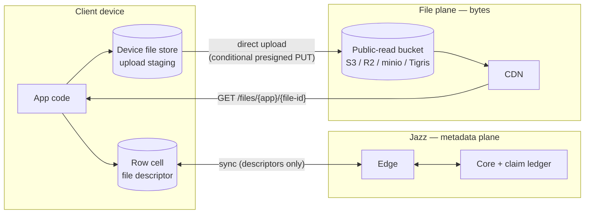
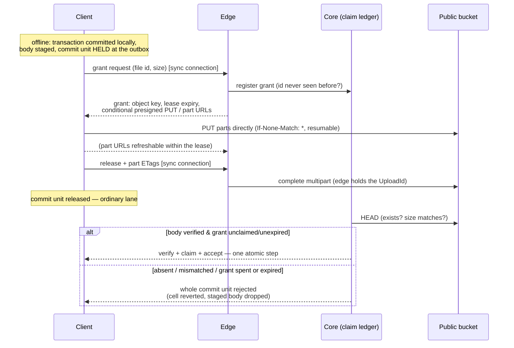
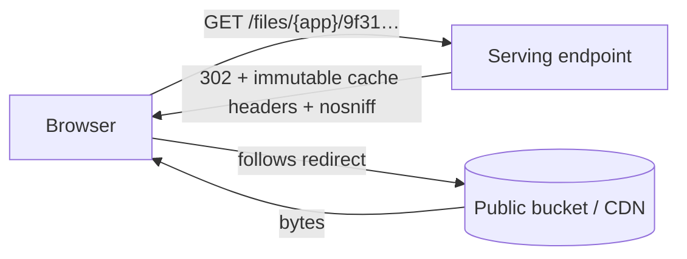

# Files in Jazz — the design, explained

Date: 2026-07-09
Audience: humans. The implementation-facing PRD is
`2026-07-09-files-spec.md`; the grilled design rationale is
`2026-07-08-files-design.md` (this document and the PRD supersede its
file-table data model, its private-files split, and its SDK read surface).
This document explains the design in plain language, with diagrams and API
examples.

## The one-sentence version

A file in Jazz is a value in one of your own rows — a small immutable
descriptor in a cell — while the bytes live on a public-read bucket: created
offline like any write, uploaded in the background, and read the way the web
reads everything, through one stable public URL.

```ts
const avatar = await jazz.files.fromBlob(blob);        // offline-capable
await db.profiles.update(me.id, { avatar });           // a normal column write

                          // a plain URL
```

## The big picture: two planes

The core split is that **metadata and bytes travel completely different
roads**. The descriptor rides the existing Jazz machinery like any cell
value. The bytes never touch it.



Why this split, rather than pushing bytes through sync like large blobs do
today:

- **Cost.** Large blobs make every gigabyte pass through Jazz compute and
  land in Jazz storage — the expensive tier. Object storage plus CDN egress
  is the cheap tier, and because uploads go browser→S3 and downloads go
  CDN→browser, our servers never carry the bytes at all. Billing becomes
  "storage + egress", which is exactly what the object store already meters.
- **URLs.** The web already knows how to display a file: give it a URL. By
  serving bytes at `GET /files/{app}/{file-id}`, every file works in
  ``, `<video>`, and pasted links with zero SDK involvement on the read
  path.
- **History hygiene.** Rows are editable and versioned; bodies are immutable
  and huge. Keeping bodies out of the database keeps history, branches, and
  sync payloads small.

## Choice 1: a file is a value in your row

There is no file table and no new entity to manage. **File is a column
type.** You put it wherever the file belongs, next to the data it belongs
to:

```ts
const appSchema = {
  profiles: s.table({
    handle: s.string(),
    avatar: s.file(), // the file lives ON the profile row
    banner: s.file(), // more than one is fine
  }),
  messages: s.table({
    text: s.string(),
    attachment: s.file(), // optional like any column
  }),
};
```

The cell holds a **file descriptor** — an immutable value naming exactly one
body:

| Field       | Meaning                                                                                                    |
| ----------- | ---------------------------------------------------------------------------------------------------------- |
| `file id`   | client-minted, **mandated cryptographically random** (UUIDv4-grade); the object key and URL derive from it |
| `name`      | filename at creation (download filename)                                                                   |
| `mime_type` | content type, pinned onto the object at upload                                                             |
| `size`      | bytes, server-verified                                                                                     |

Two rules make the whole system easy to reason about:

- **The descriptor is immutable.** You never edit its fields. "Replace the
  file" means uploading new bytes and swapping the _whole cell_ to the new
  descriptor — an ordinary column update, gated by the ordinary update
  policy. Each descriptor-body pair is immutable forever, which is what lets
  every cache downstream treat bodies as never-changing.
- **Mutable metadata is a sibling column.** A display name the user can
  edit, captions, tags — those are normal columns on the same row, queryable
  and policy-gated like everything else. File identity and app metadata
  never fight.

Why a column instead of a dedicated file table (the shape we discarded):

- The file sits **where the data is** — no side table, no foreign key, no
  join to render a profile with its avatar.
- **Permissions collapse to the obvious thing**: the host table's row
  policies. There is no parallel file table whose policies must mirror the
  referencing table's.
- The column model **subsumes** the table model: a drive-style app is just
  `s.table({ content: s.file(), ...metadata })`. The reverse isn't true — a
  file table can't put an avatar directly on the profile row.

There is deliberately **no `hash` field**. Bodies are single-writer and
immutable, so a hash declared by the uploader would only protect the
uploader's own readers from the uploader — little value for real
verification cost. Apps that want tamper-evidence add their own column.

## Choice 2: every file is public by URL — on a public-read bucket

Every accepted file is readable by anyone who has its URL. Full stop.

```
https://<host>/files/{app}/9f31c2ae-…     ← stable, unauthenticated, forever
```

The bucket itself is **public-read**: anonymous `GetObject` allowed,
listing denied. That one decision is what makes the caching story clean —
there are no signed GET URLs anywhere, so nothing in the read path ever
expires. The serving endpoint just 302-redirects to the public object URL
(the path mirrors the object key `{app}/{file-id}` exactly, so no lookup is
needed), and deployments can equally point a CDN straight at the bucket.

What the permissions system does and does not cover:

```
                 ┌──────────────────────────────────┐
   row policies  │  METADATA (the host row)         │  read  → who syncs it
   gate this ──▶ │  descriptor + sibling columns    │  update→ who swaps/renames
                 │                                  │  delete→ who deletes
                 └──────────────────────────────────┘
                 ┌──────────────────────────────────┐
   nothing gates │  BYTES (the body)                │  anyone with the URL
   this ───────▶ │  GET /files/{app}/{file-id}      │  reads them
                 └──────────────────────────────────┘
```

The only thing standing between the world and the bytes is the file id — so
the id is not allowed to be weak. **The protocol mandates ids minted from a
cryptographic RNG with at least UUIDv4 entropy**, and the bucket denies
listing so ids can't be enumerated from the store side.

Two hardening rules keep the public surface from becoming an attack
surface:

- **No overwrites, ever.** File ids are public (they're in every URL), and
  they're also the object key — so nothing may ever accept an upload to an
  existing key. Grant issuance refuses any id the claim ledger has ever
  seen, and every presigned PUT carries `If-None-Match: *`, so the store
  itself rejects a write to an occupied key. "Immutable" is enforced by the
  bucket, not by politeness.
- **No script serving.** `Content-Type` and `Content-Disposition` are
  pinned into the presigned PUT at grant time (a client can't deviate), the
  serving layer adds `X-Content-Type-Options: nosniff` on everything, and
  only an allowlist of render-safe types (image, video, audio, PDF) is
  served `inline` — never `text/html`, never SVG. Everything else downloads
  as `attachment`. Your files domain cannot be turned into an XSS or
  phishing host.

Why public-only instead of the classic published/private split:

- **Caching gets trivial.** Immutable bodies at never-expiring public URLs
  mean unconditional `Cache-Control: immutable` everywhere, and any CDN can
  cache every body forever. Private files would have forced short-TTL
  signed URLs, mint round-trips, and a revocation asterisk on caching.
- **Serving gets flat.** A download is one redirect — no Jazz DB lookup, no
  policy evaluation, no auth. Cost per download is effectively the CDN's.
- **Honesty.** Byte-level access control through signed URLs is
  bearer-token security with TTL caveats — easy to mistake for more than it
  is. "Bytes are public, metadata is permissioned" is a rule developers can
  hold in their head.

The value Jazz adds to files is the **integrated experience** — files as
values in your own relational rows, synced, subscribed, permission-gated as
metadata — plus **offline-capable creation**. Apps with genuinely
confidential content keep it out of files or encrypt client-side;
byte-level access control can be layered on later without changing the URL
scheme.

## Choice 3: upload is offline-first, with leases and one claim ledger

Creating a file works with the network unplugged, because it is just a local
byte write plus a normal transaction:

```ts
const attachment = await jazz.files.fromBlob(blob);
await db.messages.insert({ text: "look at this", attachment });
// committed locally; the body sits in the device file store (upload staging)
```

The interesting part is what happens between "created offline" and "visible
to everyone", because Jazz never shows anyone a descriptor whose bytes
weren't verified:



The decisions hiding in that diagram:

- **The hold takes the whole transaction — and that's a feature.** The
  transaction that writes a fresh descriptor (including its sibling
  columns) waits at the outbox until the body is confirmed. So when the
  message above arrives at another device, the attachment is already
  fetchable: **a descriptor you can see is a file you can get**.
- **Independent writes bypass; you choose early visibility.** Later,
  unrelated commit units skip past the held one — one slow 2 GB video never
  stalls the session. An app that wants the message text visible before the
  upload finishes models the file cell in its own row (an attachments row)
  and renders its own pending state — an app choice, not a forced
  semantic.
- **One claim ledger, at the core.** Grants are registered at the core when
  issued, and "verify the body + claim the grant + accept the transaction"
  is a single atomic step there. That is what makes "one file id, one live
  cell, ever" hold across edges, races, and retries: a descriptor copied
  into a second cell finds its grant already claimed and rejects; two
  same-id transactions racing through different edges get exactly one
  acceptance; and a retried release for an already-claimed grant gets the
  recorded outcome back (idempotent), never a bogus rejection. The ledger
  is permanent — an id can never be granted twice; after a lease expires,
  the SDK simply restarts with a fresh id.
- **Grants are leases, swept without races.** A grant unclaimed within its
  window (days, operator-tunable) is first atomically marked expired in the
  ledger — from that moment it can never be claimed — and only then does
  the sweep delete the object and abort any incomplete multipart (the edge
  initiated the multipart, so the `UploadId` is on record). The lease is
  also the resume window: part ETags persist locally, restarts resume where
  they left off, and fresh part URLs can be requested for the same grant
  when a presign window (hours) runs out inside a lease (days). Grant
  issuance itself is open to any authenticated session — abuse is bounded
  by the sweep in v1, with per-identity rate limits planned.

No second credential system exists anywhere in this: grant, part-URL
refresh, and release are messages on the already-authenticated sync
connection.

The client observes all of it through one state machine on the handle:

```
local ──▶ uploading(progress) ──▶ released ──▶ accepted
                                          └──▶ rejected
```

which is the existing durability-tier story extended by one file-specific
stage — and the app's surface for "this device holds unreleased files",
which matters because until release, the creating device holds the only
copy.

## Choice 4: download is a redirect to a public object



One HTTP endpoint, `GET /files/{app}/{file-id}`, is the entire read-path
surface, and it does nothing but translate the path into the public object
URL — same key, no database, no policy check, no signature. Range requests
(video seeking) are handled natively by the store/CDN. Because bodies are
immutable and the public URL never changes meaning,
`Cache-Control: immutable` has no asterisks — a CDN can hold a body
forever.

`file.url()` is therefore **pure local string construction** — no round
trip, no async step, no expiry:

```tsx

<video src={msg.attachment.url()} />
```

One honest caveat: the URL goes live at **acceptance**. Before that it
404s — which is fine, because the only party who can render the file before
acceptance is the device that just created it, and that device is already
holding the Blob (see the API section).

## Choice 5: reads are the web's — no SDK read API, no offline reads

The SDK has **no `toBlob`, no `toStream`, no read cache**. Reading a file is
`fetch(file.url())` — userland, like any other web resource. This is a
deliberate subtraction:

- The dominant read path is a URL in an ``/`<video>` tag, whose bytes
  never pass through the SDK anyway. An SDK read API would be a second,
  rarely-used path pretending to be the main one.
- Blob derivation is two lines of userland:

```ts
const blob = await (await fetch(msg.attachment.url())).blob();
```

- **Offline reads don't exist in v1**, and the design says so instead of
  half-promising them. The honest baseline: the browser's HTTP cache holds
  immutable bodies well, so recently-viewed files often work offline — but
  nothing guarantees it. Real offline file reading is a future
  **service-worker integration** that caches `/files/*` responses — the
  same mechanism the web uses for every other offline asset, and the only
  one that also covers plain `` tags.

The device file store still exists, but it is **upload staging only**: it
holds bodies this device created, from `fromBlob` until the writing
transaction is accepted upstream (surviving restarts so uploads resume),
then drops them. It is never read back by the SDK.

## Choice 6: deletion is "the cell died"

There is no delete-a-file operation, because there is nothing extra to
delete. A file's body is deleted when its cell dies, through ordinary,
policy-gated writes:

- the cell is **overwritten** with a new descriptor (file replaced),
- the cell is **set to null** (file removed),
- the **row is deleted**.

The one-live-cell rule from Choice 3 makes "this body is unreferenced"
exact, so responsibility can have a single owner: the **core** — the one
place that observes writes settle globally — appends the dead file id to a
durable deletion queue and issues idempotent, retried DELETEs against the
bucket. Two devices swapping the same cell offline need no special rule:
conflict resolution picks one descriptor like any column write, and the
loser's overwritten descriptor is ordinary cell death, its body queued for
deletion. The metadata change is visible immediately; the object disappears
eventually; the URL then 404s. CDN-cached copies age out on their own —
with immutable caching, purge is best-effort at most, and the design says
so rather than pretending otherwise.

One deliberate wrinkle: **bodyless history**. Historical reads and branches
can surface a descriptor at a past cut after its object is deleted. That is
correct, not a bug — bodies live outside history, so deleting an object is
truncation-like for the bytes while the descriptor stays readable. Its URL
404s like any deleted file's.

## The API, end to end

```ts
// declare — a file column wherever a file belongs
const appSchema = {
  messages: s.table({
    text: s.string(),
    attachment: s.file(),
  }),
};

// create — offline-capable, background upload
const attachment = await jazz.files.fromBlob(blob);
const msg = await db.messages.insert({ text: "specs attached", attachment });

// preview immediately — you already hold the bytes; the URL goes live at acceptance
img.src = URL.createObjectURL(blob);

// observe the upload
attachment.uploadState.subscribe((st) => {
  // "local" | "uploading" (with progress) | "released" | "accepted" | "rejected"
});

// render once accepted — plain URL, no async, no auth
;

// read bytes — userland, like any web resource
const blob2 = await (await fetch(msg.attachment.url())).blob();

// replace — swap the whole cell to a fresh upload (old body gets deleted)
await db.messages.update(msg.id, {
  attachment: await jazz.files.fromBlob(newBlob),
});

// remove — kill the cell (or delete the row)
await db.messages.update(msg.id, { attachment: null });
```

(`fromBlob` follows the existing `file-storage.ts` runtime shape; its
`toBlob`/`toStream`/`fromStream` siblings are deliberately not carried over.
Exact builder spellings like `s.file` may shift during implementation.)

## What we deliberately didn't build

| Not built                          | Because                                                                                                  |
| ---------------------------------- | -------------------------------------------------------------------------------------------------------- |
| A file table / built-in file rows  | the column subsumes it (a files table is a table with a file column) and puts files where the data is    |
| Private files / signed URLs        | would poison caching and flat-cost serving; metadata permissions + mandated-entropy ids are the v1 story |
| SDK read API (`toBlob`/`toStream`) | the real read path is the URL; blob derivation is two lines of userland `fetch`                          |
| Offline reads                      | only a service worker can honestly provide them (it also covers `` tags); future work               |
| `fromStream` / unknown-size upload | the descriptor and the grant both need `size` up front; a Blob knows it, a stream doesn't                |
| Content hashing & dedup            | hash protects only the uploader's own readers; dedup needs refcounting before deletion is safe           |
| Descriptor move/copy between cells | needs refcounting or a transfer protocol; v1 is one file id, one live cell                               |
| Lists of files in one cell         | one file column per cell in v1; use multiple columns or a side table                                     |
| Upload through Jazz servers        | our bandwidth would pay for every upload                                                                 |
| Standalone file service            | second deployable + duplicated policy evaluation; revisit when traffic warrants                          |
| General orphan GC                  | ledger-coordinated grant leases + a lifecycle backstop close the abuse faucet                            |
| Rate limits / per-identity quotas  | leases bound storage abuse in v1; rate limits on grants and egress are planned future work               |

Each of these is expanded in the design doc's "Rejected alternatives"
section — required reading before reopening any of them.
