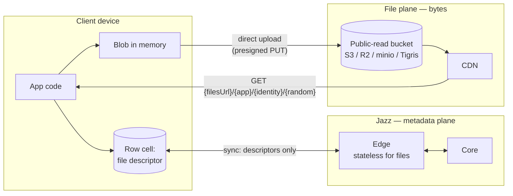
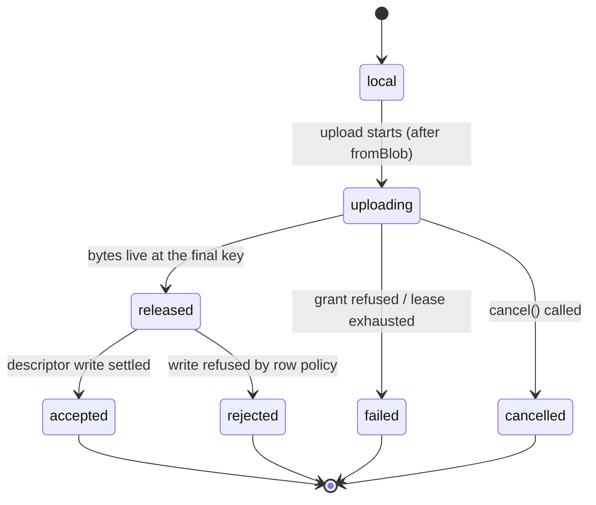
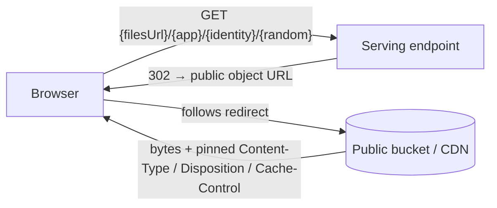
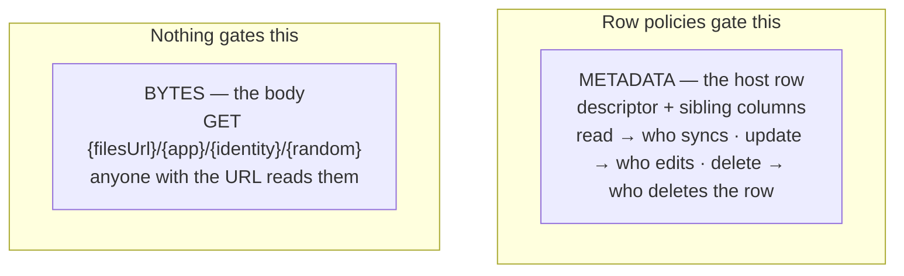

# Files in Jazz — developer guide (APIs & flows)

A file in Jazz is a **column** on a row. You declare it in your schema,
create it from a `Blob`, write it into a cell like any value, and render it
from a plain URL. The bytes live on a public-read S3-compatible bucket and
are served straight from a CDN; only the metadata travels through Jazz sync.

```ts
// declare → create → write → render, end to end
const avatar = await db.profiles.avatar.fromBlob(blob); // created on the column
await db.profiles.update(me.id, { avatar });            // an ordinary column write
                            // a plain, permanent URL
```

This guide is the **user-facing API surface** and the **flows** behind it.
For rationale and rejected alternatives, see the design doc; for the exact
contract, the PRD (`2026-07-09-files-spec.md`) and slice-1 spec.

---

## The two planes

Metadata and bytes take two different roads. The descriptor (a tiny JSON
value) syncs as column data; the bytes go browser→bucket and CDN→browser,
never through Jazz servers.



The whole read path is a URL. The whole write path is a direct upload under
a short-lived grant. Jazz servers carry no bytes and keep no file-plane
state.

---

## API 1 — Declare a file column

`s.file()` is a column type. Put it wherever the file belongs; more than one
per table is fine. Two options shape it, both declared once in the schema:

```ts
const schema = {
  profiles: s.table({
    handle: s.string(),
    avatar: s.file(), // permanent, any type
  }),
  messages: s.table({
    text: s.string(),
    attachment: s.file({ types: ["image/*", "application/pdf"] }), // type-restricted
    voice_note: s.file({ ttl: "7d" }), // ephemeral (see API 6)
  }),
};
```

| Option  | Effect                                                                                                                                |
| ------- | ------------------------------------------------------------------------------------------------------------------------------------- |
| `ttl`   | Names a **TTL class** from the deployment's set (e.g. `1d`/`7d`/`30d`). The bucket deletes the body on schedule. Omitted → permanent. |
| `types` | Allowed MIME types — exact (`application/pdf`) or `type/*` patterns. Enforced at upload. Omitted → any type.                          |

Under the hood a file column is the same facade `s.json()` uses: a
schema-level kind stored as canonical JSON text, so no new value type
touches the row format or the WASM/NAPI/RN bindings. The cell holds a
**descriptor** — `{ v: 1, id, name, mime_type, size }` — whose _shape_ is
validated on write and nothing more. `name`/`mime_type`/`size` are
app-trusted; anything you query or sort by belongs in a sibling column.

---

## API 2 — Create a file

`fromBlob` is a method **on the file column** — the column is the
receiver, so it supplies the TTL class, the allowed `types`, and (via the
session-bound `db`) your identity. It mints the
file id synchronously and returns a handle immediately — `url()` works at
once — then uploads in the background.

```ts
const attachment = await db.messages.attachment.fromBlob(blob, {
  name: "photo.jpg", // download filename (optional)
  // mime_type defaults to blob.type; pass `type` when the Blob has none
});
```

| Part                     | Meaning                                                                                                                                                                                                                               |
| ------------------------ | ------------------------------------------------------------------------------------------------------------------------------------------------------------------------------------------------------------------------------------- |
| `db.messages.attachment` | The file-column accessor. Being the receiver, it supplies the TTL class baked into the id and the allowed-types set checked at upload. `.fromBlob` exists only on file columns, and needs a live (identity-bearing) session to reach. |
| `blob`                   | The bytes. `size` is measured from it; there is no `fromStream` (the grant needs `size` up front).                                                                                                                                    |
| `name`                   | Optional filename for the download `Content-Disposition`.                                                                                                                                                                             |
| `type`                   | Optional MIME override. Defaults to `blob.type`; if both are empty (common for Node `Buffer`s), `fromBlob` **throws** — an untyped body can't be served safely.                                                                       |

Then write the handle into a cell — an ordinary column write:

```ts
const msg = await db.messages.insert({ text: "look at this", attachment });
```

The id is **the file's own**, not the row's: it exists the moment
`fromBlob` returns, before any cell write, and the same handle can be
written into several cells (an ordinary descriptor copy — the class stays
the one it was created with, even if the other column declares a different
one). Creating and
minting work fully offline — a client always knows its own identity and
schema. Because `.fromBlob` lives on a column reached through the live
`db`, an identity-bearing session is structural, not a checked
precondition (anonymous local-first identities qualify).

---

## API 3 — Render from a URL

`file.url()` is pure local string construction — no round trip, no async,
no expiry:

```tsx

<video src={msg.attachment.url()} />
```

The URL is `{filesUrl}/{app}/{identity}/{random}` (with a `t{class}` segment
for TTL'd files). `filesUrl` is client config — it defaults to
`{serverUrl}/files`, so a single-server deployment configures nothing.
Bodies are immutable, so permanent files serve with `Cache-Control:
immutable` and TTL'd files with `max-age` capped to their class — a CDN
caches every body unconditionally.

Two honest properties to hold in your head:

- **Bytes are public.** Anyone with the URL reads them; the unguessable
  random part is the only barrier. Keep genuinely sensitive content out of
  files or encrypt it yourself.
- **The URL names its uploader** (a stable pseudonymous derivation of the
  identity, never a raw id). It's linkable across one uploader's files.
- **The URL 404s until release.** Before the upload finishes, render from
  the Blob you already hold: `URL.createObjectURL(blob)`.

---

## API 4 — Observe the upload

The handle exposes one state machine. Subscribe to show progress and to
know when bytes are live:

```ts
attachment.uploadState.subscribe((st) => {
  // "local" | "uploading" | "released" | "accepted" | "rejected" | "failed" | "cancelled"
});
```



- `accepted`/`rejected` are the ordinary transaction fates of the cell
  write. When the handle is written into several cells, it reads
  `accepted` if **any** write settles accepted, `rejected` only if **all**
  do — so acting on `rejected` never strands bytes a live cell still uses.
- `failed` means the upload itself couldn't finish (the grant was refused
  because the type or class didn't match the column, or the lease expired).
  Transient offline/network errors are **not** terminal — the SDK waits and
  retries within the session.
- The creating device holds the only copy of the bytes, **in memory**,
  until release. Closing the app before then abandons the upload (the
  descriptor still syncs; its URL 404s).

---

## API 5 — Cancel, read bytes, delete

```ts
// cancel an in-flight upload before release (→ cancelled, nothing left behind)
attachment.cancel();

// read bytes — userland, like any web resource
const blob = await (await fetch(msg.attachment.url())).blob();

// remove the reference — kill the cell; the body is untouched
await db.messages.update(msg.id, { attachment: null });

// remove the bytes — explicit, uploader-or-backend only
await jazz.files.delete(msg.attachment.id);
```

There is no `toBlob`/`toStream`: reading is `fetch(url())`. `delete()`
returns a Promise that resolves on origin confirmation and rejects on
failure; it's one idempotent bucket DELETE, so re-calling is always safe
and _is_ the retry story (no durable intent record). Authorization is the
same identity check as grants — the id carries its owner — so no metadata
or ledger is consulted. After delete the URL 404s; CDN-cached copies age
out on their own.

---

## API 6 — Let time delete it (TTL)

TTL is a property of the column, declared once — never a per-call option:

```ts
voice_note: s.file({ ttl: "7d" }),
```

Every file created for a TTL column carries that class, baked into its id,
landing under the class's key prefix with one bucket lifecycle rule. The
clock starts at release; expiry deletes the **body only** — the descriptor
stays and its URL 404s, the same ordinary bodyless state as an explicit
delete. Granularity is days, and a CDN may serve a body up to one
class-length past expiry. The class is fixed at creation: a descriptor
copied into a differently-declared column keeps its own class.

---

## Flow — upload

Grant, direct PUT, release — all over the already-authenticated sync
connection, no second credential system. Any edge can serve any step; the
client carries the `UploadId`.

```mermaid
sequenceDiagram
    participant C as Client
    participant E as Edge (stateless)
    participant S3 as Public bucket

    Note over C: fromBlob → id + url() ready; Blob held in memory;<br/>the descriptor-writing transaction is HELD at the outbox
    C->>E: grant (file id, size, mime_type, name, column)
    Note over E: pure check — no bucket reads, no records:<br/>identity segment == UUIDv5(session identity)?<br/>class + mime_type match the column's declaration?
    E->>S3: (multipart only) CreateMultipartUpload → UploadId
    E-->>C: pending key, lease, UploadId,<br/>presigned PUT(s) with pinned Content-Type / Disposition / Cache-Control + If-None-Match:*
    C->>S3: PUT bytes to pending/  (single PUT, or parts)
    Note over C: part URLs refreshable within the lease, from any edge
    C->>E: release (file id, UploadId?, part ETags?)
    E->>S3: HEAD final (present → done)<br/>· complete multipart (conditional where supported)<br/>· copy pending → final (REPLACE headers; UploadPartCopy if >5GB)<br/>· delete pending
    Note over C: hold releases → descriptor enters the ordinary lane;<br/>url() now live
    Note over S3: lifecycle expires pending/ after the lease;<br/>per-backend job reaps abandoned multiparts;<br/>each TTL class prefix has its own expiry rule
```

What the diagram encodes:

- **Granting is computation, not lookup.** The requested key must sit in
  the requester's own identity namespace. Nothing is read from the bucket
  and nothing recorded — the multipart path's single `CreateMultipartUpload`
  (to mint the `UploadId`) is the only issuance call; single-PUT grants make
  none. Foreign namespaces are unreachable _by construction_.
- **Serving headers are pinned at grant**, embedded in the presigned PUT,
  and re-sent on the release copy — the client can't override them.
- **Release is idempotent.** It HEADs the final key first; a retry just
  finds the object and succeeds. If it finds nothing (a lying client, or an
  honest one whose pending object expired at a day boundary), that's
  reported — the handle goes to `failed`, not a false success.
- **Nothing is verified.** No size check, no acceptance step. A client that
  lies harms only its own URL.
- **Lease expiry mid-session** re-uploads under the **same id** (re-claiming
  your own never-released id is safe), so a captured `url()` never breaks.

---

## Flow — download

One endpoint, one redirect, no database and no policy check on the read
path.



The endpoint mirrors the object key exactly, so it needs no lookup —
deployments may equally point a CDN straight at the bucket. Range requests
(video seeking) are served natively by the store. Two serving-security
notes for operators:

- **Content-Disposition is computed at grant time**: `inline` only for a
  fixed render-safe allowlist (image, video, audio, PDF — never `text/html`
  or `image/svg+xml`), everything else `attachment`. Matched on the MIME
  essence type, so parameters can't dodge it.
- **`X-Content-Type-Options: nosniff` is a deployment requirement** on the
  public object host (bytes never transit the 302 endpoint): CloudFront
  response-headers policy on S3, a custom domain + Managed Transform on R2,
  a reverse proxy on minio, bucket "Additional Headers" on Tigris.

---

## Permissions — what's gated, what's public



The permission surface is exactly the host table's row policies, gating
**metadata**. The body is public by URL. Row policies and byte
confidentiality are different axes — never mistake one for the other.

---

## What lives where

| You want to…         | Use                                                               |
| -------------------- | ----------------------------------------------------------------- |
| Declare a file field | `s.file()` / `s.file({ ttl, types })`                             |
| Create a file        | `db.<table>.<column>.fromBlob(blob, { name?, type? })`            |
| Put it on a row      | an ordinary column write                                          |
| Render it            | `file.url()` in an ``/`<video>`/link                         |
| Read its bytes       | `fetch(file.url())`                                               |
| Track the upload     | `handle.uploadState`                                              |
| Abort an upload      | `handle.cancel()`                                                 |
| Remove the bytes     | `jazz.files.delete(id)` — or a TTL class removes them on schedule |

Exact builder spellings (`s.file`, the `db.<table>.<column>` accessor
path) may shift during implementation; the shapes above are the contract.
