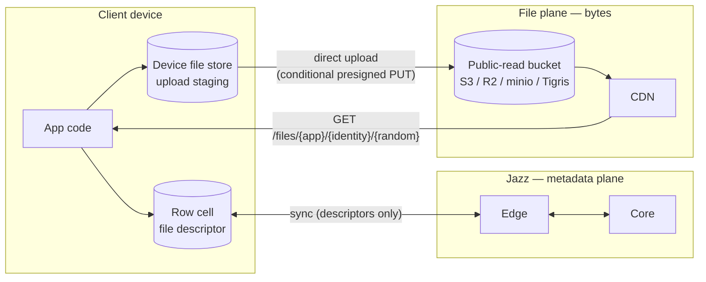
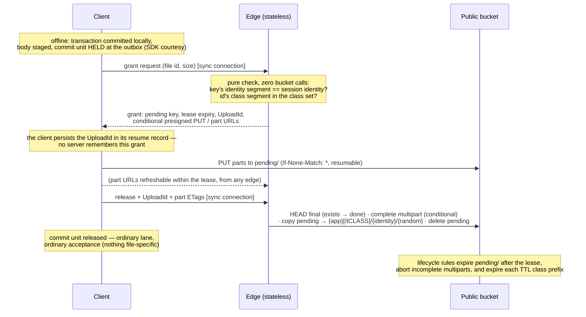
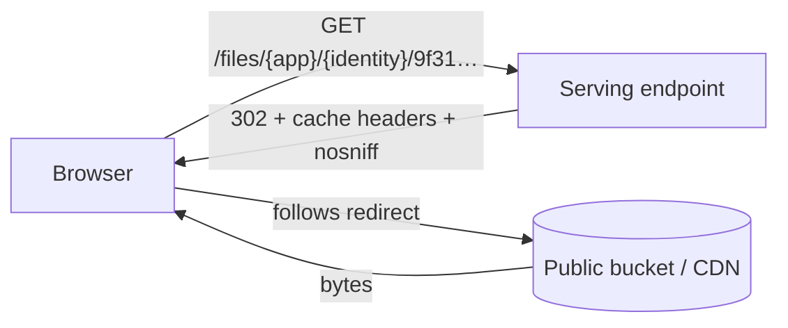

# Files in Jazz — the design, explained

```ts
const avatar = await jazz.files.fromBlob(blob);        // offline-capable
await db.profiles.update(me.id, { avatar });           // a normal column write

                          // a plain URL
```

## The big picture: two planes

Metadata and bytes follow two different roads:

- metadata is stored as column data (like for s.json())
- bytes are uploaded to S3



Why this split, rather than pushing bytes through sync like large blobs do
today:

- **Cost.** Large blobs make every gigabyte pass through Jazz compute and
  land in Jazz storage — the expensive tier. Object storage plus CDN egress
  is the cheap tier, and because uploads go browser→S3 and downloads go
  CDN→browser, our servers never carry the bytes at all. Billing becomes
  "storage + egress", which is exactly what the object store already meters.
- **URLs.** The web already knows how to display a file: give it a URL. By
  serving bytes at `GET /files/{app}/{identity}/{random}`, every file works
  in ``, `<video>`, and pasted links with zero SDK involvement on the
  read path.

## Choice 1: a file is a value in your row

There is no file table and no new entity to manage. **File is a column
type.** You put it wherever the file belongs, next to the data it belongs
to:

```ts
const appSchema = {
  profiles: s.table({
    handle: s.string(),
    avatar: s.file(), // the file lives ON the profile row
    banner: s.file(), // more than one is fine
  }),
  messages: s.table({
    text: s.string(),
    attachment: s.file(), // optional like any column
    voice_note: s.file({ ttl: "7d" }), // ephemeral: the column declares the lifetime
  }),
};
```

Under the hood this is the same trick `s.json()` already plays: a
schema-level column kind that stores its value as canonical JSON text. No
new value type exists anywhere in the stack — not in the row format, not in
the WASM/NAPI bindings — only a schema facade plus one write-path check
that the _shape_ is right. (On the schema wire the column carries its TTL
class the way JSON columns carry their JSON-Schema: `FILE('7d')`.)

The cell holds a **file descriptor** — a small versioned value naming one
body:

| Field       | Meaning                                                                                                                                                                                              |
| ----------- | ---------------------------------------------------------------------------------------------------------------------------------------------------------------------------------------------------- |
| `v`         | descriptor version (`1`); strict on write, lenient on read                                                                                                                                           |
| `file id`   | minted on-device, finalized at the first cell write: **the column's TTL class (if any) + your identity id + a CSPRNG random part** (UUIDv4-grade, mandated); key, URL, and expiry all derive from it |
| `name`      | filename at creation (download filename)                                                                                                                                                             |
| `mime_type` | content type, pinned onto the object at upload                                                                                                                                                       |
| `size`      | body length in bytes, as declared by the uploader                                                                                                                                                    |

Two things make this easy to reason about — and note what's _not_ on the
list:

- **The descriptor is a convention, not an enforced invariant.** Jazz
  validates its shape (canonical `v:1` JSON, known fields, well-formed id)
  and nothing else. Editing fields in place, copying a
  descriptor into another cell, even hand-writing one — all ordinary
  column writes under the ordinary update policy. What stays hard is the
  _body_: it is immutable at the bucket (nobody can ever be granted a key
  in someone else's namespace, and the store refuses a write to an
  occupied key), so no write to any cell can change any bytes.
  `name`/`mime_type`/`size` are app-trusted metadata — the same class as
  the `hash` we deliberately dropped: a lying value misleads only that
  app's own readers.
- **Queryable metadata is a sibling column.** The file cell is opaque to
  the query layer (whole-value equality, null checks — text semantics).
  Anything you filter or sort by — display names, tags, a size you trust —
  lives in real columns on the same row.

Why a column instead of a dedicated file table (the shape we discarded):

- The file sits **where the data is** — no side table, no foreign key, no
  join to render a profile with its avatar.
- **Permissions collapse to the obvious thing**: the host table's row
  policies. There is no parallel file table whose policies must mirror the
  referencing table's.
- The column model **subsumes** the table model: a drive-style app is just
  `s.table({ content: s.file(), ...metadata })`. The reverse isn't true — a
  file table can't put an avatar directly on the profile row.

## Choice 2: every file is public by URL — and the key knows its owner

Every file is readable by anyone who has its URL. Full stop.

```
https://<host>/files/{app}/{identity}/9f31c2ae-…   ← stable, unauthenticated
```

The bucket itself is **public-read**: anonymous `GetObject` allowed,
listing denied. That one decision is what makes the caching story clean —
there are no signed GET URLs anywhere, so nothing in the read path ever
expires. The serving endpoint just 302-redirects to the public object URL
(the path mirrors the object key exactly, so no lookup is needed), and
deployments can equally point a CDN straight at the bucket.

The key's shape is the design's quiet centerpiece: **the uploader's
identity id is part of the key**. That single fact replaces a whole family
of machinery (see Choices 3 and 6) because "may you write here?" and "may
you delete this?" become string comparisons — no ledger, no tombstones, no
metadata, no lookups. Two consequences, stated honestly:

- **Confidentiality rests on the random part.** It's mandated
  CSPRNG-random (UUIDv4-grade), and the bucket denies listing, so bodies
  are unguessable — but anyone holding a URL reads its bytes.
- **Every URL names its uploader.** The identity id is pseudonymous (an
  opaque id), but it is stable and linkable across all of one uploader's
  files. Apps that treat identity ids as sensitive must front their files
  or keep them off the file plane.

What the permissions system does and does not cover:

```
                 ┌──────────────────────────────────┐
   row policies  │  METADATA (the host row)         │  read  → who syncs it
   gate this ──▶ │  descriptor + sibling columns    │  update→ who edits cells
                 │                                  │  delete→ who deletes rows
                 └──────────────────────────────────┘
                 ┌──────────────────────────────────┐
   nothing gates │  BYTES (the body)                │  anyone with the URL
   this ───────▶ │  GET /files/{app}/{identity}/…   │  reads them
                 └──────────────────────────────────┘
```

Why public-only instead of the classic published/private split:

- **Caching gets trivial.** Immutable bodies at never-expiring public URLs
  mean `Cache-Control: immutable` for permanent files (and `max-age`
  capped to the class for TTL'd ones), so any CDN can cache every body
  unconditionally. Private files would have forced short-TTL signed URLs,
  mint round-trips, and a revocation asterisk on caching.
- **Serving gets flat.** A download is one redirect — no Jazz DB lookup, no
  policy evaluation, no auth. Cost per download is effectively the CDN's.
- **Honesty.** Byte-level access control through signed URLs is
  bearer-token security with TTL caveats — easy to mistake for more than it
  is. "Bytes are public, metadata is permissioned" is a rule developers can
  hold in their head.

The value Jazz adds to files is the **integrated experience** — files as
values in your own relational rows, synced, subscribed, permission-gated as
metadata — plus **offline capability**. Apps with genuinely confidential
content keep it out of files or encrypt client-side; byte-level access
control can be layered on later without changing the URL scheme.

## Choice 3: upload is offline-first — and nobody verifies anything

Creating a file works with the network unplugged, because it is just a local
byte write plus a normal transaction — and because the id is minted
entirely on-device (the destination column's TTL class + your identity id

- fresh randomness, finalized when the descriptor first lands in a cell),
  this works from the very first moment an identity exists, no server
  handshake ever:

```ts
const attachment = await jazz.files.fromBlob(blob);
await db.messages.insert({ text: "look at this", attachment });
// committed locally; the body sits in the device file store (upload staging)
```



The decisions hiding in that diagram:

- **Granting is a computation, not a lookup.** The requested key must sit
  in the requester's own identity namespace — a string comparison. Nothing
  is read from the bucket, written, or recorded at issuance. Nobody can
  ever be granted a key outside their own namespace, so overwriting or
  taking over another identity's URL is impossible _by construction_ — no
  uniqueness checks, no tombstones, no conditional-copy gymnastics. The
  `If-None-Match: *` guard on the PUT and the multipart completion stays
  only as a belt against an SDK colliding with itself.
- **Nothing is verified — deliberately.** There is no size check and no
  file-specific acceptance step. Everything verification used to protect
  is either already unprotected by choice (descriptor fields are
  app-trusted) or handled structurally: foreign namespaces are
  unreachable, and unreleased uploads are garbage-collected by the bucket
  itself. A client that lies — releases without uploading, declares the
  wrong size — harms only its own descriptor, whose URL 404s or
  misdescribes its own body.
- **Release is the only ceremony: complete + copy + clean.** Uploads land
  under `pending/`. On release — served by _any_ edge, since the client
  brings the `UploadId` and part ETags — the edge HEADs the final key
  (already there → done), completes the multipart, server-side-copies the
  object to its final key — the copy is what makes the public URL go live,
  and for TTL'd files it is what starts the expiry clock — and deletes the
  pending object. Idempotent by construction: a retried release just finds
  the final object and succeeds; there is no outcome to record.
- **Cleanup is the bucket's job, not a sweeper's.** A lifecycle rule
  expires the `pending/` prefix after the lease window (days), the native
  incomplete-multipart abort rule covers half-finished uploads, and each
  TTL class prefix has its own expiry rule. Prefix-based, so it works on
  S3, R2, minio, and Tigris alike. No sweep machinery exists; grant
  farming accumulates nothing past the lease. After an expiry the SDK just
  restarts with a fresh id — and since ids are namespace-bound, an expired
  id is re-claimable only by its original owner, ever.
- **The hold is an SDK courtesy, not a server gate.** The transaction that
  writes a `fromBlob` descriptor (including its sibling columns) waits at
  the outbox until release, so files created through the upload path are
  fetchable by the time other devices see them. Later, unrelated commit
  units bypass the held one — one slow 2 GB video never stalls the session.
  An app that wants the message text visible before the upload finishes
  models the file cell in its own row and renders its own pending state.
- **The server remembers nothing — and now reads nothing either.** Grant
  issuance is a pure computation; release derives everything from the
  bucket; delete authorization is the same namespace comparison. Edges are
  fully stateless for the file plane, which is why any edge can refresh
  part URLs or perform a release, and why edge restarts, load-balancing,
  and scaling need no file-plane coordination at all.

No second credential system exists anywhere in this: grant, part-URL
refresh, release, and delete are messages on the already-authenticated sync
connection.

The client observes all of it through one state machine on the handle:

```
local ──▶ uploading(progress) ──▶ released ──▶ accepted
                                          └──▶ rejected
```

where accepted/rejected are the ordinary transaction fates — and the
"unreleased files on this device" signal matters, because until release the
creating device holds the only copy.

## Choice 4: download is a redirect to a public object



One HTTP endpoint — `GET /files/{app}/{identity}/{random}`, with a
`t{class}` segment after `{app}` for TTL'd files — is the entire read-path
surface, and it does nothing but translate the path into the public object
URL — same key, no database, no policy check, no signature. Range requests
(video seeking) are handled natively by the store/CDN. Because bodies are
immutable and the public URL never changes meaning, permanent files carry
`Cache-Control: immutable` with no asterisks — a CDN can hold a body
forever — while TTL'd files carry `max-age` capped to their class.

`file.url()` is therefore **pure local string construction** — no round
trip, no async step, no expiry:

```tsx

<video src={msg.attachment.url()} />
```

One honest caveat: the URL goes live at **release** (the copy to the
permanent key). Before that it 404s — which is fine, because the only party
who can render the file before release is the device that just created it,
and that device is already holding the Blob (see the API section).

## Choice 5: reads are the web's — offline lives _below_ the URL

The SDK has **no `toBlob`, no `toStream`**. Reading a file is
`fetch(file.url())` — userland, like any other web resource:

```ts
const blob = await (await fetch(msg.attachment.url())).blob();
```

The dominant read path is a URL in an ``/`<video>` tag, whose bytes
never pass through the SDK — so an SDK-level cache could never make files
work offline. The offline layer therefore sits _below_ the URL, as a
**per-platform interceptor** that every URL load passes through. Both
interceptors run the same three-step logic over the device file store:
serve this device's **staged** body (own files render immediately —
offline, even before release), else serve the **cached** body, else fetch
through and write the cache.

- **Web: a Jazz-shipped service worker** intercepting `/files/*` — the
  mechanism the web uses for every other offline asset, and the only one
  that also covers plain `` tags. The app registers it once. Caveat:
  no SW controls the very first page load, so requests then fall through
  to the network — the Blob-in-hand preview never fully dies. One
  deployment rule (spike-verified): a SW sees only same-origin requests,
  so `/files/*` must be served on the app's own origin (proxy or CDN
  path-through) — a cross-origin file host bypasses the SW entirely.
- **React Native: a loopback HTTP server** inside the Jazz native module —
  there are no service workers on RN, and images/video load through native
  networking that JS can't intercept, so the interception point becomes a
  local URL. On RN, `file.url()` returns
  `http://127.0.0.1:<port>/<secret>/files/…`, which makes `<Image>`, video
  components, and WebViews work unmodified. One Rust implementation over
  the same device file store. Bound to loopback only, random port,
  per-boot secret path segment (other apps on the device can reach
  localhost); it dies when the app is suspended — fine, nothing renders
  then. URLs you store or share must be canonical:
  `url({ canonical: true })`.

The device file store accordingly holds two classes of bodies, and only
interceptors read it: **staged** (created here, kept until the writing
transaction is accepted — never evicted before that; possibly the only
copy in existence) and **cached** (keyed by file id — safe, bodies are
immutable — LRU-evicted under a configurable budget; eviction is
reversible, bodies are refetchable by URL). Any file opened once is
readable offline, and your own files are readable offline from the moment
you create them.

## Choice 6: cells never kill bodies — you delete them, or time does

Editing rows never deletes bytes. Overwrite a file cell, null it, delete
the whole row — the object stays. Copies of a descriptor, history, and
branches all stay coherent by default, and there is no settle-observation
machinery deciding when a body is "unreferenced."

Bodies leave the bucket exactly two ways:

**You delete them.**

```ts
await jazz.files.delete(msg.attachment.id);
```

- **Who may:** the uploader, or the app's backend surface. The proof is
  the key itself — the id carries its owner's identity, so authorization
  is the same string comparison grants use. No metadata to read, no ledger
  to consult. Richer rules ("album owners can delete") are app-backend
  logic that ends in a backend delete call, which skips the check.
- **How it runs:** the request travels over the sync connection like grant
  and release, and any server executes it as **one idempotent DELETE**
  against the bucket. Retries converge; deleting an already-deleted id
  succeeds — and the retrying is the _client's_ job: the SDK persists a
  pending-delete intent locally and keeps retrying across restarts until
  the origin confirms, so `delete()` is safely fire-and-forget while the
  server still remembers nothing. The URL then 404s; CDN-cached copies age out on their own
  (immutable caching makes purge best-effort at most, and the design says
  so rather than pretending otherwise). And a dead URL stays dead to
  everyone but its owner: the id lives in the owner's namespace, so nobody
  else can ever re-claim it — no tombstones needed. (The owner _could_
  re-use their own id; the SDK never does — fresh randoms every time — so
  that's a footgun you'd have to aim deliberately.)

**Or time does — declared once, in the schema.**

```ts
voice_note: s.file({ ttl: "7d" }), // the column's role decides the lifetime
```

- TTL is a property of the column, not the call site: every file written
  into a TTL-declared column gets that class, baked into its id at the
  first cell write, landing under the class prefix
  (`{app}/t7d/{identity}/{random}`) covered by that class's one bucket
  lifecycle rule. The deployment declares its class set (say, 1d/7d/30d);
  permanent is the default; there is no per-call override.
- The clock starts at the release copy. Expiry deletes the **body only**:
  descriptors remain in cells and history, and their URLs 404 — the same
  ordinary bodyless state as an explicit delete. Identity-bound keys make
  this safe: an expired id can't be claimed by anyone else, ever.
- Honest edges: lifecycle granularity is days, not minutes; `max-age` is
  capped to the class, so a CDN may serve a body up to one class-length
  past expiry; the class is fixed at upload — a descriptor copied into a
  differently-declared column keeps its baked-in class, and re-declaring a
  column's `ttl` affects only files written afterwards (extension would be
  a re-copy; deferred).

**The flip side, stated plainly:** permanent storage persists until someone
deletes it. An app that wants tidy storage deletes when its domain says so,
or picks a TTL class up front — Jazz won't guess from row edits.

Descriptors pointing at a deleted or expired body — live cells, copies,
historical reads, branches — are all the same ordinary state: metadata
readable, URL 404s. **Bodyless descriptors are legal**, not a crash.

## The API, end to end

```ts
// declare — a file column wherever a file belongs; the column names the lifetime
const appSchema = {
  messages: s.table({
    text: s.string(),
    attachment: s.file(),                 // permanent
    voice_note: s.file({ ttl: "7d" }),    // ephemeral: bucket cleans up on schedule
  }),
};

// create — offline-capable, background upload
// (the id is finalized when the descriptor lands in a column — the column's
// declaration decides permanent vs TTL class)
const attachment = await jazz.files.fromBlob(blob);
const msg = await db.messages.insert({ text: "specs attached", attachment });

// preview immediately — you already hold the bytes; the URL goes live at release
img.src = URL.createObjectURL(blob);

// observe the upload
attachment.uploadState.subscribe((st) => {
  // "local" | "uploading" (with progress) | "released" | "accepted" | "rejected"
});

// render once released — plain URL, no async, no auth
;

// read bytes — userland, like any web resource
const blob2 = await (await fetch(msg.attachment.url())).blob();

// replace — swap the cell to a fresh upload (the old body stays until deleted)
await db.messages.update(msg.id, {
  attachment: await jazz.files.fromBlob(newBlob),
});

// remove the reference — kill the cell (bytes untouched)
await db.messages.update(msg.id, { attachment: null });

// remove the bytes — explicit, uploader-or-backend only
await jazz.files.delete(oldAttachment.id);
```

(`fromBlob` follows the existing `file-storage.ts` runtime shape; its
`toBlob`/`toStream`/`fromStream` siblings are deliberately not carried over.
Exact builder spellings like `s.file` may shift during implementation.)

## What we deliberately didn't build

| Not built                                   | Because                                                                                                                           |
| ------------------------------------------- | --------------------------------------------------------------------------------------------------------------------------------- |
| A file table / built-in file rows           | the column subsumes it (a files table is a table with a file column) and puts files where the data is                             |
| Private files / signed URLs                 | would poison caching and flat-cost serving; metadata permissions + mandated-entropy random parts are the v1 story                 |
| Descriptor immutability enforcement         | it protected an app only from itself; the body is immutable at the bucket, which is the part that matters                         |
| Body verification                           | everything it protected is either app-trusted by choice or handled structurally (namespace-bound keys, pending-prefix TTL)        |
| Automatic deletion on cell death            | inference machinery + refcounting questions for a call the app can make explicitly; `jazz.files.delete` and TTL classes reclaim   |
| A grant ledger / any server-side file state | authorization is a string comparison against the identity-bound key; issuance needs zero bucket calls and records nothing         |
| Tombstones                                  | not needed — a deleted id lives in its owner's namespace, so nobody else can ever re-claim it                                     |
| Uploader metadata on objects                | not needed — the key itself names its owner; delete auth is the same comparison as grants                                         |
| Blinded/HMAC'd identity prefixes            | considered; raw identity ids accepted for v1 (pseudonymous, stated) — blinding would cost a first-contact handshake               |
| Server sweep for unclaimed uploads          | the bucket's own lifecycle rules (prefix expiry + multipart abort) do it with zero code                                           |
| SDK read API (`toBlob`/`toStream`)          | the real read path is the URL; blob derivation is two lines of userland `fetch`                                                   |
| SDK-level offline reads                     | only URL interceptors can honestly provide offline (they cover `` tags); v1 ships a web SW and an RN loopback server instead |
| `fromStream` / unknown-size upload          | the grant needs `size` up front; a Blob knows it, a stream doesn't                                                                |
| Exact per-file expiry timestamps            | portable lifecycle rules are day-granular and prefix-scoped; classes cover the need without a scheduled-delete queue              |
| Per-call TTL (`fromBlob` option)            | lifetime is a property of the column's role; the schema declares it once and call sites stay clean                                |
| TTL extension after creation                | a re-copy would reset the expiry clock; deferred until someone needs it                                                           |
| Content hashing & dedup                     | hash protects only the uploader's own readers; dedup needs refcounting before deletion is safe                                    |
| Lists of files in one cell                  | one file column per cell in v1; use multiple columns or a side table                                                              |
| Upload through Jazz servers                 | our bandwidth would pay for every upload                                                                                          |
| Standalone file service                     | second deployable + duplicated policy evaluation; revisit when traffic warrants                                                   |
| Rate limits / per-identity quotas           | the pending-prefix TTL bounds storage abuse in v1; rate limits on grants and egress are planned future work                       |

Each of these is expanded in the design doc's "Rejected alternatives"
section — required reading before reopening any of them.
