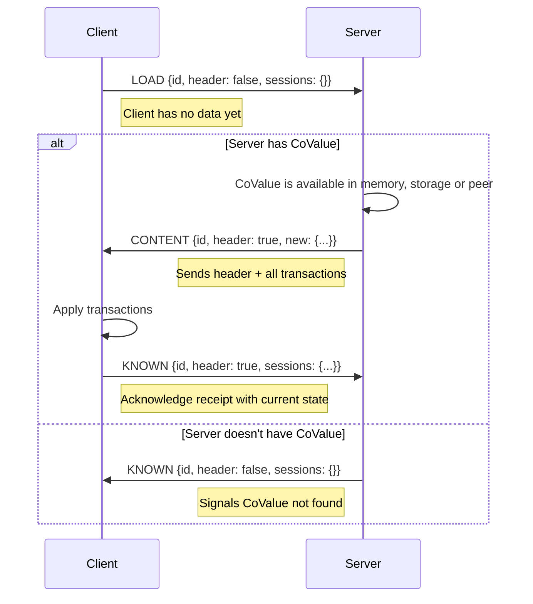
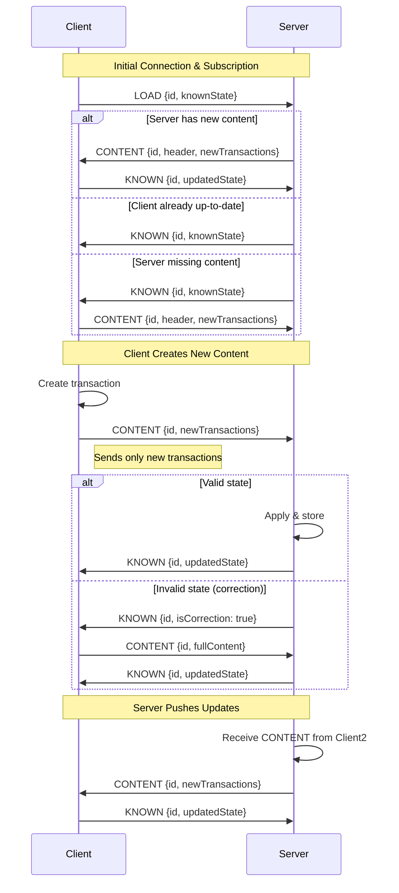

# Jazz Sync Protocol

## Overview

The Jazz sync protocol uses four message types:
- **LOAD**: Request to load/subscribe to a CoValue
- **KNOWN**: Share known state (what transactions we have)
- **CONTENT**: Send new transactions/content
- **DONE**: Signal completion (not used at the moment)

## Message Type Details

### LOAD Message
- **Purpose**: Subscribe to a CoValue and request sync
- **Contains**: Known state (what the sender already has)
- **Response**:
  - CONTENT missing from the sender
  - KNOWN state if the sender is not missing any content

### KNOWN Message
- **Purpose**: Share known state (acknowledgment or state update)
- **Contains**: Current known state (header + session transaction counts)
- **Variants**: 
  - Normal: `{action: "known", ...}`
  - Correction: `{action: "known", isCorrection: true, ...}`
- **Response**: CONTENT missing from the sender's known state

### CONTENT Message
- **Purpose**: Send new transactions
- **Contains**: 
  - Header (if first time sending this CoValue)
  - New transactions per session: `{after: N, newTransactions: [...]}`
  - `expectContentUntil` (for streaming large CoValues)
- **Response**:
  - KNOWN message as acknowledgment
  - KNOWN with `isCorrection: true` if missing CoValue content
  - LOAD request for any missing CoValue dependency
  - CONTENT with empty known state if missing the CoValue

### DONE Message
- **Purpose**: Signal completion (not used at the moment)
- **Contains**: Just the CoValue ID

## Common Sync Flows

### Initial Connection - Client Subscribes to CoValue

### Client with CoValue subscribes to Server

