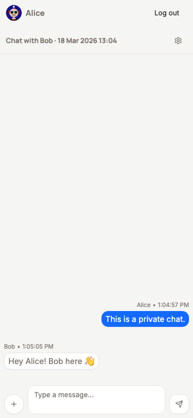
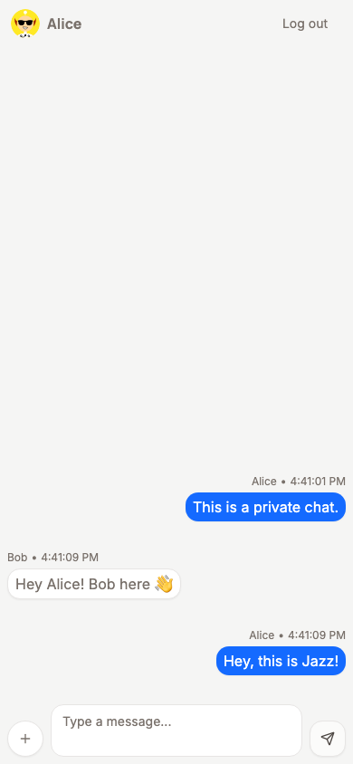
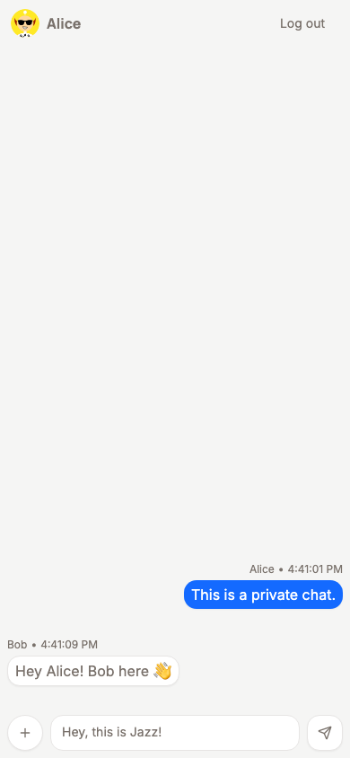
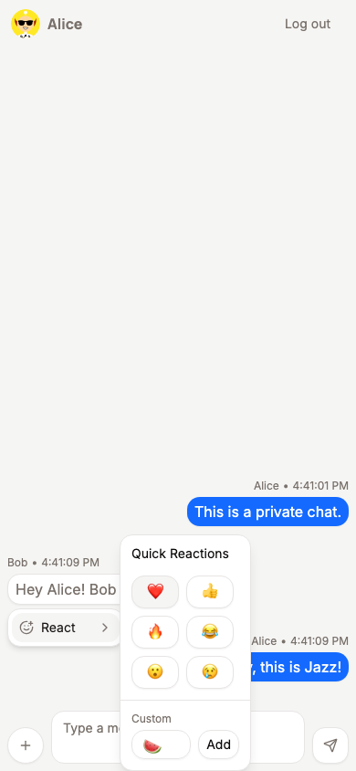
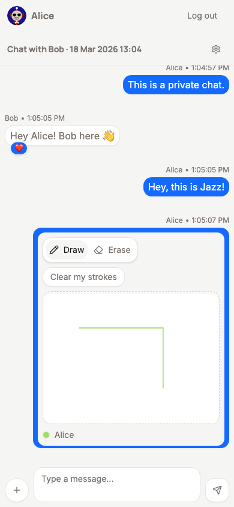

<!-- _class: hero -->

# How Chat uses Jazz

A walkthrough of a real-time chat app with row-level permissions, built with Jazz and React.

Public rooms, private chats, invite links, emoji reactions, file uploads, collaborative canvases.



---

## What is Jazz?

Jazz is a **local-first** sync framework. Every client runs a full database in a WASM worker, persisted in the browser's private filesystem. Changes sync to a server and reach all connected clients in real time.

<svg xmlns="http://www.w3.org/2000/svg" viewBox="0 0 560 212" width="520" height="196" style="display:block;margin:0.5rem auto">
  <defs>
    <marker id="arr" markerWidth="8" markerHeight="6" refX="8" refY="3" orient="auto"><polygon points="0 0, 8 3, 0 6" fill="#6b7280"/></marker>
    <marker id="arrs" markerWidth="8" markerHeight="6" refX="8" refY="3" orient="auto-start-reverse"><polygon points="0 0, 8 3, 0 6" fill="#6b7280"/></marker>
  </defs>
  <rect x="180" y="10" width="200" height="58" rx="8" fill="#dcfce7" stroke="#16a34a" stroke-width="1.5"/>
  <text x="280" y="34" text-anchor="middle" font-family="ui-sans-serif,sans-serif" font-size="13" font-weight="700" fill="#166534">Jazz sync server</text>
  <text x="280" y="54" text-anchor="middle" font-family="ui-sans-serif,sans-serif" font-size="11" fill="#166534">sync + fan-out + policy enforcement</text>
  <rect x="8" y="130" width="170" height="74" rx="8" fill="#dbeafe" stroke="#3b82f6" stroke-width="1.5"/>
  <text x="93" y="154" text-anchor="middle" font-family="ui-sans-serif,sans-serif" font-size="13" font-weight="700" fill="#1e40af">Browser A</text>
  <text x="93" y="174" text-anchor="middle" font-family="ui-monospace,monospace" font-size="11" fill="#1e3a8a">WASM worker</text>
  <text x="93" y="192" text-anchor="middle" font-family="ui-monospace,monospace" font-size="11" fill="#1e3a8a">Local DB</text>
  <rect x="382" y="130" width="170" height="74" rx="8" fill="#dbeafe" stroke="#3b82f6" stroke-width="1.5"/>
  <text x="467" y="154" text-anchor="middle" font-family="ui-sans-serif,sans-serif" font-size="13" font-weight="700" fill="#1e40af">Browser B</text>
  <text x="467" y="174" text-anchor="middle" font-family="ui-monospace,monospace" font-size="11" fill="#1e3a8a">WASM worker</text>
  <text x="467" y="192" text-anchor="middle" font-family="ui-monospace,monospace" font-size="11" fill="#1e3a8a">Local DB</text>
  <line x1="215" y1="68" x2="93" y2="128" stroke="#6b7280" stroke-width="1.5" stroke-dasharray="5,3" marker-start="url(#arrs)" marker-end="url(#arr)"/>
  <line x1="345" y1="68" x2="467" y2="128" stroke="#6b7280" stroke-width="1.5" stroke-dasharray="5,3" marker-start="url(#arrs)" marker-end="url(#arr)"/>
</svg>

Writes are **instant locally**. Row-level **policies** are enforced on the server, so only authorised data reaches each client.

---

<!-- _style: "pre { font-size: 0.65rem; line-height: 1.45; margin: 0; } h2 { margin-bottom: 0.5em; }" -->

## The schema

**[`schema/current.ts`](../schema/current.ts)** defines the tables. You can optionally run `jazz-tools validate` as a local check via the root `schema.ts` wrapper.

<div style="display:grid;grid-template-columns:1fr 1fr;gap:0.8rem;margin-top:0.4rem">

```typescript
table("profiles", {
  userId: col.string(),
  name: col.string(),
  avatar: col.string().optional(),
});
table("chats", {
  name: col.string().optional(),
  isPublic: col.boolean(),
  createdBy: col.string(),
  joinCode: col.string().optional(),
});
table("chatMembers", {
  chatId: col.ref("chats"),
  userId: col.string(),
  joinCode: col.string().optional(),
});
table("messages", {
  chatId: col.ref("chats"),
  text: col.string(),
  senderId: col.ref("profiles"),
  createdAt: col.timestamp(),
});
```

```typescript
table("reactions", {
  messageId: col.ref("messages"),
  userId: col.string(),
  emoji: col.string(),
});
table("canvases", {
  chatId: col.ref("chats"),
  createdAt: col.timestamp(),
});
table("strokes", {
  canvasId: col.ref("canvases"),
  ownerId: col.string(),
  color: col.string(),
  width: col.int(),
  pointsJson: col.string(),
  createdAt: col.timestamp(),
});
table("attachments", {
  messageId: col.ref("messages"),
  type: col.string(),
  name: col.string(),
  fileId: col.ref("files"),
  size: col.int(),
});
```

</div>

---

## Client setup

`JazzProvider` wraps your app. Pass it a config and `createJazzClient` — Jazz takes care of the WASM worker, the local database, and the sync connection.

**[`src/App.tsx`](../src/App.tsx)**

```typescript
import { createJazzClient, JazzProvider } from "jazz-tools/react";

export function App() {
  return (
    <JazzProvider config={defaultConfig()} createJazzClient={createJazzClient}
                  fallback={<p>Loading...</p>}>
      <AppContent />
    </JazzProvider>
  );
}
```

That's the entire setup.

---

## Accessing the db anywhere

`useDb()` and `useSession()` are available to any component inside `JazzProvider`.

```typescript
import { useDb, useSession, useAll } from "jazz-tools/react";

const db = useDb(); // full query + write API
const session = useSession(); // { user_id, ... } | null
const userId = session?.user_id;
```

`ChatList`, `ChatView`, `MessageComposer`, `ActionMenu`, `ChatReactions` — each calls `useDb()` directly, no wiring needed.

---

## Live queries with `useAll`



`useAll` subscribes to a query against the local database. When data changes — including changes from other users — the component re-renders.

**[`src/components/chat-view/ChatView.tsx`](../src/components/chat-view/ChatView.tsx)**

```typescript
const messages =
  useAll(
    app.messages.where({ chatId }).include({ sender: true }).orderBy("createdAt", "desc").limit(20),
  ) ?? [];
```

When a remote user sends a message, it appears instantly.

---

## Synchronous writes



Writes return immediately. The local database is the source of truth; the server catches up in the background.

**[`src/components/composer/MessageComposer.tsx`](../src/components/composer/MessageComposer.tsx)**

```typescript
const handleSend = (html: string) => {
  db.insert(app.messages, {
    chatId,
    text: html.trim(),
    senderId: myProfile.id,
    createdAt: new Date(),
  });
};
```

No loading spinners, no optimistic UI layer. The insert is the UI update.

---

## Permissions — the policy DSL

Policies live in **[`schema/permissions.ts`](../schema/permissions.ts)**, written in a typed DSL. They're compiled into the schema and enforced on the server on every sync.

```typescript
// Messages: only chat members can read or send
policy.messages.allowRead.where((msg) =>
  anyOf([
    allowedTo.read("chatId"), // inherits from parent: public chats are readable
    policy.chatMembers.exists.where({ chatId: msg.chatId, userId: session.user_id }),
  ]),
);
policy.messages.allowInsert.where((msg) =>
  policy.chatMembers.exists.where({ chatId: msg.chatId, userId: session.user_id }),
);
policy.messages.allowDelete.where({ senderId: session.user_id });
```

Row-level security is a schema concern. Components contain no auth logic.

---

## Public and private chats


The `chats` policy combines three conditions, with no backend code:

```typescript
policy.chats.allowRead.where((chat) =>
  anyOf([
    { isPublic: true }, // public rooms
    policy.chatMembers.exists.where({
      // accepted members
      chatId: chat.id,
      userId: session.user_id,
    }),
    { joinCode: session["claims.join_code"] }, // invite link bearer
  ]),
);
```

The third condition is how invites work: a client attaches a temporary credential to its subscription, and the server checks it against the chat's join code.

---

## The invite flow

Private chats carry a `joinCode`. Sharing `/#/invite/:chatId/:code` lets anyone join in two steps.

**[`src/components/InviteHandler.tsx`](../src/components/InviteHandler.tsx)**

```typescript
// Step 1: subscribe with the join code as a temporary credential.
// The server matches it against the chat's joinCode and syncs the row.
db.subscribeAll(
  app.chats.where({ id: chatId }),
  (delta) => {
    if (delta.all.length > 0) setChatLoaded(true);
  },
  undefined,
  { user_id: userId, claims: { join_code: code } },
);

// Step 2: once the chat row is local, insert the membership and navigate.
db.insert(app.chatMembers, { chatId, userId, joinCode: code });
navigate(`/#/chat/${chatId}`);
```

The credential is never stored. It exists only for this subscription.

---

## Chat header and settings

The `ChatHeader` shows the chat name (or participant names and date) with a settings button. The `ChatSettings` sheet lets members rename the chat, view the member list, share an invite, or leave.

```typescript
// Display name: shows other members' names, or an explicit title if set
const displayName = useChatDisplayName(chatId, chat?.name);

// Any member can rename the chat (clear the name to revert to participants)
db.update(app.chats, chatId, { name: newName || null });

// Leave: delete your own membership, navigate to the chat list
db.delete(app.chatMembers, myMembership.id);
navigate("/#/chats");
```

When a user opens a public chat they haven't joined yet, `ChatView` adds them as a member automatically.

---

## Reactions — live, policy-scoped



Each reaction is a row. The query is live; toggling one is a synchronous insert or delete.

**[`src/components/chat/ChatReactions.tsx`](../src/components/chat/ChatReactions.tsx)**

```typescript
const reactions = useAll(app.reactions.where({ messageId })) ?? [];

const handleToggle = (emoji: string) => {
  const mine = reactions.find((r) => r.emoji === emoji && r.userId === userId);
  if (mine) {
    db.delete(app.reactions, mine.id);
  } else {
    db.insert(app.reactions, { messageId, userId, emoji });
  }
};
```

`allowDelete` is scoped to `{ userId: session.user_id }` — you can only remove your own reactions. The policy handles it; the component doesn't check.

---

## Attachments — Jazz file storage

Jazz splits files into chunks and handles reassembly. Uploads wait for server confirmation so the data is available to other users immediately.

```typescript
// Upload: store on the edge, wait for confirmation
const storedFile = await db.createFileFromBlob(app, attachment.file, { tier: "edge" });

db.insert(app.attachments, {
  messageId: message.id,
  type: attachment.type,
  name: attachment.file.name,
  fileId: storedFile.id,
  size: attachment.file.size,
});

// Download: fetch from the edge
const blob = await db.loadFileAsBlob(app, attachment.fileId, { tier: "edge" });
```

Attachments inherit their read policy from the parent message via `allowedTo.read("messageId")`.

---

## Collaborative canvas



Each chat can host shared drawing canvases. Strokes are rows synced in real time.

```typescript
// Live — re-renders whenever any stroke is added or removed
const allStrokes = useAll(app.strokes.where({ canvasId })) ?? [];

// Clear your own strokes — policy enforces ownerId check server-side
for (const s of allStrokes.filter((s) => s.ownerId === userId)) {
  db.delete(app.strokes, s.id);
}
```

Strokes inherit read access from their canvas, which inherits from the chat. The canvas component has no explicit access checks.

---

## Jazz API surface — used in Chat

| API                                         | Notes                                                     |
| ------------------------------------------- | --------------------------------------------------------- |
| `createJazzClient`                          | Passed to JazzProvider — sets up the WASM worker and sync |
| `JazzProvider`                              | Makes the db available to all child components            |
| `useDb()`                                   | Returns the db handle for queries and writes              |
| `useSession()`                              | Current user identity (`user_id`)                         |
| `useAll(query)`                             | Live query hook — re-renders on changes                   |
| `db.insert` / `db.delete` / `db.update`     | Synchronous local writes, synced in the background        |
| `db.insertDurable`                          | Async write — resolves when confirmed at the given tier   |
| `db.createFileFromBlob` / `loadFileAsBlob`  | File upload and download                                  |
| `db.subscribeAll(query, cb, opts, session)` | Manual subscription with optional credential override     |
| `definePermissions`                         | Policy DSL — row-level security defined in the schema     |
