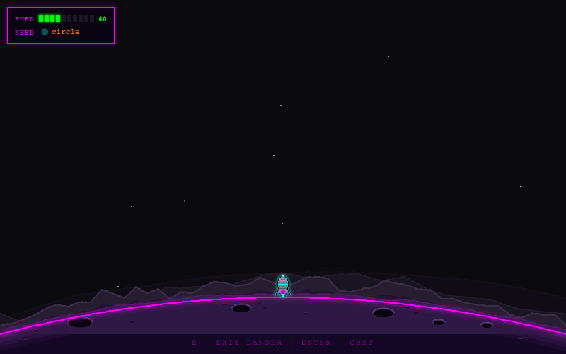
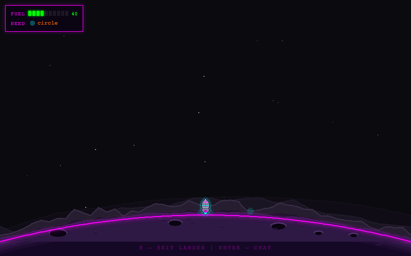
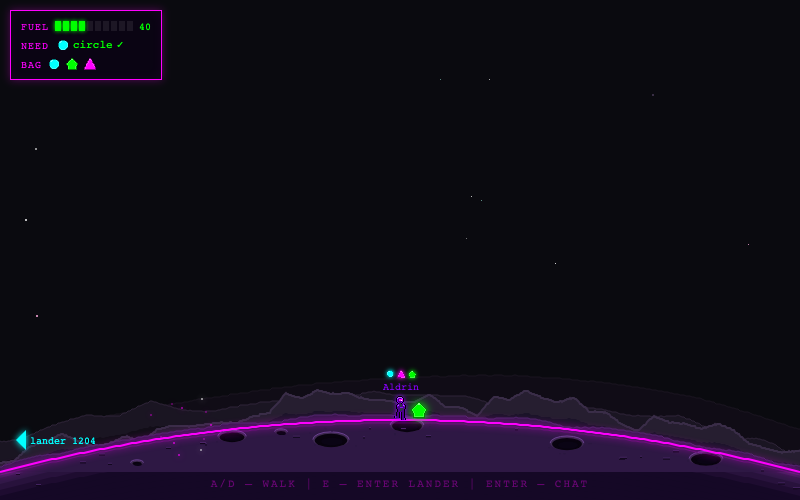

<!-- _class: hero -->

# How Moon Lander uses Jazz

A walkthrough of real-time multiplayer in a browser game — built with Jazz, React, and a canvas physics engine.

Players share a moon surface: they collect fuel deposits, trade fuel with each other, and see each other's landers moving in real time.



---

## What is Jazz?

Jazz is a **local-first** sync framework. Every client runs a full database in a WASM worker, persisted to disk via OPFS. Changes sync to an edge server and fan out to all connected clients in real time.

<svg xmlns="http://www.w3.org/2000/svg" viewBox="0 0 560 212" width="520" height="196" style="display:block;margin:0.5rem auto">
  <defs>
    <marker id="arr" markerWidth="8" markerHeight="6" refX="8" refY="3" orient="auto"><polygon points="0 0, 8 3, 0 6" fill="#6b7280"/></marker>
    <marker id="arrs" markerWidth="8" markerHeight="6" refX="8" refY="3" orient="auto-start-reverse"><polygon points="0 0, 8 3, 0 6" fill="#6b7280"/></marker>
  </defs>
  <rect x="180" y="10" width="200" height="58" rx="8" fill="#dcfce7" stroke="#16a34a" stroke-width="1.5"/>
  <text x="280" y="34" text-anchor="middle" font-family="ui-sans-serif,sans-serif" font-size="13" font-weight="700" fill="#166534">Jazz sync server</text>
  <text x="280" y="54" text-anchor="middle" font-family="ui-sans-serif,sans-serif" font-size="11" fill="#166534">sync + fan-out</text>
  <rect x="8" y="130" width="170" height="74" rx="8" fill="#dbeafe" stroke="#3b82f6" stroke-width="1.5"/>
  <text x="93" y="154" text-anchor="middle" font-family="ui-sans-serif,sans-serif" font-size="13" font-weight="700" fill="#1e40af">Browser A</text>
  <text x="93" y="174" text-anchor="middle" font-family="ui-monospace,monospace" font-size="11" fill="#1e3a8a">WASM worker</text>
  <text x="93" y="192" text-anchor="middle" font-family="ui-monospace,monospace" font-size="11" fill="#1e3a8a">OPFS (local DB)</text>
  <rect x="382" y="130" width="170" height="74" rx="8" fill="#dbeafe" stroke="#3b82f6" stroke-width="1.5"/>
  <text x="467" y="154" text-anchor="middle" font-family="ui-sans-serif,sans-serif" font-size="13" font-weight="700" fill="#1e40af">Browser B</text>
  <text x="467" y="174" text-anchor="middle" font-family="ui-monospace,monospace" font-size="11" fill="#1e3a8a">WASM worker</text>
  <text x="467" y="192" text-anchor="middle" font-family="ui-monospace,monospace" font-size="11" fill="#1e3a8a">OPFS (local DB)</text>
  <line x1="215" y1="68" x2="93" y2="128" stroke="#6b7280" stroke-width="1.5" stroke-dasharray="5,3" marker-start="url(#arrs)" marker-end="url(#arr)"/>
  <line x1="345" y1="68" x2="467" y2="128" stroke="#6b7280" stroke-width="1.5" stroke-dasharray="5,3" marker-start="url(#arrs)" marker-end="url(#arr)"/>
</svg>

- No REST API. No WebSockets to manage. No manual state reconciliation.
- Writes are **instant locally** — sync happens in the background.
- Every client is always readable, even offline.

---

## The schema

Three tables define the entire multiplayer state. Written in a TypeScript DSL in [`schema/current.ts`](../schema/current.ts); `jazz build` generates a SQL migration and typed interfaces.

<div style="display:grid;grid-template-columns:1fr 1fr;gap:1rem;margin-top:0.5rem">
<div>

```typescript
import { table, col } from "jazz-tools";

table("players", {
  playerId: col.string(),
  name: col.string(),
  color: col.string(),
  mode: col.string(),
  positionX: col.int(),
  positionY: col.int(),
  velocityX: col.int(),
  velocityY: col.int(),
  landerFuelLevel: col.int(),
  requiredFuelType: col.string(),
  thrusting: col.boolean(),
  lastSeen: col.int(),
});
```

</div>
<div>

```typescript
table("fuel_deposits", {
  fuelType: col.string(),
  positionX: col.int(),
  collected: col.boolean(),
  collectedBy: col.string(),
  createdAt: col.int(),
});

table("chat_messages", {
  playerId: col.string(),
  message: col.string(),
  createdAt: col.int(),
});
```

</div>
</div>

---

## Client setup

One call to `createJazzClient` initialises the WASM worker, opens the OPFS database, and begins syncing. `JazzProvider` makes the `db` available to every component in the tree.

**[`src/App.tsx`](../src/App.tsx)**

```typescript
import { createJazzClient, JazzProvider } from "jazz-tools/react";

export function App({ config, playerId, ... }: AppProps) {
  const [client, setClient] = useState<JazzClient | null>(null);

  useEffect(() => {
    let active = true;
    let jazzClient: JazzClient | null = null;
    createJazzClient(config).then(  // one-time: WASM + OPFS + sync
      (c) => { if (active) { jazzClient = c; setClient(c); } else c.shutdown(); },
      (err) => { if (active) console.error("Jazz init failed:", err); },
    );
    return () => { active = false; jazzClient?.shutdown(); };
  }, [config.appId, config.serverUrl]);

  return (
    <JazzProvider client={client}>
      <GameWithSync playerId={playerId} />  {/* all Jazz access lives below here */}
    </JazzProvider>
  );
}
```

If no config is provided, `<Game>` mounts directly with no Jazz layer — useful for offline play and for the test suite.

---

## Where Jazz lives in the source tree

All Jazz integration is in one folder:

```
src/jazz/
├── GameWithSync.tsx   ← bridge: Jazz data → Game props + write callbacks
├── useSync.ts         ← all Jazz reads (subscriptions to 3 tables)
└── SyncManager.ts     ← all Jazz writes (batched on a 200 ms interval)
```

`src/game/` and `src/Game.tsx` are pure game engine code — they receive data via props and callbacks and know nothing about Jazz.

This separation means you can read the entire Jazz integration by looking at three files, without touching any physics or rendering code.

---

## Live subscriptions: `useAll`



**[`src/jazz/useSync.ts`](../src/jazz/useSync.ts)**

```typescript
import { useAll, useDb } from "jazz-tools/react";

export function useSync(playerId: string): SyncResult {
  // Other players' positions, modes, fuel levels — live from the server
  const remotePlayers = useAll(
    app.players.where({ playerId: { ne: playerId } }),
  );

  // Deposits on the surface — drives the game's collectible objects
  const uncollectedDeposits = useAll(
    app.fuel_deposits.where({ collected: false }),
  );

  // Chat messages, newest-last
  const chatMessages = useAll(
    app.chat_messages.orderBy("createdAt", "asc"),
  );
  ...
}
```

Results stream from the sync server. When any client writes, every subscriber re-renders automatically — no polling, no manual invalidation.

---

## Waiting for the edge: the `settled` flag

The first `useAll` result may arrive before all remote data has synced. Moon Lander uses a `settled` flag to delay game setup until the edge subscription has delivered its initial payload.

```typescript
// undefined = still connecting; [] or [...] = server has responded
const allUncollected = useAll(app.fuel_deposits.where({ collected: false }));

const settled = allUncollected !== undefined;
```

`settled` gates two things:

1. **Deposit reconciliation** — ensuring the surface has the right number of deposits for the current player count (runs once, after settle).
2. **Player row insert** — the local player is only written to the DB after settle, preventing duplicate rows from concurrent joins.

---

## Durability tiers

The tier on a write controls where the promise resolves. All writes eventually propagate everywhere — the tier just sets how far it must travel first.

<svg xmlns="http://www.w3.org/2000/svg" viewBox="0 0 640 255" width="960" height="383" style="display:block;margin:0.5rem auto">
  <defs>
    <marker id="aw" markerWidth="6" markerHeight="5" refX="6" refY="2.5" orient="auto"><polygon points="0 0,6 2.5,0 5" fill="#7c3aed"/></marker>
    <marker id="ae" markerWidth="6" markerHeight="5" refX="6" refY="2.5" orient="auto"><polygon points="0 0,6 2.5,0 5" fill="#16a34a"/></marker>
    <marker id="ag" markerWidth="6" markerHeight="5" refX="6" refY="2.5" orient="auto"><polygon points="0 0,6 2.5,0 5" fill="#d97706"/></marker>
    <marker id="as" markerWidth="6" markerHeight="5" refX="6" refY="2.5" orient="auto"><polygon points="0 0,6 2.5,0 5" fill="#6366f1"/></marker>
  </defs>

  <!-- Participant boxes (centers: 75, 230, 390, 555) -->
  <rect x="12"  y="10" width="126" height="38" rx="6" fill="#f9fafb" stroke="#9ca3af" stroke-width="1.5"/>
  <text x="75"  y="34" text-anchor="middle" font-family="ui-sans-serif,sans-serif" font-size="13" font-weight="700" fill="#374151">Client</text>

  <rect x="165" y="10" width="130" height="38" rx="6" fill="#f5f3ff" stroke="#7c3aed" stroke-width="1.5"/>
  <text x="230" y="34" text-anchor="middle" font-family="ui-sans-serif,sans-serif" font-size="13" font-weight="700" fill="#4c1d95">OPFS Worker</text>

  <rect x="325" y="10" width="130" height="38" rx="6" fill="#dcfce7" stroke="#16a34a" stroke-width="1.5"/>
  <text x="390" y="34" text-anchor="middle" font-family="ui-sans-serif,sans-serif" font-size="13" font-weight="700" fill="#166534">Edge Node</text>

  <rect x="490" y="10" width="130" height="38" rx="6" fill="#fef3c7" stroke="#d97706" stroke-width="1.5"/>
  <text x="555" y="34" text-anchor="middle" font-family="ui-sans-serif,sans-serif" font-size="13" font-weight="700" fill="#92400e">Global Core</text>

  <!-- Lifelines -->
  <line x1="75"  y1="48" x2="75"  y2="250" stroke="#e5e7eb" stroke-width="1" stroke-dasharray="4,3"/>
  <line x1="230" y1="48" x2="230" y2="250" stroke="#e5e7eb" stroke-width="1" stroke-dasharray="4,3"/>
  <line x1="390" y1="48" x2="390" y2="250" stroke="#e5e7eb" stroke-width="1" stroke-dasharray="4,3"/>
  <line x1="555" y1="48" x2="555" y2="250" stroke="#e5e7eb" stroke-width="1" stroke-dasharray="4,3"/>

  <!-- write "worker": Client → OPFS Worker -->
  <line x1="79" y1="90" x2="226" y2="90" stroke="#7c3aed" stroke-width="1.5" marker-end="url(#aw)"/>
  <circle cx="230" cy="90" r="5" fill="#7c3aed" stroke="#fff" stroke-width="1.5"/>
  <line x1="235" y1="90" x2="386" y2="90" stroke="#e5e7eb" stroke-width="1" stroke-dasharray="4,3"/>
  <line x1="394" y1="90" x2="551" y2="90" stroke="#e5e7eb" stroke-width="1" stroke-dasharray="4,3"/>
  <text x="152" y="82" text-anchor="middle" font-family="ui-monospace,monospace" font-size="10.5" fill="#7c3aed">db.insert({tier:"worker"})</text>

  <!-- write "edge": Client → Edge Node -->
  <line x1="79" y1="135" x2="386" y2="135" stroke="#16a34a" stroke-width="1.5" marker-end="url(#ae)"/>
  <circle cx="390" cy="135" r="5" fill="#16a34a" stroke="#fff" stroke-width="1.5"/>
  <line x1="395" y1="135" x2="551" y2="135" stroke="#e5e7eb" stroke-width="1" stroke-dasharray="4,3"/>
  <text x="232" y="127" text-anchor="middle" font-family="ui-monospace,monospace" font-size="10.5" fill="#166534">db.insert({tier:"edge"})</text>

  <!-- write "global": Client → Global Core -->
  <line x1="79" y1="180" x2="551" y2="180" stroke="#d97706" stroke-width="1.5" marker-end="url(#ag)"/>
  <circle cx="555" cy="180" r="5" fill="#d97706" stroke="#fff" stroke-width="1.5"/>
  <text x="316" y="172" text-anchor="middle" font-family="ui-monospace,monospace" font-size="10.5" fill="#d97706">db.insert({tier:"global"})</text>

  <!-- Divider -->
  <line x1="12" y1="196" x2="628" y2="196" stroke="#f0f0f0" stroke-width="1.5"/>

  <!-- useAll(q, "edge"): Edge Node → Client -->
  <line x1="386" y1="212" x2="79" y2="212" stroke="#6366f1" stroke-width="1.5" stroke-dasharray="5,3" marker-end="url(#as)"/>
  <text x="232" y="205" text-anchor="middle" font-family="ui-monospace,monospace" font-size="10.5" fill="#6366f1">useAll(q) — edge subscription</text>

  <!-- useAll(q, "global"): Global Core → Client -->
  <line x1="551" y1="238" x2="79" y2="238" stroke="#6366f1" stroke-width="1.5" stroke-dasharray="5,3" marker-end="url(#as)"/>
  <text x="316" y="231" text-anchor="middle" font-family="ui-monospace,monospace" font-size="10.5" fill="#6366f1">useAll(q) — global subscription</text>
</svg>

---

## Why batch writes? The SyncManager

The game engine runs at **60 fps**. Writing on every frame would generate thousands of DB calls per second — far more than anything needs to sync in real time.

**[`src/jazz/SyncManager.ts`](../src/jazz/SyncManager.ts)**

```typescript
export class SyncManager {
  private pendingCollections: string[] = [];
  private pendingRefuels: FuelType[] = [];
  private pendingShares: Array<{ fuelType: string; receiverPlayerId: string }> = [];
  private pendingBursts: string[] = [];
  private pendingMessages: string[] = [];

  constructor(private db: ReturnType<typeof useDb>, private playerId: string) {
    // Drain all queues every 200 ms — 5 writes/s instead of 60
    this.intervalId = setInterval(() => this.flush(), DB_SYNC_INTERVAL_MS);
  }

  collectDeposit(id: string) { this.pendingCollections.push(id); }
  refuel(fuelType: FuelType)  { this.pendingRefuels.push(fuelType); }
  sendMessage(text: string)   { this.pendingMessages.push(text); }
  ...
}
```

The game engine calls `collectDeposit()`, `refuel()`, etc. synchronously — they just push to a queue. The writes to Jazz happen asynchronously in `flush()`, 5 times per second.

---

## Collecting a deposit

<div style="display:grid;grid-template-columns:3fr 2fr;gap:1.5rem;margin-top:0.4rem">
<div>

When the player walks over a fuel deposit, `collectDeposit` is queued. On the next flush:

```typescript
// src/jazz/SyncManager.ts — inside doFlush()
await db.update(
  app.fuel_deposits,
  depId,
  { collected: true, collectedBy: playerId },
  { tier: "edge" },
);
```

Every other client's `useAll(fuel_deposits.where({ collected: false }), "edge")` subscription updates automatically — the deposit disappears from their surface and into the collector's inventory.

</div>
<div>

<blockquote>
<strong>Concurrent collect?</strong> Both writes go through with <code>collected: true</code>. Last-write-wins resolves <code>collectedBy</code> to whichever timestamp arrived at the edge later — one player wins, the other's collection is silently overwritten on sync. No locks, no errors.
</blockquote>
</div>
</div>

---

## Sharing fuel cross-client

When Player A gives a deposit to Player B, no new row is created. A just updates `collectedBy`:

```typescript
// src/jazz/SyncManager.ts — inside doFlush()
await this.db.update(
  app.fuel_deposits,
  shareId,
  { collectedBy: share.receiverPlayerId },
  { tier: "edge" },
);
```

Player B's `useAll(app.fuel_deposits.where({ collected: true }), "edge")` subscription already contains the row. The `collectedBy` update propagates as a plain row update — Player B's inventory reflects the share immediately.

---

## Releasing a deposit: DELETE + INSERT

When a player refuels their lander, the deposit is returned to the surface. Rather than updating `collected: false` on the existing row, the code deletes it and inserts a fresh one:

```typescript
// src/jazz/SyncManager.ts — releaseDeposit()
await this.db.deleteFrom(app.fuel_deposits, depId);
await this.db.insert(
  app.fuel_deposits,
  { fuelType, positionX, collected: false, collectedBy: "", createdAt: Date.now() },
  { tier: "edge" },
);
```

The fresh INSERT is picked up by all clients' `where({ collected: false })` subscriptions — the deposit reappears on everyone's surface.

---

## Player state sync


Every player's position, velocity, fuel level, and mode are written to the `players` table. SyncManager skips the write if nothing meaningful has changed, using configurable thresholds:

```typescript
// src/jazz/SyncManager.ts — inside doFlush()
// First flush inserts the row; subsequent flushes update it if state changed
if (!this.dbRowId && ds.localPlayerSettled) {
  this.dbRowId = await this.db.insert(app.players, state, { tier: "edge" });
} else if (this.dbRowId && playerStateChanged(this.lastSynced, state)) {
  await this.db.update(app.players, this.dbRowId, state, { tier: "edge" });
}
```

Every other client's `useAll(app.players.where({ playerId: { ne: myId } }))` subscription updates automatically — their rendering of the remote lander stays in sync. (`ne` is Jazz's "not equal" operator — the subscription excludes the local player's own row.)

---

## Jazz API surface — used in Moon Lander

| API                                    | Used for                                                       |
| -------------------------------------- | -------------------------------------------------------------- |
| `createJazzClient(config)`             | Initialise WASM worker + OPFS database, begin syncing          |
| `JazzProvider`                         | Provide `db` to every component — no prop drilling             |
| `useDb()`                              | Access the db write API from any component                     |
| `useAll(query)`                        | Live subscription — re-renders on every remote or local change |
| `db.insert(table, data, { tier })`     | Create a new row; `"edge"` broadcasts to remote subscribers    |
| `db.update(table, id, data, { tier })` | Update fields on an existing row; `"edge"` broadcasts          |
| `db.deleteFrom(table, id)`             | Delete a row (used before re-inserting a released deposit)     |

**Key insight:** the entire multiplayer state of a real-time game — positions, collectibles, inventory, chat — is managed with just these seven API calls. No custom server, no WebSocket handlers, no conflict resolution code.
