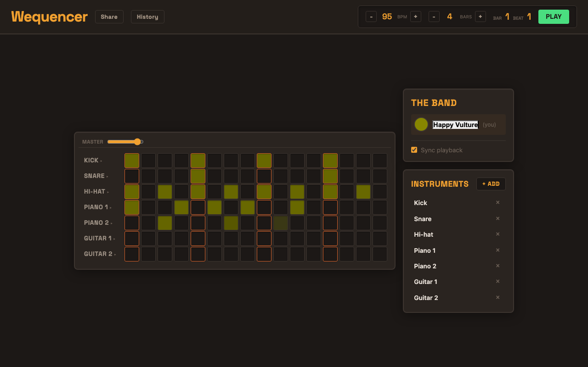
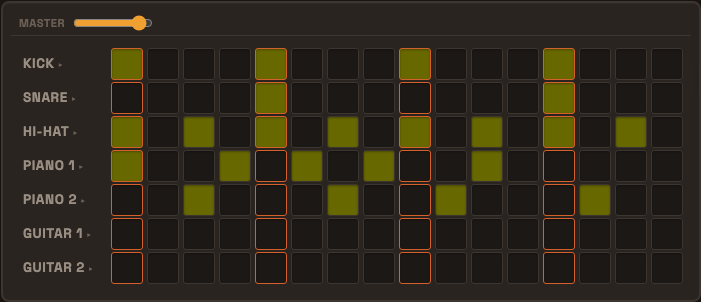
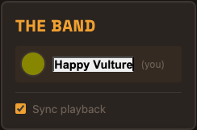
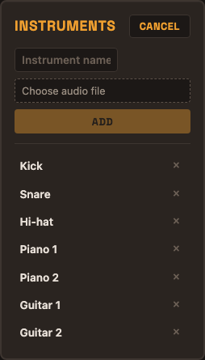

<!-- _class: hero -->

# How Wequencer uses Jazz

A walkthrough of real-time collaboration in a collaborative drum sequencer — built with Jazz, Svelte, and Tone.js.



---

## What is Jazz?

Jazz is a **local-first** sync framework. Every client runs a full database in a WASM worker, persisted to disk via OPFS. Changes sync to an edge server and fan out to all connected clients in real time.

<svg xmlns="http://www.w3.org/2000/svg" viewBox="0 0 560 212" width="520" height="196" style="display:block;margin:0.5rem auto">
  <defs>
    <marker id="arr" markerWidth="8" markerHeight="6" refX="8" refY="3" orient="auto"><polygon points="0 0, 8 3, 0 6" fill="#6b7280"/></marker>
    <marker id="arrs" markerWidth="8" markerHeight="6" refX="8" refY="3" orient="auto-start-reverse"><polygon points="0 0, 8 3, 0 6" fill="#6b7280"/></marker>
  </defs>
  <!-- Jazz sync server at top -->
  <rect x="180" y="10" width="200" height="58" rx="8" fill="#dcfce7" stroke="#16a34a" stroke-width="1.5"/>
  <text x="280" y="34" text-anchor="middle" font-family="ui-sans-serif,sans-serif" font-size="13" font-weight="700" fill="#166534">Jazz sync server</text>
  <text x="280" y="54" text-anchor="middle" font-family="ui-sans-serif,sans-serif" font-size="11" fill="#166534">sync + fan-out</text>
  <!-- Browser A bottom left -->
  <rect x="8" y="130" width="170" height="74" rx="8" fill="#dbeafe" stroke="#3b82f6" stroke-width="1.5"/>
  <text x="93" y="154" text-anchor="middle" font-family="ui-sans-serif,sans-serif" font-size="13" font-weight="700" fill="#1e40af">Browser A</text>
  <text x="93" y="174" text-anchor="middle" font-family="ui-monospace,monospace" font-size="11" fill="#1e3a8a">WASM worker</text>
  <text x="93" y="192" text-anchor="middle" font-family="ui-monospace,monospace" font-size="11" fill="#1e3a8a">OPFS (local DB)</text>
  <!-- Browser B bottom right -->
  <rect x="382" y="130" width="170" height="74" rx="8" fill="#dbeafe" stroke="#3b82f6" stroke-width="1.5"/>
  <text x="467" y="154" text-anchor="middle" font-family="ui-sans-serif,sans-serif" font-size="13" font-weight="700" fill="#1e40af">Browser B</text>
  <text x="467" y="174" text-anchor="middle" font-family="ui-monospace,monospace" font-size="11" fill="#1e3a8a">WASM worker</text>
  <text x="467" y="192" text-anchor="middle" font-family="ui-monospace,monospace" font-size="11" fill="#1e3a8a">OPFS (local DB)</text>
  <!-- Bidirectional arrows: server ↕ each browser (no direct browser-to-browser link) -->
  <line x1="215" y1="68" x2="93" y2="128" stroke="#6b7280" stroke-width="1.5" stroke-dasharray="5,3" marker-start="url(#arrs)" marker-end="url(#arr)"/>
  <line x1="345" y1="68" x2="467" y2="128" stroke="#6b7280" stroke-width="1.5" stroke-dasharray="5,3" marker-start="url(#arrs)" marker-end="url(#arr)"/>
</svg>

- No REST API. No polling. No manual state reconciliation.
- Writes are **instant locally** — sync happens in the background.
- Every client is always readable, even offline.

---

## 1. The schema

The schema is written in a **TypeScript DSL** (`schema/current.ts`). Running `jazz codegen` reads it and generates two things: a SQL migration and the typed `schema/app.ts` interfaces used throughout the app.

**[`schema/current.ts`](../schema/current.ts)** — source of truth

```typescript
import { table, col } from "jazz-tools";

table("instruments", {
  name: col.string(),
  sound: col.bytes(), // binary blobs are first-class
  display_order: col.int(),
});

table("beats", {
  jam: col.ref("jams"),
  instrument: col.ref("instruments"),
  beat_index: col.int(), // 0–15
  placed_by: col.string(), // session user_id
});
```

`col.ref()` declares foreign keys. `col.bytes()` maps to `Uint8Array` in TypeScript. The generated `schema/app.ts` provides typed interfaces and query builders — shown on the next slide.

---

## 2. Generated types

Codegen produces typed interfaces for every table, plus a typed entry point for all queries:

```typescript
// schema/app.ts — AUTO-GENERATED, do not edit
export interface Beat {
  id: string;
  jam: string;
  instrument: string;
  beat_index: number;
  placed_by: string; // who placed this beat
}

export interface Instrument {
  id: string;
  name: string;
  sound: Uint8Array; // binary blobs are first-class
  display_order: number;
}

export const app = {
  instruments: new InstrumentQueryBuilder(),
  beats: new BeatQueryBuilder(),
  participants: new ParticipantQueryBuilder(),
};
```

---

## 3. Client setup

One call to `createJazzClient` initialises the WASM worker, opens the OPFS database, and begins syncing. `JazzSvelteProvider` makes the `db` available to every component in the tree — no prop drilling.

**[`src/App.svelte`](../src/App.svelte)**

```svelte
<script lang="ts">
  import { createJazzClient, JazzSvelteProvider } from 'jazz-tools/svelte';
  import Main from './Main.svelte';

  const client = createJazzClient({
    appId: import.meta.env.VITE_JAZZ_APP_ID ?? 'wequencer',
    serverUrl: import.meta.env.DEV
      ? window.location.origin   // Vite proxies /sync and /events in dev
      : import.meta.env.VITE_JAZZ_SERVER_URL,
  });
</script>

<JazzSvelteProvider {client}>
  {#snippet children()}
    <Main />
  {/snippet}
</JazzSvelteProvider>
```

---

## 4. Accessing the db anywhere

Any component inside `JazzSvelteProvider` can reach the database and the current user session — no context threading needed.

```typescript
import { getDb, getSession } from "jazz-tools/svelte";

const db = getDb(); // full query + write API
const session = getSession(); // { user_id, ... } | null
```

Used in `InstrumentRow`, `InstrumentManager`, and `Participants` — each just calls `getDb()` directly.

---

## 5. Live queries with `QuerySubscription` (Svelte)

`QuerySubscription` is a **Svelte-specific** class from `jazz-tools/svelte` that wraps `db.subscribeAll`. Its `.current` property stays in sync with the live local database — every write (from any user, anywhere) triggers a Svelte re-render automatically.

**[`src/Sequencer.svelte`](../src/Sequencer.svelte)**

```svelte
<script lang="ts">
  import { QuerySubscription } from 'jazz-tools/svelte';

  // Instrument list — re-renders whenever any instrument changes
  const instruments = new QuerySubscription(
    app.instruments.orderBy('display_order'),
  );

  // All beats — used to drive the whole grid
  const allBeats = new QuerySubscription(app.beats);
</script>

{#each instruments.current ?? [] as instrument (instrument.id)}
  <InstrumentRow {instrument} beats={beatsForInstrument(instrument.id)} />
{/each}
```

No polling. No manual refetch. Jazz handles invalidation.

---

## 6. The grid



Each row is an instrument. Each cell is a beat position.

`instruments.current` drives the rows.
`allBeats.current` drives the cells.

When User B clicks a cell, User A's grid updates in real time — Jazz delivers the write to every subscriber instantly.

---

## 7. Synchronous writes

Writes to the local database are **synchronous**. They return immediately; sync to the edge server happens in the background.

**[`src/InstrumentRow.svelte`](../src/InstrumentRow.svelte) — toggling a beat**

```typescript
function toggleBeat(index: number) {
  const existing = beats.find((b) => b.beat_index === index);

  if (existing) {
    db.delete(app.beats, existing.id); // remove
  } else {
    db.insert(app.beats, {
      jam: jamId,
      instrument: instrument.id,
      beat_index: index,
      placed_by: session?.user_id ?? "anonymous", // tag the author
    });
  }
}
```

No `await`. No optimistic updates. No loading states. The local write _is_ the truth — sync catches up silently.

---

## 8. Real-time collaboration

Every beat carries its author's `user_id` via `placed_by`. Wequencer maps each user to a stable colour using their ID — so you can see exactly who placed which beat.

```typescript
// A stable hue derived from a user ID string
function getStableHue(userId: string): number { ... }

// In the beat cell template:
const hue = beat ? getStableHue(beat.placed_by) : undefined;
```

When a remote user places a beat, their `QuerySubscription` (Svelte) fires on User A's machine, the cell re-renders with the new colour, and the beat starts playing on the next loop — all without any server round-trip in the UI layer.


---

## 9. Async setup: seeding instruments

**[`src/jam.ts`](../src/jam.ts)**

```typescript
export async function ensureInstrumentsSeeded(db: Db): Promise<void> {
  // Return visits: localStorage flag is set → skip immediately, works offline.
  if (localStorage.getItem(SEEDED_STORAGE_KEY)) return;

  // First visit on this device: wait for edge confirmation.
  // Jazz has no custom-ID insert or upsert, so settledTier: 'edge' is the
  // only way to prevent two fresh clients seeding concurrently.
  const existing = await db.all(app.instruments, { settledTier: "edge" });
  const existingNames = new Set(existing.map((i) => i.name));

  for (const seed of missingSeeds(existingNames)) {
    const buf = await (await fetch(seed.file)).arrayBuffer();
    db.insert(app.instruments, {
      name: seed.name,
      sound: new Uint8Array(buf),
      display_order: seed.display_order,
    });
  }
  localStorage.setItem(SEEDED_STORAGE_KEY, "1");
}
```

- **Return visits** skip the network entirely — the app opens instantly and works offline.
- **First visit** on a new device still uses `settledTier: 'edge'` to guard against duplicate seeding from concurrent fresh clients.
- If the edge is unreachable on a first visit, the promise waits until connectivity returns. Subsequent visits are unaffected.

---

## 10. The participants panel

Every user who joins a jam is recorded as a `Participant`. The panel subscribes live and lets you rename yourself — the update syncs to everyone immediately.



```typescript
// Reactive — updates when anyone joins or renames
const allParticipants = new QuerySubscription(app.participants);

// Editing your own name
db.update(app.participants, editingId, { display_name: name });
```

Identity flows through `session.user_id` — the same ID that colours your beats in the grid.

---

## 11. Instruments panel



Instruments can be added at runtime. Upload any audio file — it is stored as a `BYTEA` blob in the database and synced to all clients as binary data.

```typescript
db.insert(app.instruments, {
  name: newInstrumentName,
  sound: new Uint8Array(audioBuffer),
  display_order: nextOrder,
});
```

Because `QuerySubscription` watches `app.instruments`, every client's grid grows a new row the moment the insert lands.

---

<!-- _style: "table { font-size: 0.8rem; } td, th { padding: 0.25rem 0.5rem; }" -->

## Jazz API surface — used in Wequencer

| API                                      | Notes                                                                 |
| ---------------------------------------- | --------------------------------------------------------------------- |
| `createJazzClient`                       | Initialises WASM worker + OPFS database, begins syncing               |
| `JazzSvelteProvider`                     | Provides `db` to every component — no prop drilling                   |
| `getDb()`                                | Db singleton — callable from any component in the tree                |
| `getSession()`                           | Current user identity (`user_id`)                                     |
| `new QuerySubscription(query)`           | **Svelte-specific** — reactive live query, re-renders on every change |
| `db.insert` / `db.update` / `db.delete`  | Synchronous local writes — sync to edge happens in the background     |
| `db.all(query, { settledTier: 'edge' })` | Async read that waits for edge server confirmation before resolving   |
