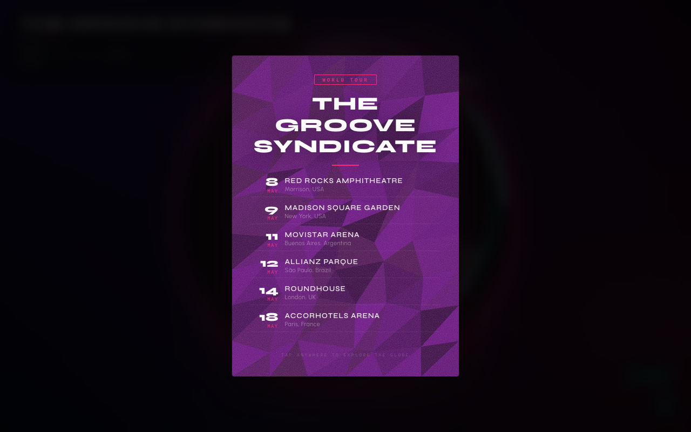
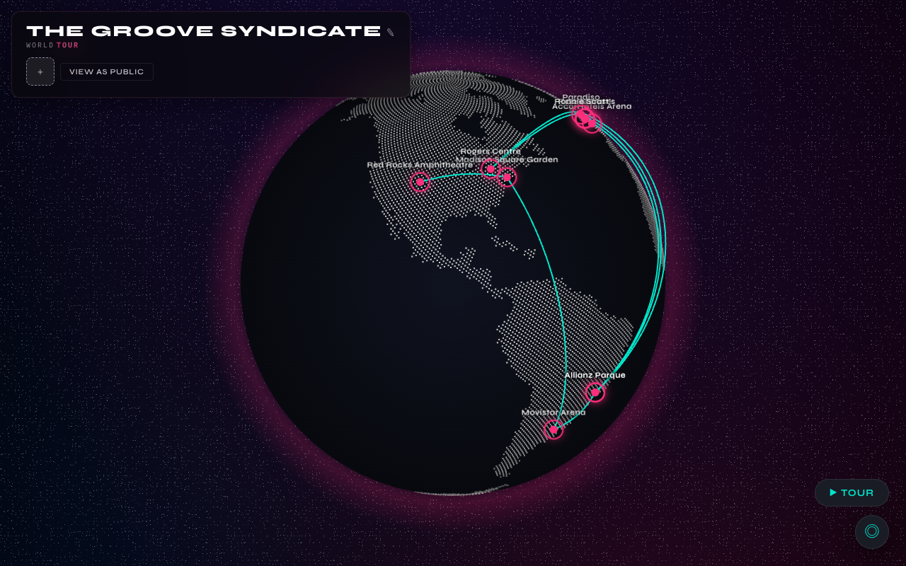
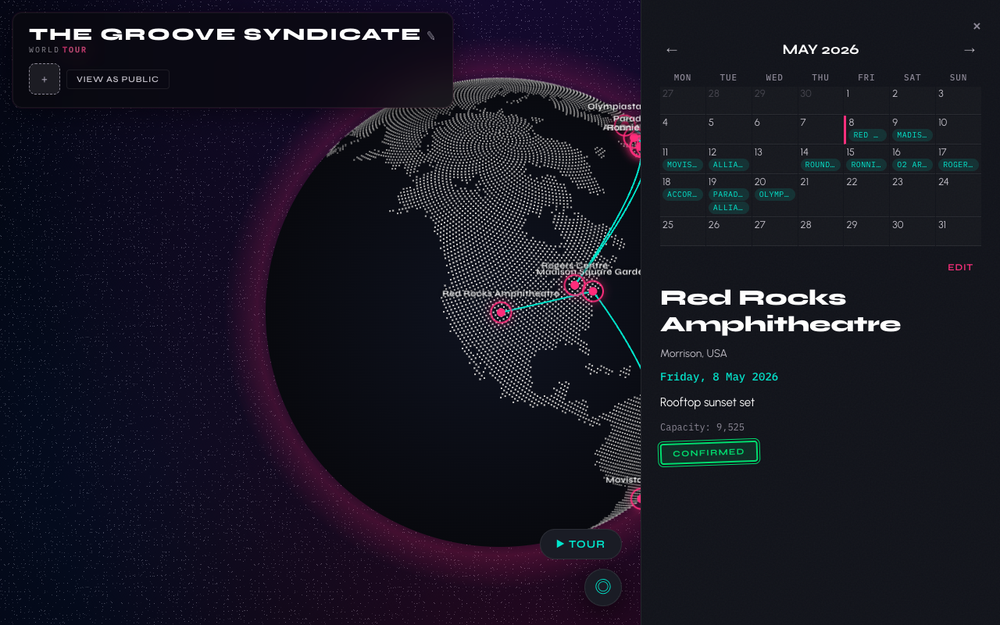
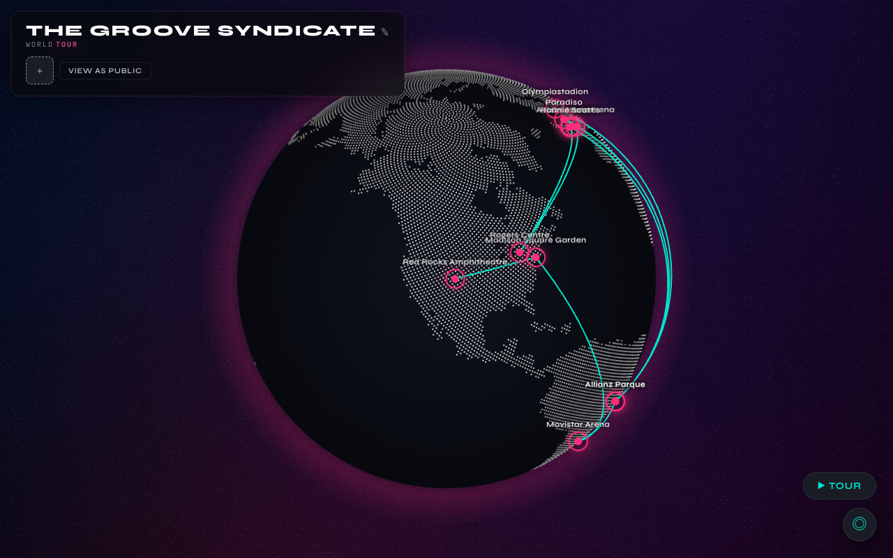

<!-- _class: hero -->

# How World Tour uses Jazz

A walkthrough of a tour management app built with Jazz, Vue 3, and MapLibre GL. Band members manage stops, the public sees a live globe.



---

## What is Jazz?

Jazz is a **local-first** sync framework. Every client runs a full database in a WASM worker, persisted to disk via OPFS. Changes sync to an edge server and fan out to all connected clients in real time.

<svg xmlns="http://www.w3.org/2000/svg" viewBox="0 0 560 212" width="520" height="196" style="display:block;margin:0.5rem auto">
  <defs>
    <marker id="arr" markerWidth="8" markerHeight="6" refX="8" refY="3" orient="auto"><polygon points="0 0, 8 3, 0 6" fill="#6b7280"/></marker>
    <marker id="arrs" markerWidth="8" markerHeight="6" refX="8" refY="3" orient="auto-start-reverse"><polygon points="0 0, 8 3, 0 6" fill="#6b7280"/></marker>
  </defs>
  <rect x="180" y="10" width="200" height="58" rx="8" fill="#dcfce7" stroke="#16a34a" stroke-width="1.5"/>
  <text x="280" y="34" text-anchor="middle" font-family="ui-sans-serif,sans-serif" font-size="13" font-weight="700" fill="#166534">Jazz sync server</text>
  <text x="280" y="54" text-anchor="middle" font-family="ui-sans-serif,sans-serif" font-size="11" fill="#166534">sync + fan-out</text>
  <rect x="8" y="130" width="170" height="74" rx="8" fill="#dbeafe" stroke="#3b82f6" stroke-width="1.5"/>
  <text x="93" y="154" text-anchor="middle" font-family="ui-sans-serif,sans-serif" font-size="13" font-weight="700" fill="#1e40af">Browser A</text>
  <text x="93" y="174" text-anchor="middle" font-family="ui-monospace,monospace" font-size="11" fill="#1e3a8a">WASM worker</text>
  <text x="93" y="192" text-anchor="middle" font-family="ui-monospace,monospace" font-size="11" fill="#1e3a8a">OPFS (local DB)</text>
  <rect x="382" y="130" width="170" height="74" rx="8" fill="#dbeafe" stroke="#3b82f6" stroke-width="1.5"/>
  <text x="467" y="154" text-anchor="middle" font-family="ui-sans-serif,sans-serif" font-size="13" font-weight="700" fill="#1e40af">Browser B</text>
  <text x="467" y="174" text-anchor="middle" font-family="ui-monospace,monospace" font-size="11" fill="#1e3a8a">WASM worker</text>
  <text x="467" y="192" text-anchor="middle" font-family="ui-monospace,monospace" font-size="11" fill="#1e3a8a">OPFS (local DB)</text>
  <line x1="215" y1="68" x2="93" y2="128" stroke="#6b7280" stroke-width="1.5" stroke-dasharray="5,3" marker-start="url(#arrs)" marker-end="url(#arr)"/>
  <line x1="345" y1="68" x2="467" y2="128" stroke="#6b7280" stroke-width="1.5" stroke-dasharray="5,3" marker-start="url(#arrs)" marker-end="url(#arr)"/>
</svg>

- No REST API. No polling. No manual state reconciliation.
- Writes are **instant locally**, sync happens in the background.
- Every client is always readable, even offline.

---

## The schema

The schema is written in TypeScript. Running `pnpm build` reads it and generates typed interfaces and query builders in `schema/app.ts`.

**[`schema/current.ts`](../schema/current.ts)**

```typescript
import { table, col } from "jazz-tools";

table("venues", {
  name: col.string(),
  city: col.string(),
  country: col.string(),
  lat: col.float(),
  lng: col.float(),
  capacity: col.int().optional(),
});

table("stops", {
  bandId: col.ref("bands"), // foreign key
  venueId: col.ref("venues"), // foreign key
  date: col.timestamp(),
  status: col.enum("confirmed", "tentative", "cancelled"),
  publicDescription: col.string(),
  privateNotes: col.string().optional(),
});
```

`col.ref()` declares foreign keys. `col.enum()` maps to a union type. `.optional()` makes a field nullable.

---

## Client setup

One call to `createJazzClient` initialises the WASM worker, opens the OPFS database, and begins syncing. `JazzProvider` makes the `db` available to every component in the tree, no prop drilling.

**[`src/main.ts`](../src/main.ts)**

```typescript
import { createApp, h } from "vue";
import { createJazzClient, JazzProvider } from "jazz-tools/vue";
import App from "./App.vue";

const client = createJazzClient({
  appId: "019d29f4-dc2a-74c1-bc08-a22a7fc2204a",
  serverUrl: "http://localhost:4200",
});

const vueApp = createApp({
  render() {
    return h(
      JazzProvider,
      { client },
      {
        default: () => h(App),
        fallback: () => h("p", "Loading..."),
      },
    );
  },
});

vueApp.mount("#app");
```

---

## Accessing the database anywhere

Any component inside `JazzProvider` can reach the database and the current user session, no context threading needed.

```typescript
import { useDb, useSession } from "jazz-tools/vue";

const db = useDb(); // full query + write API
const session = useSession(); // { user_id, ... } | null
```

Used across the app: `App.vue`, `StopDetail`, `StopCreateForm`, `TourCalendar`, `BandLogo` each just calls `useDb()` directly.

---

## Live queries with `useAll` (Vue)



`useAll` is a **Vue-specific** composable that wraps `db.subscribeAll`. It returns a `ShallowRef` that stays in sync with the live local database. Every write (from any user, anywhere) triggers a Vue re-render automatically.

**[`src/App.vue`](../src/App.vue)**

```typescript
const stopsData = useAll(
  app.stops
    .where({ date: { gte: today, lte: threeWeeks } })
    .include({ venue: true })
    .orderBy("date", "asc")
    .limit(12),
);
```

- **Fluent query builder**: `.where()`, `.include()`, `.orderBy()`, `.limit()`, all typed.
- **Relation includes**: `.include({ venue: true })` eager-loads the venue for each stop.
- **No polling. No manual refetch.** Jazz handles invalidation.

---

## Role-based queries


The same `useAll` hook drives different views depending on who's logged in. Band members see all stops, the public sees only confirmed ones.

**[`src/App.vue`](../src/App.vue)**

```typescript
const baseStopsQuery = app.stops
  .where({ date: { gte: today, lte: threeWeeks } })
  .include({ venue: true })
  .orderBy("date", "asc")
  .limit(12);

const confirmedStopsQuery = app.stops
  .where({ status: "confirmed", date: { gte: today, lte: threeWeeks } })
  .include({ venue: true })
  .orderBy("date", "asc")
  .limit(12);

const stopsQuery = canEdit ? baseStopsQuery : confirmedStopsQuery;
const stopsData = useAll(stopsQuery);
```

One composable, two audiences. The server-side row-level policies (shown later) enforce this. The client-side query is just a convenience for filtering.

---

## Permissions

Permissions are defined in a TypeScript DSL alongside the schema. They compile to row-level security policies enforced by the Jazz runtime, not the UI.

**[`schema/permissions.ts`](../schema/permissions.ts)**

```typescript
import { definePermissions } from "jazz-tools/permissions";
import { app } from "./app.js";

export default definePermissions(app, ({ policy, session, anyOf }) => {
  const isBandMember = policy.members.exists.where({
    userId: session.user_id,
  });

  // Public: anyone can read confirmed stops
  policy.stops.allowRead.where(anyOf([{ status: "confirmed" }, isBandMember]));

  // Only band members can write
  policy.stops.allowInsert.where(isBandMember);
  policy.stops.allowUpdate.where(isBandMember);
  policy.stops.allowDelete.where(isBandMember);
});
```

`anyOf` composes conditions. `policy.members.exists` checks for a related row. These are enforced at the database level. A malicious client cannot bypass them.

---

## Co-located data access



Each component owns the Jazz calls it needs. No prop drilling for data, no event bubbling for writes. This is the idiomatic Jazz + Vue pattern.

**[`src/components/StopDetail.vue`](../src/components/StopDetail.vue)**

```html
<script setup lang="ts">
  import { useDb, useSession } from "jazz-tools/vue";
  import { app } from "../../schema/app.js";

  const db = useDb();
  const session = useSession();
  const canEdit = !!session;

  function save() {
    db.update(app.stops, props.stop.id, {
      date: new Date(editDate.value),
      status: editStatus.value,
      publicDescription: editDescription.value,
    });
  }

  function deleteStop() {
    db.delete(app.stops, props.stop.id);
  }
</script>
```

---

## Self-contained components



**[`src/components/StopCreateForm.vue`](../src/components/StopCreateForm.vue)** fetches its own venue list via `useAll`, and inserts both the venue and the stop directly.

```html
<script setup lang="ts">
  import { useDb, useAll } from "jazz-tools/vue";
  import { app } from "../../schema/app.js";

  const db = useDb();
  const venues = useAll(app.venues); // live venue list, no props needed

  function submit() {
    const venue = db.insert(app.venues, {
      name: newVenue.name,
      city: newVenue.city,
      country: newVenue.country,
      lat: newVenue.lat,
      lng: newVenue.lng,
    });
    db.insert(app.stops, {
      bandId: props.bandId,
      venueId: venue.id, // available immediately, no await
      date: new Date(stopDate.value),
      status: stopStatus.value,
      publicDescription: publicDescription.value,
    });
  }
</script>
```

No `await`. The insert returns immediately because writes hit the local DB first.

---

## File handling


**[`src/components/BandLogo.vue`](../src/components/BandLogo.vue)** is fully self-contained: it subscribes to its own band data, loads the logo file, and handles uploads, all via Jazz APIs.

```typescript
const db = useDb();
const bandsWithLogo = useAll(app.bands.include({ logoFile: { parts: true } }));

// Upload: binary file → Jazz file → link to band
async function onFileSelected(event: Event) {
  const file = input.files?.[0];
  if (!file) return;
  const insertedFile = await db.createFileFromBlob(app, file);
  db.update(app.bands, props.bandId, { logoFileId: insertedFile.id });
}

// Download: Jazz file → Blob → Object URL
const blob = await db.loadFileAsBlob(app, logoFile);
logoUrl.value = URL.createObjectURL(blob);
```

- **Nested includes**: `.include({ logoFile: { parts: true } })` loads the file and its binary parts in one query.
- **`createFileFromBlob`** / **`loadFileAsBlob`** handle chunked binary storage transparently.

---

<!-- _style: "table { font-size: 0.8rem; } td, th { padding: 0.25rem 0.5rem; }" -->

## Jazz API surface used in World Tour

| API                                        | Notes                                                            |
| ------------------------------------------ | ---------------------------------------------------------------- |
| `createJazzClient`                         | Initialises WASM worker + OPFS database, begins syncing          |
| `JazzProvider`                             | Provides `db` to every component, no prop drilling               |
| `useDb()`                                  | Db singleton, callable from any component in the tree            |
| `useSession()`                             | Current user identity (`user_id`), drives permission-aware UI    |
| `useAll(query)`                            | **Vue-specific** reactive live query, re-renders on every change |
| `db.insert` / `db.update` / `db.delete`    | Synchronous local writes, sync to edge happens in the background |
| `db.all(query)`                            | Async read, used for one-time checks (seeding, deduplication)    |
| `db.createFileFromBlob` / `loadFileAsBlob` | Chunked binary file storage and retrieval                        |
| `definePermissions`                        | Row-level security policies enforced by the Jazz runtime         |
| `.where()` / `.include()` / `.orderBy()`   | Fluent, typed query builder with relation eager-loading          |
