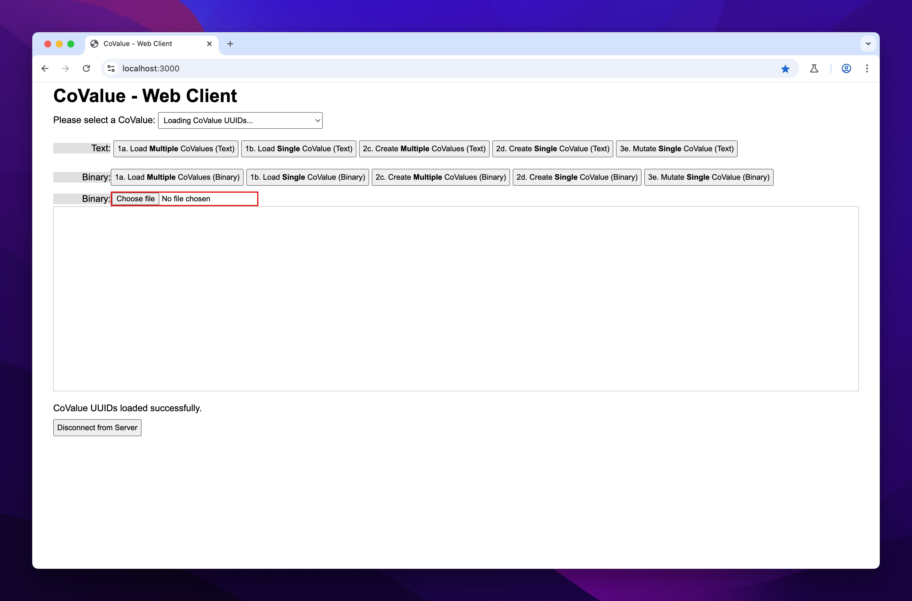

# 1.0. Introduction
This README contains my findings while building a microbenchmark to explore the efficiency of WebSockets versus HTTP1.1/2/3 + SSE as specified in [this research task](https://github.com/garden-co/jazz/issues/301).

## 1.1. Overview
Out of the total of 9 different web server + protocol combos, only 6 web server + protocol combos were feasible.

Below is a snapsot of web server + protocol combos that were built:

| # | Server      | Layer 7 | Layer 6 | Layer 4 | Built | Status |
|----|------------|--------|------------|--------|--------|--------|
| A1 | Node.js    | WebSocket (WS) |  TLSv1.3 (Optional) | TCP | ✔️ | **Complete** |
| A2 |     | HTTP/1.1 + Server-Sent Events (SSE) |  TLSv1.3 (Optional) | TCP | ✔️ | **Complete** |
| A3 |     | HTTP/2 + SSE |  TLSv1.3 (Optional) | TCP | ✔️ | **Complete** |
| A4 |     | HTTP/3 + SSE |  TLSv1.3 (Mandatory) | UDP (QUIC) | ❌ | **N/A** |
| B1 | uWebSockets.js | WebSocket |  TLSv1.3 (Optional) | TCP | ✔️ | **Complete** |
| B2 |     | HTTP/1 + SSE |  TLSv1.3 (Optional) | TCP | ✔️ | **Complete** |
| B3 |     | HTTP/2 + SSE |  TLSv1.3 (Optional) | TCP | ❌ | **N/A** |
| B4 |     | HTTP/3 + SSE |  TLSv1.3 (Mandatory) | UDP (QUIC) | ❌ | **N/A** |
| C1 | Node.js + Caddy    | HTTP/3 + SSE |  TLSv1.3 (Mandatory) | UDP (QUIC) | ✔️ | **Complete** | 

## 1.2. Server + Protocol Combos
As can be seen in the table above, 6 different web servers + protocol combos were built for the benchmarks:
1. Node.js (WS) code-named `node-ws`;
2. Node.js (HTTP/1.1 + SSE) code-named `node-http1`;
3. Node.js (HTTP/2 + SSE) code-named `node-http2`;
4. uWebSockets.js (WS) code-named `uws-ws`;
5. uWebSockets.js (HTTP/1.1 + SSE) code-named `uws-http1`;
6. Caddy + Node.js (HTTP/3 + SSE) code-named `caddy-http3`.

## 1.3. Server Memory Limit
On the development machine I used, which has 16GB of RAM installed, the memory limit for the `node` process defaults to 4GB. 

For the benchmarks proper, each web server is started with a higher memory limit of 8GB. This is set in `package.json` via `--max-old-space-size=8192` for all 6 web servers, but if running on a machine with higher installed memory, you can raise it as needed.

## 1.4. Server Test Data 
I used [faker.js](https://v7.fakerjs.dev/) to generate test data served by each web server. 

To keep things fast, the generated test data are not stored in a database. Instead, everything is served from memory, with the exception of binary files used to simulate binary CoValue downloads and uploads. These are stored on disk at: `public/downloads` and `public/uploads`.

Each web server listens on https://localhost:3000/ and serves a default `index` page from the file `public/client/{ws|http}/index.html`, depending on whether the server's transport is based on websockets or plain HTTP + SSE. 

The default `index` page hosts all JavaScript code that will be driven by [`playwright`](https://playwright.dev/) and [`artillery`](https://www.artillery.io/) load tests.

The default page includes a minified version of `faker.js` which is also used to create test data in the browser. The only downside is this [caveat](https://v7.fakerjs.dev/guide/usage.html#browser) from the `faker.js` documentation:
> Using the browser is great for experimenting 👍. However, due to all of the strings Faker uses to generate fake data, Faker is a large package. It's > 5 MiB minified. Please avoid deploying the full Faker in your web app.

## 1.5. Server Network Conditions
With respect to simulating various network conditions (I, II, III, IV), I explored:

OS-level throttling using third-party tools like:
- [Network Link Conditioner for MacOS](https://apple.stackexchange.com/questions/24066/how-to-simulate-slow-internet-connections-on-the-mac)
- [NetLimiter for Windows](https://www.netlimiter.com/)

Or doing the throttling at the browser-level using:
- [Chrome DevTools](https://developer.chrome.com/docs/devtools/network#throttle) 

I eventually came across Shopify's [`toxiproxy`](https://github.com/Shopify/toxiproxy) which has first-class support for programmatic use and would have been perfect for our needs. Unfortunately, `toxiproxy` was designed to [proxy TCP traffic](https://github.com/Shopify/toxiproxy?tab=readme-ov-file#2-populating-toxiproxy), meaning it would work for TCP-based protocols like HTTP/1.1 and HTTP/2, but not for HTTP/3, which is based on UDP (QUIC), so I had to abandon the idea.

I was able to achieve the desired OS-level programmatic throttling using a combination of macOS' `pfctl` (packet filter control) and `dnctl` (dummynet control) CLI tools. Note that some programmatic invocations of `pfctl` and `dnctl` by scripts used in the benchmarks will require sudo privileges.

The only downside is that the benchmarks would need to be adapted to use `netem` (network emulator) and `tc` (traffic control), if there's a need to execute it on a server-class machine running Linux.

## 1.6. Summary
This is a high-level summary of the different components that make up the microbenchmark.

The next chapter will take a deeper look at some of the decisions that went into the design of the web servers and highlight a couple of implementation notes.

---

# 2.0. Server Design
> If you're doing back pressure, the 'right way' depends on whether your system is 'open' or 'closed'.

—[Marc Brooker](https://x.com/MarcJBrooker/status/1910429156367814732)

## 2.0.1. Head-of-Line Blocking (HOLB)
The most demanding aspect of the benchmarks are the requirements involving:
* simulating bulk _download_ of (binary) CoValues that lead to HOLB;
* simulating bulk _upload_ of (binary) CoValues that lead to HOLB;

because either case will produce a lot of network I/O for HOLB to show up as network congestion in the benchmarks i.e. extremely high server response times, which in the benchmark report is recorded as high latency.

To avoid the common benchmarking mistake where each target is exercised differently, I abstracted all logic related to the handling of binary CoValues (i.e. streaming downloads and uploads of 50MB binary files in 100KB chunks) into a single class named `FileStreamManager`. 

This class is used internally by all 6 web servers and can be found in the file `src/node-js/filestream-manager.ts`.

## 2.1. Node.js
### 2.1.1. WS
This server uses the blazing fast [`ws`](https://github.com/websockets/ws) WebSocket library. As per the [docs](https://github.com/websockets/ws?tab=readme-ov-file#opt-in-for-performance), the optional [`bufferutil`](https://github.com/websockets/bufferutil) binary addon was installed alongside the `ws` module to improve the performance of certain masking and unmasking operations.

The code can be found in `src/node-js/websocket.ts` and it is used for only 1 protocol combo:
* WS with TLS (used by `node-ws`).

### 2.1.2. HTTP/1.1 + SSE
#### Express
For the web servers that use HTTP + SSE as their transport, I initially wanted to use [`lib/http.js`](https://nodejs.org/api/http.html) directly, as the spec suggested. It quickly became clear I would have to handle lots of boring stuff like serving static files, file-upload and other minutiae by myself, and I'd have to repeat the same code for HTTP/1.1 and HTTP/2, so I ditched the idea and switched to [Express](https://github.com/expressjs/express) so I could iterate quickly.

Express doesn't have [first-class support](https://github.com/expressjs/express/issues/5462) for HTTP/2 yet, but HTTP/2 can still be had using [SPDY](https://github.com/expressjs/express/issues/5462#issuecomment-1936586792). 

The original Express code is in `src/node-js/http-sse-express.ts` and it handled both HTTP/1.1 with TLS and HTTP/2 with TLS.

#### Fastify
[Fastify](https://github.com/fastify/fastify) claims to be [significantly faster](https://github.com/fastify/fastify?tab=readme-ov-file#benchmarks) than Express so once the first HTTP + SSE server was feature-complete, I converted the Express middleware code to Fastify using an LLM, after multiple attempts[^1].

After the conversion, the only changes that were needed were due to differences between how Express and Fastify handled protocol errors. 

Even though I was successful in combining the `spdy` [npm package](https://www.npmjs.com/package/spdy) with Express, the resulting HTTP/2 implementation didn't raise protocol errors when connection-specific header fields like [`Connection: keep-alive`](https://developer.mozilla.org/en-US/docs/Web/HTTP/Reference/Headers/Connection), [`Keep-Alive: <value>`](https://developer.mozilla.org/en-US/docs/Web/HTTP/Reference/Headers/Keep-Alive) or [`Transfer-Encoding: chunked`](https://developer.mozilla.org/en-US/docs/Web/HTTP/Reference/Headers/Transfer-Encoding) are accidentally included by a developer. 

Those headers are valid in HTTP/1.1 but invalid in HTTP/2, but it was only Fastify that flagged their presence as protocol errors.

The Fastify code can be found in `src/node-js/http-sse-fastify.ts` and it is used to bootstrap 3 different protocol combos: 
* HTTP/1.1 with TLS + SSE (used by `node-http1`);
* HTTP/2 with TLS + SSE (used by `node-http2`); 
* HTTP/1.1 without TLS + SSE (used by `caddy-http3`)[^2];

## 2.2. µWebSockets.js (µWS.js)
### 2.2.1. WS
Out of all 6 web servers, this server was the most challenging to get right. By far.

#### No Free Lunch
First, the µWS project touts it high performance credentials and it is able to do this because it offers far more knobs for tuning, compared to other WebSocket libraries. Those additional knobs were a major source of footguns.

For instance, if µWS.js receives a payload from a client whose size exceeds the default value of [`maxPayloadLength`](https://unetworking.github.io/uWebSockets.js/generated/interfaces/WebSocketBehavior.html#maxPayloadLength), the connection is immediately closed. 

Currently, `maxPayloadLength` defaults to `16 * 1024` i.e. `16KB`, but I didn't realize this until I started experiencing WebSocket connection closures. These unexplained connection closures didn't come up at all when I load tested the Node.js server using the `ws` WebSocket library. 

In retrospect, this type of head-scratching was bound to occur because many of µWS defaults are lower than what's needed for these benchmarks e.g. download and upload of binary CoValues happen in chunks of `100KB`.


Second, the project's backpressure [example](https://github.com/uNetworking/uWebSockets.js/blob/master/examples/Backpressure.js) is too basic to be representative of how backpressure may arise in the real-world, or how it may be handled, without ugly hacks.

So, it was not surprising that all major LLMs struggle with generating realistic µWS code compared to other libraries in widespread use. I had to do a lot of trial-and-error to solve many of the issues that came up during development.


Third, for the CoValue mutation scenario, a WebSocket client has to first subscribe to a topic so that it can receive notifications from that topic (by the WebSocket server) when a CoValue is mutated afterwards. The problem that I encountered was that any attempts to subscribe a WebSocket client to a topic using the [`ws.subscribe()`](https://unetworking.github.io/uWebSockets.js/generated/interfaces/WebSocket.html#subscribe.subscribe-1) method didn't work reliably unless within a certain context. 

Topic subscription via the `ws.subscribe()` method only works immediately after a WebSocket client is connected to the µWS server i.e. when it is first handled *inside* the server's [`ws.open()`](https://unetworking.github.io/uWebSockets.js/generated/interfaces/WebSocketBehavior.html#open) method.


The code can be found in `src/uws-js/websocket.ts` and it is used for only 1 protocol combo:
* WS with TLS (used by `uws-ws`).

### 2.2.2. HTTP/1.1 + SSE
To eke out the most performance in the µWS.js server (HTTP/1.1 + SSE) code-named `uws-http1`, I used its [corking](https://github.com/uNetworking/uWebSockets/blob/d437169851a21785c7c3beaaeb5cb83c88665230/misc/READMORE.md#corking) mechanism. Corking, when used correctly, allows µWS.js to efficiently combine multiple individual syscalls that invoke `send()` into a single network syscall to `send()`.

The code can be found in `src/uws-js/http1-sse.ts` and it is used for only 1 protocol combo:
* HTTP/1.1 with TLS + SSE (used by `uws-http1`).

---

# 3.0. Running the Code
```bash
cd /tmp
git clone https://github.com/ayewo/jazz/ -b single-threaded-server-benchmarks --single-branch benchmarks
cd /tmp/benchmarks/

# 1. setup local SSL certs
brew install mkcert
mkdir -p /tmp/benchmarks/experiments/servers/cert
cd /tmp/benchmarks/experiments/servers/cert
mkcert localhost 127.0.0.1
mkcert -install

# 2. put test files in the paths expected by playwright
mkdir -p /tmp/benchmarks/experiments/servers/tests/fixtures
cd /tmp/benchmarks/experiments/servers/tests/fixtures
dd if=/dev/urandom of=sample_file.bin bs=1m count=50
zip binary-sample.zip sample_file.bin

cd /tmp/benchmarks/experiments/servers
mkdir -p public/downloads
mkdir -p public/uploads
cp tests/fixtures/binary-sample.zip public/downloads/sample.zip

# 3. install Chromium for playwright tests
pnpm playwright install chromium

# 4. install Caddy web server
brew install caddy
# Use to stop the background service
brew services stop caddy

# 5. these scripts start each web server on port 3000, one at a time, and each benchmark test for structured text and binary
pnpm clean && pnpm bench && pnpm report
```

--- 

# 4.0. Benchmarks
Below is a screenshot of the HTML + JS client used to run the benchmarking code driven by Playwright and Artillery.



The JS loaded by the page supports both types of transports i.e. WebSockets and HTTP + SSE.

There are a total of 8 target metrics but the HTML (buttons) can only represent 5 of those metrics directly (1a., 1b., 2c., 2d., and 3e.) as test scenarios. 

In total, there are 10 test scenarios and each of the 6 web servers was tested against the 10 test scenarios.

What follows next are the aggregated results for each of the 10 test scenarios.

## 4.1. Legends
### VUsers (✔️/❌) column
* `5 (4/1)` means that 5 VUsers were created, 4 VUsers completed while 1 VUser failed to complete the test.
* `1 (1/0)` means that 1 VUser was created, 1 VUser completed while 0 VUser failed to complete the test.

### Servers
The short names below are used as a shorthand to refer to individual server + protocol combos:

|  | A1 | A2 | A3 | B1 | B2 | C1 |
|----------------|----|----|----|----|----|-----|
| **Server** | Node.js | Node.js | Node.js | uWebSockets.js | uWebSockets.js | Node.js + Caddy |
| **Transport** | WebSocket (WS) | HTTP/1.1 + SSE | HTTP/2 + SSE | WebSocket | HTTP/1.1 + SSE | HTTP/3 + SSE |


## 4.2. Test Scenarios: Single Virtual User (VUser) 
**Table 1: Scenario `1a Text - Load Multiple` (Duration in ms)**

| Batch Size | A1    | A2    | A3    | B1    | B2    | C1    |
| :--------- | :---- | :---- | :---- | :---- | :---- | :---- |
| 10         | 42.9  | 50.9  | 128.1 | 28.8  | 38.9  | 33.5  |
| 20         | 44.4  | 86.3  | 71.8  | 42.5  | 69.0  | 58.9  |
| 30         | 70.7  | 90.2  | 86.0  | 64.3  | 85.4  | 89.5  |
| 50         | 109.8 | 143.2 | 159.0 | 103.4 | 148.8 | 146.4 |
| 100        | 239.5 | 302.0 | 307.0 | 220.1 | 289.1 | 342.2 |

**Table 2: Scenario `2c Text - Create Multiple` (Duration in ms)**

| Batch Size | A1    | A2    | A3    | B1    | B2    | C1     |
| :--------- | :---- | :---- | :---- | :---- | :---- | :----- |
| 10         | 74.6  | 77.6  | 80.0  | 70.7  | 75.8  | 110.1  |
| 20         | 125.1 | 139.3 | 138.7 | 120.3 | 137.6 | 228.0  |
| 30         | 205.9 | 213.1 | 212.2 | 188.3 | 219.3 | 339.8  |
| 50         | 356.5 | 378.2 | 373.6 | 338.0 | 376.2 | 555.8  |
| 100        | 834.3 | 865.1 | 873.2 | 789.4 | 879.3 | 1214.0 |

**Table 3: Scenario `1a Binary - Load Multiple` (Duration in ms)**

| Batch Size | A1       | A2      | A3      | B1       | B2      | C1       |
| :--------- | :------- | :------ | :------ | :------- | :------ | :------- |
| 10         | 19219.0  | 11207.7 | 12774.0 | 16405.4  | 10565.1 | 11115.6  |
| 20         | 33445.4  | 22042.7 | 21892.1 | 33831.8  | 19403.0 | 18137.3  |
| 30         | 55267.5  | 30078.4 | 28909.0 | 47968.0  | 33367.6 | 28767.5  |
| 50         | 73755.8  | 56990.5 | 45355.2 | 74167.9  | 46184.0 | 83324.5  |
| 100        | 151889.2 | 89146.4 | 96224.7 | 127742.6 | 95764.8 | 111256.0 |

**Table 4: Scenario `2c Binary - Create Multiple` (Duration in ms)**

| Batch Size | A1       | A2       | A3       | B1       | B2       | C1       |
| :--------- | :------- | :------- | :------- | :------- | :------- | :------- |
| 10         | 16852.1  | 22023.7  | 21503.2  | 27745.9  | 22881.8  | 45427.5  |
| 20         | 34453.6  | 41730.9  | 42567.2  | 55460.9  | 46734.2  | 82669.7  |
| 30         | 54580.9  | 61874.0  | 64396.6  | 82897.9  | 66655.3  | 123594.6 |
| 50         | 92957.5  | 103242.4 | 103242.4 | 137950.2 | 128231.3 | 216176.4 |
| 100        | 182365.8 | 208629.4 | 204982.1 | 279595.6 | 222214.5 | 390875.1 |

Note that the 'VUsers (✔️/❌)' column was omitted for clarity because all entries in these tables had the same value of `1 (1/0)`.
* `1 (1/0)` means that 1 VUser was created, 1 VUser completed while 0 VUser failed to complete the test.


## 4.3. Test Scenarios: Multiple Virtual Users (VUsers) 
**Table 5: Scenario `1b Text - Load Single - Page Load`**

| Server | VUsers (✔️/❌) | Min (ms) | Max (ms) | Mean (ms) | p50 (ms) | p95 (ms) | p99 (ms) |
| :----- | :------------- | :------- | :------- | :-------- | :------- | :------- | :------- |
| A1     | 61 (61/0)      | 80       | 388      | 120.4     | 115.6    | 156.0    | 198.4    |
| A2     | 61 (61/0)      | 77       | 527      | 142.0     | 117.9    | 252.2    | 354.3    |
| A3     | 61 (61/0)      | 73       | 250      | 88.7      | 77.5     | 108.9    | 237.5    |
| B1     | 61 (61/0)      | 88       | 368      | 151.2     | 149.9    | 242.3    | 252.2    |
| B2     | 61 (61/0)      | 72       | 348      | 125.9     | 89.1     | 252.2    | 257.3    |
| C1     | 61 (61/0)      | 78       | 459      | 170.3     | 135.7    | 320.6    | 361.5    |

**Table 6: Scenario `1b Text - Load Single - CoValue Load`**

| Server | VUsers (✔️/❌) | Min (ms) | Max (ms) | Mean (ms) | p50 (ms) | p95 (ms) | p99 (ms) |
| :----- | :------------- | :------- | :------- | :-------- | :------- | :------- | :------- |
| A1     | 61 (61/0)      | 106      | 273      | 212.2     | 214.9    | 252.2    | 267.8    |
| A2     | 61 (61/0)      | 114      | 434      | 278.7     | 267.8    | 399.5    | 399.5    |
| A3     | 61 (61/0)      | 113      | 279      | 230.1     | 232.8    | 262.5    | 262.5    |
| B1     | 61 (61/0)      | 91       | 277      | 190.0     | 190.6    | 257.3    | 278.7    |
| B2     | 61 (61/0)      | 92       | 277      | 209.0     | 228.2    | 267.8    | 267.8    |
| C1     | 61 (61/0)      | 95       | 412      | 231.1     | 247.2    | 333.7    | 376.2    |

**Table 7: Scenario `2d Text - Create Single - Page Load`**

| Server | VUsers (✔️/❌) | Min (ms) | Max (ms) | Mean (ms) | p50 (ms) | p95 (ms) | p99 (ms) |
| :----- | :------------- | :------- | :------- | :-------- | :------- | :------- | :------- |
| A1     | 61 (61/0)      | 98       | 443      | 147.6     | 144.0    | 198.4    | 206.5    |
| A2     | 61 (61/0)      | 83       | 380      | 110.6     | 96.6     | 165.7    | 223.7    |
| A3     | 61 (61/0)      | 80       | 261      | 97.7      | 94.6     | 108.9    | 122.7    |
| B1     | 61 (61/0)      | 102      | 367      | 185.6     | 183.1    | 257.3    | 262.5    |
| B2     | 61 (61/0)      | 86       | 365      | 174.3     | 169.0    | 242.3    | 267.8    |
| C1     | 61 (61/0)      | 92       | 655      | 207.5     | 186.8    | 383.8    | 645.6    |

**Table 8: Scenario `2d Text - Create Single - CoValue Create`**

| Server | VUsers (✔️/❌) | Min (ms) | Max (ms) | Mean (ms) | p50 (ms) | p95 (ms) | p99 (ms) |
| :----- | :------------- | :------- | :------- | :-------- | :------- | :------- | :------- |
| A1     | 61 (61/0)      | 88       | 278      | 157.8     | 156.0    | 194.4    | 232.8    |
| A2     | 61 (61/0)      | 94       | 225      | 167.3     | 169.0    | 214.9    | 219.2    |
| A3     | 61 (61/0)      | 96       | 233      | 201.9     | 202.4    | 228.2    | 232.8    |
| B1     | 61 (61/0)      | 68       | 180      | 124.3     | 135.7    | 162.4    | 169.0    |
| B2     | 61 (61/0)      | 84       | 170      | 130.2     | 125.2    | 165.7    | 169.0    |
| C1     | 61 (61/0)      | 88       | 602      | 134.0     | 117.9    | 175.9    | 179.5    |

**Table 9: Scenario `1b Binary - Load Single - Page Load`**

| Server | VUsers (✔️/❌) | Min (ms) | Max (ms) | Mean (ms) | p50 (ms) | p95 (ms) | p99 (ms) |
| :----- | :------------- | :------- | :------- | :-------- | :------- | :------- | :------- |
| A1     | 61 (25/36)     | 216      | 10110    | 3056.5    | 1790.4   | 8520.7   | 9999.2   |
| A2     | 61 (61/0)      | 92       | 381      | 154.3     | 144.0    | 223.7    | 301.9    |
| A3     | 61 (61/0)      | 81       | 373      | 146.5     | 135.7    | 262.5    | 295.9    |
| B1     | 61 (61/0)      | 169      | 7464     | 1976.0    | 1153.1   | 7117.0   | 7407.5   |
| B2     | 61 (48/13)     | 112      | 7464     | 1976.0    | 1153.1   | 7117.0   | 7407.5   |
| C1     | 61 (61/0)      | 103      | 6828     | 1056.3    | 340.4    | 6702.6   | 6838.0   |

**Table 10: Scenario `1b Binary - Load Single - CoValue Load`**

| Server | VUsers (✔️/❌) | Min (ms) | Max (ms) | Mean (ms) | p50 (ms) | p95 (ms) | p99 (ms) |
| :----- | :------------- | :------- | :------- | :-------- | :------- | :------- | :------- |
| A1     | 61 (25/36)     | 4166     | 88402    | 24259.2   | 23162.4  | 27730.6  | 88462.1  |
| A2     | 61 (61/0)      | 963      | 2177     | 1180.3    | 1085.9   | 2101.1   | 2101.1   |
| A3     | 61 (61/0)      | 928      | 1727     | 1088.0    | 1064.4   | 1249.1   | 1620.0   |
| B1     | 61 (61/0)      | 2229     | 22277    | 11193.1   | 9607.1   | 18220.0  | 21381.5  |
| B2     | 61 (48/13)     | 920      | 22277    | 11193.1   | 9607.1   | 18220.0  | 21381.5  |
| C1     | 61 (61/0)      | 1532     | 30065    | 17855.5   | 22254.1  | 27181.5  | 28290.8  |

**Table 11: Scenario `2d Binary - Create Single - Page Load`**

| Server | VUsers (✔️/❌) | Min (ms) | Max (ms) | Mean (ms) | p50 (ms) | p95 (ms) | p99 (ms) |
| :----- | :------------- | :------- | :------- | :-------- | :------- | :------- | :------- |
| A1     | 61 (61/0)      | 139      | 7229     | 2281.3    | 2101.1   | 5826.9   | 6312.2   |
| A2     | 61 (60/1)      | 152      | 36024    | 2951.5    | 2566.3   | 4676.2   | 22703.7  |
| A3     | 61 (60/1)      | 152      | 41285    | 3626.5    | 1790.4   | 15839.7  | 36691.5  |
| B1     | 61 (24/37)     | 120      | 9837     | 5024.8    | 5272.4   | 9416.8   | 9416.8   |
| B2     | 61 (53/8)      | 145      | 41285    | 3626.5    | 1790.4   | 15839.7  | 36691.5  |
| C1     | 61 (57/4)      | 240      | 71533    | 6481.5    | 1326.4   | 38960.5  | 66857.6  |

**Table 12: Scenario `2d Binary - Create Single - CoValue Create`**

| Server | VUsers (✔️/❌) | Min (ms) | Max (ms) | Mean (ms) | p50 (ms) | p95 (ms) | p99 (ms) |
| :----- | :------------- | :------- | :------- | :-------- | :------- | :------- | :------- |
| A1     | 61 (61/0)      | 6654     | 73451    | 58497.2   | 65533.7  | 72426.2  | 72426.2  |
| A2     | 61 (60/1)      | 4855     | 115925   | 83641.4   | 112458.3 | 114730.2 | 114730.2 |
| A3     | 61 (60/1)      | 5603     | 141624   | 80006.8   | 108048.6 | 108048.6 | 110231.4 |
| B1     | 61 (24/37)     | 12027    | 30785    | 25231.0   | 26115.6  | 30647.1  | 30647.1  |
| B2     | 61 (53/8)      | 5519     | 115925   | 76570.4   | 101756.1 | 103811.8 | 105909.0 |
| C1     | 61 (57/4)      | 5603     | 141624   | 80006.8   | 108048.6 | 108048.6 | 110231.4 |

**Table 13: Scenario `3e Text - Mutate Single - Page Load`**

| Server | VUsers (✔️/❌) | Min (ms) | Max (ms) | Mean (ms) | p50 (ms) | p95 (ms) | p99 (ms) |
| :----- | :------------- | :------- | :------- | :-------- | :------- | :------- | :------- |
| A1     | 1 (1/0)        | 502      | 502      | 502.0     | 497.8    | 497.8    | 497.8    |
| A2     | 1 (1/0)        | 380      | 380      | 380.0     | 376.2    | 376.2    | 376.2    |
| A3     | 1 (1/0)        | 342      | 342      | 342.0     | 340.4    | 340.4    | 340.4    |
| B1     | 1 (1/0)        | 364      | 364      | 364.0     | 361.5    | 361.5    | 361.5    |
| B2     | 1 (1/0)        | 345      | 345      | 345.0     | 347.3    | 347.3    | 347.3    |
| C1     | 1 (1/0)        | 673      | 673      | 673.0     | 671.9    | 671.9    | 671.9    |

**Table 14: Scenario `3e Text - Mutate Single - CoValue Mutate`**

| Server | VUsers (✔️/❌) | Min (ms) | Max (ms) | Mean (ms) | p50 (ms) | p95 (ms) | p99 (ms) |
| :----- | :------------- | :------- | :------- | :-------- | :------- | :------- | :------- |
| A1     | 1 (1/0)        | 5796     | 5796     | 5796.0    | 5826.9   | 5826.9   | 5826.9   |
| A2     | 1 (1/0)        | 9512     | 9512     | 9512.0    | 9607.1   | 9607.1   | 9607.1   |
| A3     | 1 (1/0)        | 4497     | 4497     | 4497.0    | 4492.8   | 4492.8   | 4492.8   |
| B1     | 1 (1/0)        | 8880     | 8880     | 8880.0    | 8868.4   | 8868.4   | 8868.4   |
| B2     | 1 (1/0)        | 9205     | 9205     | 9205.0    | 9230.4   | 9230.4   | 9230.4   |
| C1     | 1 (1/0)        | 10869    | 10869    | 10869.0   | 10832.0  | 10832.0  | 10832.0  |

**Table 15: Scenario `3e Text - Mutate Single` (Rates)**

| Server | VUsers (✔️/❌) | Producer | Iterations | Producer rate (rps) | Consumer rate (rps) | Mutations |
| :----- | :------------- | :------- | :--------- | :------------------ | :------------------ | :-------- |
| A1     | 1 (1/0)        | 1        | 10         | 3                   | 3                   | 100       |
| A2     | 1 (1/0)        | 1        | 10         | 5                   | 5                   | 100       |
| A3     | 1 (1/0)        | 1        | 10         | 8                   | 8                   | 100       |
| B1     | 1 (1/0)        | 1        | 10         | 5                   | 5                   | 100       |
| B2     | 1 (1/0)        | 1        | 10         | 5                   | 5                   | 100       |
| C1     | 1 (1/0)        | 1        | 10         | 3                   | 3                   | 100       |

**Table 16: Scenario `3e Binary - Mutate Single - Page Load`**

| Server | VUsers (✔️/❌) | Min (ms) | Max (ms) | Mean (ms) | p50 (ms) | p95 (ms) | p99 (ms) |
| :----- | :------------- | :------- | :------- | :-------- | :------- | :------- | :------- |
| A1     | 1 (1/0)        | 369      | 369      | 369.0     | 368.8    | 368.8    | 368.8    |
| A2     | 1 (1/0)        | 423      | 423      | 423.0     | 424.2    | 424.2    | 424.2    |
| A3     | 1 (1/0)        | 407      | 407      | 407.0     | 407.5    | 407.5    | 407.5    |
| B1     | 1 (1/0)        | 390      | 390      | 390.0     | 391.6    | 391.6    | 391.6    |
| B2     | 1 (1/0)        | 343      | 343      | 343.0     | 340.4    | 340.4    | 340.4    |
| C1     | 1 (1/0)        | 557      | 557      | 557.0     | 561.2    | 561.2    | 561.2    |

**Table 17: Scenario `3e Binary - Mutate Single - CoValue Mutate`**

| Server | VUsers (✔️/❌) | Min (ms) | Max (ms) | Mean (ms) | p50 (ms) | p95 (ms) | p99 (ms) |
| :----- | :------------- | :------- | :------- | :-------- | :------- | :------- | :------- |
| A1     | 1 (1/0)        | 15111    | 15111    | 15111.0   | 15218.6  | 15218.6  | 15218.6  |
| A2     | 1 (1/0)        | 13335    | 13335    | 13335.0   | 13230.3  | 13230.3  | 13230.3  |
| A3     | 1 (1/0)        | 10009    | 10009    | 10009.0   | 9999.2   | 9999.2   | 9999.2   |
| B1     | 1 (1/0)        | 13616    | 13616    | 13616.0   | 13497.6  | 13497.6  | 13497.6  |
| B2     | 1 (1/0)        | 14905    | 14905    | 14905.0   | 14917.2  | 14917.2  | 14917.2  |
| C1     | 1 (1/0)        | 23144    | 23144    | 23144.0   | 23162.4  | 23162.4  | 23162.4  |

**Table 18: Scenario `3e Binary - Mutate Single` (Rates)**

| Server | VUsers (✔️/❌) | Producer | Iterations | Producer rate (rps) | Consumer rate (rps) | Mutations |
| :----- | :------------- | :------- | :--------- | :------------------ | :------------------ | :-------- |
| A1     | 1 (1/0)        | 1        | 10         | 1                   | 10                  | 100       |
| A2     | 1 (1/0)        | 1        | 10         | 2                   | 14                  | 100       |
| A3     | 1 (1/0)        | 1        | 10         | 1                   | 9                   | 100       |
| B1     | 1 (1/0)        | 1        | 10         | 2                   | 15                  | 100       |
| B2     | 1 (1/0)        | 1        | 10         | 1                   | 7                   | 100       |
| C1     | 1 (1/0)        | 1        | 10         | 0                   | 5                   | 100       |

---

# 5.0. Footnotes
[^1]:  I was successful after 4 attempts with 3 different models. The Express-to-Fastify conversion was done using a zero-shot prompt against: 
(a) Claude Sonnet 3.5, 
(b) DeepSeek R1,
(c) Claude Sonnet 3.5 again, before switching to 
(d) Google Gemini (on February 17, 2025). 
Gemini's conversion was the closest, stylistically and semantically, to the original Express code. It also had the least amount of compilation errors from the TypeScript compiler, but I still had to refine it using Claude and some manual digging to provide type hints to the 3 different calls to `Fastify()` that create HTTP/2 with TLS, HTTP/1.1 with TLS and HTTP/1.1 without TLS.

[^2]: In this protocol combo, Fastify is on HTTP/1.1 behind Caddy on HTTP/3. Caddy handles the termination of all TLS connections.
