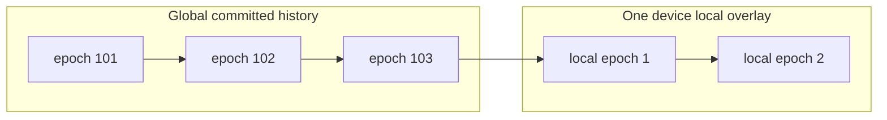
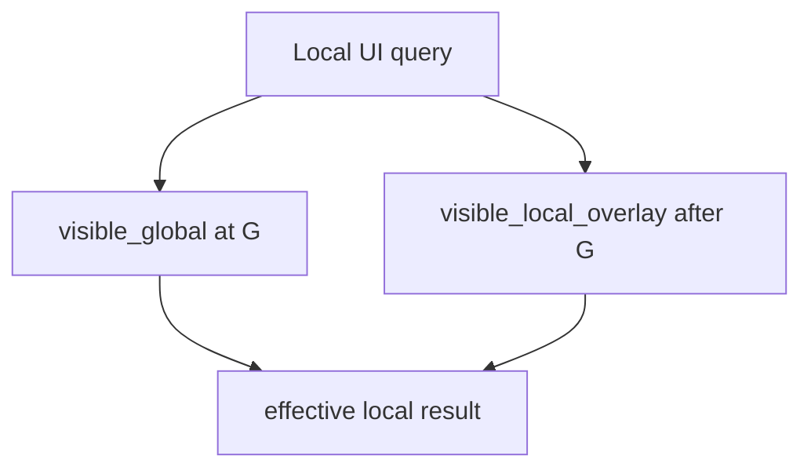
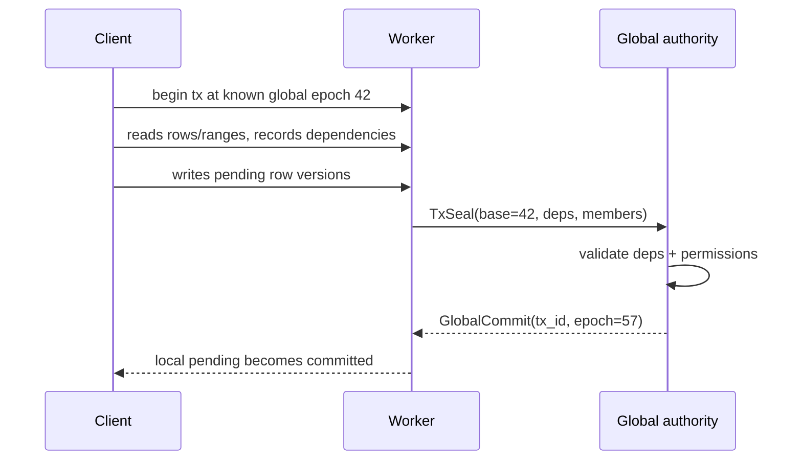

# Global Epoch Snapshot Isolation

## Why This Exists

Jazz needs true snapshot isolation for two features:

- transactions
- branches

The current row-history system already has durable row versions, branch frontiers, visible-row
caches, and replayable batch fate. That gives us history, but not a clean global read cut. Reads
mostly mean "current visible state at a durability tier", and durability tier is not the same thing
as snapshot membership.

The tempting distributed-systems answer is a version vector. That does not fit Jazz. A Jazz app can
have millions of local-first clients, and a snapshot token must not grow with the number of possible
writers.

The proposed answer is deliberately smaller:

> Snapshot isolation is defined over globally committed history using one monotonically increasing
> `global_epoch` per branch authority. Device-local writes form a private overlay and never become
> globally meaningful until the global authority accepts them.

This is not "timestamp per row" in the naive distributed sense. A row's `global_epoch` is not minted
by arbitrary clients and is not compared across independent local clocks. It is assigned only by the
global authority that serializes accepted writes for a branch.

## Core Claim

We can get away with:

```text
globally committed history:
  ordered by global_epoch

device-local optimistic history:
  ordered by local_epoch, visible only on that device/runtime path
```

No edge epoch, worker epoch, or client vector is needed for MVCC truth.

Workers and edge servers can still cache, persist, relay, preflight permissions, and answer queries
from their latest known global state. They do not assign canonical snapshot order.

## What Needs Snapshot Isolation

### Transactions

A transaction starts from a known global snapshot:

```text
base_global_epoch = latest global epoch known to this runtime
```

It may run while offline. That is allowed. Offline transactions are highly optimistic: if the base
epoch is stale, the transaction may fail at the global authority. On cold data, it can still succeed.

### Branches

A branch is created from a global snapshot:

```text
branch_base = { source_branch, base_global_epoch }
```

The branch may intentionally be stale. That is a feature, not a bug. Branching from "the last global
state this device knew" is a clear semantic boundary and avoids embedding local speculative writes
into durable branch identity.

### Batches

Batches do not need snapshot isolation. They group row-version production and replayable submission.
They may be direct or transactional, but the batch itself is not the read cut.

## Mental Model



A local read sees:

```text
global history <= latest_known_global_epoch
+ this device's local overlay
```

A global snapshot read sees only:

```text
global history <= requested_global_epoch
```

The local overlay is a UX/read-your-writes layer. It is not a distributed timestamp namespace.

## Version Stamps

Every row version has a stable identity and one of two visibility stamps.

```text
RowVersionId = (row_id, branch, batch_id)

Committed stamp:
  global_epoch: u64

Local stamp:
  local_epoch: u64
  local_base_global_epoch: u64
  device_id/runtime_id: local only
```

The row version can be:

```text
local_pending
global_committed
rejected
```

`batch_id` remains identity. It is useful for replay, sync, dedupe, and tie-breaking inside existing
row-history mechanics. It is not the MVCC clock.

## Storage Shape

This section describes a new storage format, not a migration from the current format.

### History Rows

History rows keep all durable row versions.

```text
history row key:
  (row_id, branch, batch_id)

history row payload:
  parents
  status                  // local_pending | global_committed | rejected
  global_epoch            // nullable
  local_epoch             // nullable, device-local only
  local_base_global_epoch  // nullable, device-local only
  tx_id                   // nullable
  write_kind              // direct | tx
  delete_kind
  created_by
  created_at
  updated_by
  updated_at
  metadata
  user columns...
```

The invariant:

```text
status == global_committed  => global_epoch is present
status == local_pending     => local_epoch and local_base_global_epoch are present locally
status == rejected          => never participates in ordinary reads
```

### Visible Caches

Use two visible regions:

```text
visible_global:
  current globally committed row per (branch, row_id)

visible_local_overlay:
  current device-local speculative row per (branch, row_id)
```

This keeps query semantics simple:

- global/as-of queries read only globally committed state
- local/default UI queries layer local overlay results over the global visible cache



The global visible row stores:

```text
branch
row_id
visible_batch_id
visible_global_epoch
frontier
user columns...
```

The local overlay visible row stores:

```text
branch
row_id
visible_batch_id
local_epoch
local_base_global_epoch
frontier
user columns...
```

The overlay can be dropped or rebuilt from local pending history.

### Branch Records

```text
BranchRecord {
  branch,
  source_branch,
  base_global_epoch,
  created_by,
  created_at,
}
```

A durable branch never bases itself on local pending writes. To branch from pending local changes,
first get them globally accepted or explicitly create a future "private local branch" feature with
different semantics.

## Transactions

A transaction captures:

```text
TxRecord {
  tx_id,
  target_branch,
  base_global_epoch,
  status,                 // open | sealed | accepted | rejected
  read_dependencies,
  members,
  accepted_global_epoch?,  // present after acceptance
  rejection_reason?,
}
```

The base epoch is the snapshot the transaction read from. It is enough for row-level conditional
writes only if we also know which rows or ranges the transaction depended on.

### Dependencies

```text
ReadDependency::Row {
  table,
  branch,
  row_id,
  observed_batch_id_or_absent,
}

ReadDependency::IndexRange {
  table,
  index,
  branch,
  lower_bound,
  upper_bound,
  predicate_fingerprint,
  observed_max_global_epoch,
}
```

Row dependencies cover point reads and conditional writes.

Index range dependencies cover predicates and absence checks. They prevent phantoms.

Example:

```text
insert booking if no booking overlaps 10:00-11:00
```

This cannot be validated by checking only returned rows, because the transaction observed absence.
It needs an index range dependency over the room/time range.

### Acceptance Rule

At the global authority:

```text
accept iff:
  all row dependencies still match
  all index range dependencies have no relevant committed change after the observed epoch
  permissions pass at commit time
```

If accepted, the authority assigns the next `global_epoch` and marks all member row versions as
globally committed at that epoch.



If rejected, local pending rows become rejected and ordinary local reads stop showing them.

## Indices For Predicate Dependencies

To validate predicates, committed index entries need epoch information.

Minimal correct version:

```text
table_epoch(table, branch) -> max changed global_epoch
```

This is conservative. Any table change after the transaction's base epoch can invalidate complex
predicate dependencies. Correctness first, lower concurrency.

Refined version:

```text
index_current:
  (table, branch, index, encoded_value, row_id)
    -> { batch_id, global_epoch }

index_range_epoch:
  can answer max(global_epoch) for a scanned index range
```

Then a range dependency is valid when:

```text
current max epoch in range <= observed_max_global_epoch
```

For predicates not fully covered by an index, the dependency must be broadened to a conservative
range or table dependency.

Limit/top-k queries need special care. The dependency is not only the returned rows; it includes the
boundary range where a new or updated row could enter the result.

## Sync Protocol

The protocol should stop moving tier advancement as if it were snapshot truth. It should move row
versions, transaction submissions, global commits, and rejections.

### Payloads

```text
RowVersionProposed {
  metadata?,
  row_version,       // no global_epoch
}

DirectSeal {
  batch_id,
  branch,
  members: [(row_id, row_digest)],
  batch_digest,
}

TxSeal {
  tx_id,
  branch,
  base_global_epoch,
  members: [(row_id, row_digest)],
  read_dependencies,
  tx_digest,
}

GlobalCommit {
  commit_id,         // batch_id or tx_id
  global_epoch,
  committed_members: [(row_id, branch, batch_id)],
}

CommitRejected {
  commit_id,
  code,
  reason,
}

RowVersionNeeded {
  row_version,
}

QuerySubscription {
  query,
  snapshot: latest | as_of(global_epoch),
  include_local_overlay: bool,
}

QuerySettled {
  query_id,
  global_epoch,
  through_seq,
}
```

`RowBatchStateChanged` disappears. A row version's meaningful global state changes only when a
`GlobalCommit` or `CommitRejected` arrives.

`BatchSettlement` can either disappear or become a small compatibility name around
`GlobalCommit`/`CommitRejected`. Its current tier-oriented shape should not survive.

### Connection

The authority announces its current epoch when a connection opens:

```text
Connected {
  latest_global_epoch,
  catalogue_state_hash,
  ...
}
```

Clients and workers can then ask for:

```text
SyncSince { global_epoch }
```

or rely on query subscriptions to fill the relevant row versions.

## Permissions

Permission checks at worker or edge are advisory. They are useful for local UX and for not showing
obviously forbidden rows, but they are not the final security boundary for transaction acceptance.

The global authority performs final permission evaluation for accepted writes.

Recommended rule:

```text
transaction permissions are evaluated at commit time against current global permission state
```

This is intentionally more conservative than snapshot-pure permissions. It prevents stale offline
permissions from allowing a revoked user to commit later.

Branches may read permissions as of their base epoch for branch-local query semantics, but merging
or committing back to a global branch still requires current global permission evaluation.

## Examples

### Row-Conditional Update

Alice reads:

```text
doc 7 = batch A at global_epoch 100
```

She writes offline:

```text
update doc 7 set title = "Draft"
base_global_epoch = 100
dependency = row doc 7 observed batch A
```

At commit time:

- if doc 7 is still batch A, accept
- if doc 7 has become batch B, reject

The row's old epoch does not need to equal the latest global epoch. Cold rows can remain valid for a
long time.

### Absence Check

Alice reads:

```text
no booking overlaps room 3, 10:00-11:00 at global_epoch 200
```

The transaction records:

```text
IndexRangeDependency {
  table: bookings,
  index: room_time,
  lower_bound: (room 3, 10:00),
  upper_bound: (room 3, 11:00),
  observed_max_global_epoch: 188,
}
```

If another booking appears in that range at epoch 205 before Alice commits, the authority rejects
the transaction.

### Stale Branch

Device last knows:

```text
main latest global epoch = 500
```

It creates:

```text
staging branch from main@500
```

The true authority may already be at epoch 530. That is okay. The branch explicitly means "main as
known at 500 plus staging edits."

## Why This Should Be Enough

The only globally meaningful ordering operation is accepting a write into a branch's committed
history. That operation already needs a trusted authority for transaction validation and permission
enforcement. Let that authority assign the epoch.

Everything below the authority can be treated as one of:

- a cache of global history
- a relay for proposed row versions
- a private local overlay for immediate UX

This keeps snapshot tokens bounded:

```text
as-of read:
  { branch, global_epoch }

local read:
  { branch, global_epoch, include_local_overlay }
```

It does not grow with the number of clients.

## Self-Review Concerns

This section records concerns surfaced by comparing the proposal to the current implementation and
to the ACID properties we want transactions to approximate.

### Atomicity

Global acceptance must be atomic across:

- transaction record
- member history rows
- visible global rows
- committed index entries
- range/table epoch summaries
- outbound sync notifications

Today the storage trait exposes synchronous raw-table operations and some grouped mutation helpers,
but it does not promise a cross-table atomic write batch for every backend. The new design should
make "apply one global commit" a first-class storage operation rather than relying on callers to
sequence several independent puts.

If this is not atomic, a crash can leave a row globally committed without its index epoch, or an
index visible without the corresponding row version.

### Consistency

The authority has to validate more than row freshness:

- schema/lens compatibility for all members
- row and predicate dependencies
- permission checks at commit time
- uniqueness and other schema-level constraints once those exist
- branch-base validity

The proposal should not imply that `global_epoch` alone proves consistency. `global_epoch` is the
ordering primitive; acceptance validation is the consistency boundary.

### Isolation

Row dependencies give ordinary row-level snapshot isolation. Predicate reads require index range or
table dependencies. Until range dependencies exist, the safe MVP is conservative table-level
invalidation for any transaction that depends on a predicate.

`LIMIT`, `ORDER BY`, and top-k queries are easy to get subtly wrong. A transaction that depends on
"the first N rows" depends on the boundary where another row could enter the result, not just on the
returned rows.

### Durability

Local pending writes can be durable on the device, but they are not globally durable. Product and API
language should avoid calling them committed. Suggested terms:

- `pending local`
- `globally committed`
- `rejected`

Current code uses durability tiers (`local`, `edge`, `global`) in many places. The spec intentionally
removes those as MVCC states, but implementation will need a replacement for user-facing persisted
write acknowledgements.

### Branch Epoch Scope

The spec leaves open whether epochs are per branch or app-wide. Per-branch epochs make branch-local
snapshots smaller and easier to reason about. App-wide epochs make cross-branch and catalogue
observations simpler.

The hardest case is a transaction whose correctness depends on data or permissions from more than
one branch/catalogue lane. If epochs are per branch, such a transaction needs either multiple base
epochs or a rule that those dependencies are validated against latest global state at commit time.

### Catalogue And Permissions Epochs

The current system stores catalogue and permissions separately from user row history. The new
snapshot model needs to decide whether catalogue entries and permission heads are part of the same
global epoch stream as user data.

For transaction acceptance, commit-time permission evaluation is recommended. For deterministic
as-of reads and branches, however, schema and permission context may also need epoch-addressable
history.

### Local Overlay Identity

The local overlay must be strictly device/runtime local. It should not sync as an ordered overlay to
other clients. Proposed row versions can sync upward, but their `local_epoch` should not be treated
as meaningful by the receiver.

If another runtime receives a proposed row version, it should store it as pending proposal metadata,
not as part of its own local read overlay unless there is an explicit product feature for viewing
someone else's pending work.

### Merge Semantics

The current row-history reducer supports conflicting frontiers and schema-declared merge strategies.
The new `global_epoch` model gives total order to accepted commits, but it does not remove the need
for row ancestry:

- direct concurrent local edits still need merge previews before global acceptance
- globally accepted commits may still need parent/frontier data for conflict diagnostics, replay,
  and branch merge features
- counter-like merge strategies need careful interaction with transaction validation

The spec keeps `parents` for this reason.

### Sync Replay

Replacing `RowBatchStateChanged` with `GlobalCommit` means reconnect replay needs a reliable way to
answer:

- which globally committed epochs does the peer already have?
- which proposed row versions are still pending?
- which commits were rejected?

`SyncSince { global_epoch }` handles committed history, but pending local proposals and rejection
replay need equally explicit recovery paths.

## Open Questions

- Do direct batches require global permission acceptance before they are globally committed, or can
  trusted backends mint direct global commits without a separate seal?
- Is the first implementation conservative with table-level epoch dependencies, then refined to
  index-range max epochs?
- Do branch-local commits get their own epoch sequence per branch, or does the authority use one
  app-wide epoch across all branches? Per-branch is smaller; app-wide simplifies cross-branch
  observation.
- Are catalogue and permission updates in the same epoch stream as user rows, or do transactions
  carry separate catalogue/permission base epochs?
- What storage backends can provide an atomic "apply global commit" primitive, and what fallback do
  we accept for those that cannot?
- How much local pending history should survive restart before being resubmitted or marked stale?
- Should rejected local rows remain inspectable through an explicit history/debug API?

## Non-Goals

- Data migration from the current storage format.
- Serializable isolation for arbitrary predicates in the first slice.
- Globally meaningful local, worker, or edge epochs.
- Version vectors over clients.
